# Git 與 GitFlow 教學手冊

> 一份從零開始、可直接複製貼上操作的 Git／GitFlow 實戰手冊，
> 附帶以 **Kind** 建立本機 Kubernetes 叢集、並將 GitFlow 分支對應到部署環境的完整範例。

- **適用對象**：剛接觸 Git 的新手、想導入分支策略的團隊、需要把分支流程接上 CI/CD 的工程師
- **環境**：macOS / Linux / Windows (WSL2 或 Git Bash)
- **實機驗證環境**：macOS 15 (arm64)、Git 2.55.0、Kind 0.32.0、kubectl 1.36.3、Kubernetes 1.36.1（Colima 提供 Docker runtime）

> 本手冊附帶的三支腳本都經過實機執行驗證：
> `drills/practice.sh`（12 題演練，驗收邏輯全數通過）、
> `scenarios/simulate.sh`（26 個情境、39 項自動驗證全綠）、
> `scripts/deploy.sh`（dev / staging / prod 三個環境實際部署成功）。

---

## 目錄

| # | 章節 | 內容 |
|---|------|------|
| 1 | [環境準備](#1-環境準備) | 安裝、設定、SSH 金鑰 |
| 2 | [Git 核心概念](#2-git-核心概念) | 三大區域、物件模型、HEAD |
| 3 | [Git 基本操作](#3-git-基本操作) | init / add / commit / log / diff |
| 4 | [分支與合併](#4-分支與合併) | branch / merge / 衝突處理 |
| 5 | [遠端協作](#5-遠端協作) | remote / fetch / pull / push |
| 6 | [回溯與改寫歷史](#6-回溯與改寫歷史) | reset / revert / stash / rebase |
| 7 | [GitFlow 模型](#7-gitflow-模型) | 五種分支、生命週期、規則 |
| 8 | [git-flow 指令對照](#8-git-flow-指令與純-git-對照) | CLI vs 純 Git |
| 9 | [GitFlow 完整實戰演練](#9-gitflow-完整實戰演練) | 可複製的完整腳本 |
| 10 | [Commit 規範與版本號](#10-commit-規範與版本號) | Conventional Commits / SemVer |
| 11 | [團隊協作規範](#11-團隊協作規範) | PR / Code Review / 保護分支 |
| 12 | [分支策略比較](#12-分支策略比較) | GitFlow vs GitHub Flow vs Trunk-Based |
| 13 | [Git 互動演練場](#13-git-互動演練場) | ★ 12 題動手練習，自動驗收 |
| 14 | [GitFlow 情境模擬全集](#14-gitflow-情境模擬全集) | ★ 26 種真實場景與處置 SOP |
| 15 | [多 Pipeline 設計](#15-多-pipeline-設計) | ★ 分支對應的 6 條 CI/CD 流水線 |
| A | [附錄 A：Kind + Kubernetes 部署](#附錄-akind--kubernetes-部署) | 本機叢集與 GitFlow 環境對應 |
| B | [附錄 B：疑難排解](#附錄-b疑難排解-faq) | 常見錯誤與解法 |
| C | [附錄 C：指令速查表](#附錄-c指令速查表) | 一頁式 cheat sheet |
| D | [附錄 D：其他 CI 平台範本](#附錄-d其他-ci-平台範本) | GitLab CI / Jenkins / Argo CD |

### 快速開始

```bash
# ① 完全新手 —— 從 12 題動手練習開始（只需要 git，不需要 Docker）
./drills/practice.sh list
./drills/practice.sh start 1

# ② 想看 GitFlow 各種場景怎麼跑 —— 26 個情境自動演示
./scenarios/simulate.sh list
./scenarios/simulate.sh 10          # 最刁鑽的一題：release 期間發生 hotfix

# ③ 想連 CI/CD 一起練 —— 建立本機 K8s 叢集並部署
kind create cluster --config kind-cluster.yaml
./scripts/deploy.sh develop         # → dev namespace
```

### 專案檔案結構

```text
git-gitflow-tutorial/
├── README.md                      # 本手冊
├── VERSION                        # 版本號（release / hotfix 會更新）
├── drills/
│   └── practice.sh                # ★ 12 題互動演練場（你動手，它驗收）
├── scenarios/
│   └── simulate.sh                # ★ 26 種 GitFlow 情境模擬器（自動演示）
├── app/
│   └── Dockerfile                 # 示範應用（會顯示自己來自哪個分支）
├── k8s/base/
│   ├── deployment.yaml
│   └── ingress.yaml
├── kind-cluster.yaml              # Kind 叢集定義（1 control-plane + 2 worker）
├── scripts/
│   └── deploy.sh                  # 分支 → namespace 部署腳本
└── ci-examples/
    └── github-actions/            # ★ 6 條獨立 pipeline（範例，未啟用）
        ├── 01-feature-ci.yml      #   feature/**        → 臨時 Kind 叢集
        ├── 02-develop-cd.yml      #   develop           → dev
        ├── 03-release-cd.yml      #   release/**        → staging
        ├── 04-hotfix-cd.yml       #   hotfix/**         → staging（快速通道）
        ├── 05-production-release.yml  # tag v*          → prod（需審批）
        └── 06-nightly-e2e.yml     #   排程              → 深度回歸
```

> **為什麼 pipeline 放在 `ci-examples/` 而不是 `.github/workflows/`？**
> 放在 `.github/workflows/` 會被 GitHub **自動觸發執行**。本專案是教材，
> pipeline 是拿來讀與改的範例，因此刻意放在一般目錄下，不會消耗你的 Actions 額度、
> 也不會誤觸任何環境。
>
> 想真的啟用時：
> ```bash
> mkdir -p .github && git mv ci-examples/github-actions .github/workflows
> ```
> 啟用前請先在 repo 設定好 `KUBECONFIG_DEV` 等 secret 與 environment 審批規則。

---

## 演練平台架構（C4 Model）

用 [C4 Model](https://c4model.com/) 說明這套演練平台本身是怎麼組成的。
由外而內五張圖：**誰在用 → 有哪些可執行單元 → 單元內部怎麼分工 → 關鍵資料結構 → 實際跑在哪裡**。

> 以下使用 Mermaid 原生的 C4 語法（`C4Context` / `C4Container` / `C4Component` / `C4Deployment`），
> 每一張都已實際渲染驗證過。

### Level 1 — System Context（系統情境）

誰會用這套平台、它跟外部世界的邊界在哪。

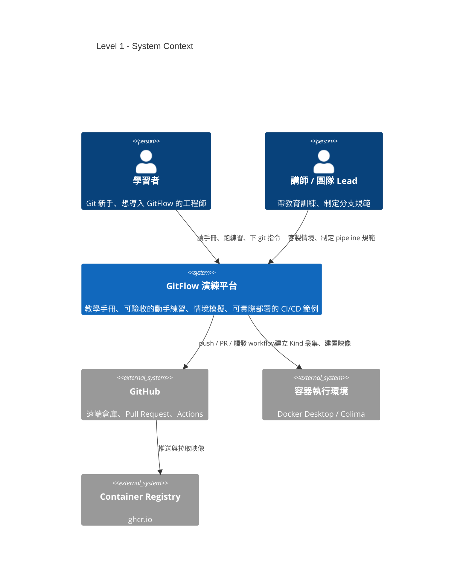

| 元素 | 類型 | 說明 |
|------|------|------|
| 學習者 | Person | 跑 12 題演練、讀手冊、在沙箱下 git 指令 |
| 講師 / 團隊 Lead | Person | 客製情境、把分支規範寫進 pipeline |
| GitFlow 演練平台 | System | 本專案：手冊 + 演練工具 + 部署範例 |
| GitHub | External | 遠端倉庫、Pull Request、Actions |
| 容器執行環境 | External | Kind 需要它才能把節點跑成容器 |
| Container Registry | External | CI 推送映像的目的地（ghcr.io） |

### Level 2 — Container（可執行單元）

平台內部有哪些「可以獨立跑起來」的單元，彼此怎麼互動。

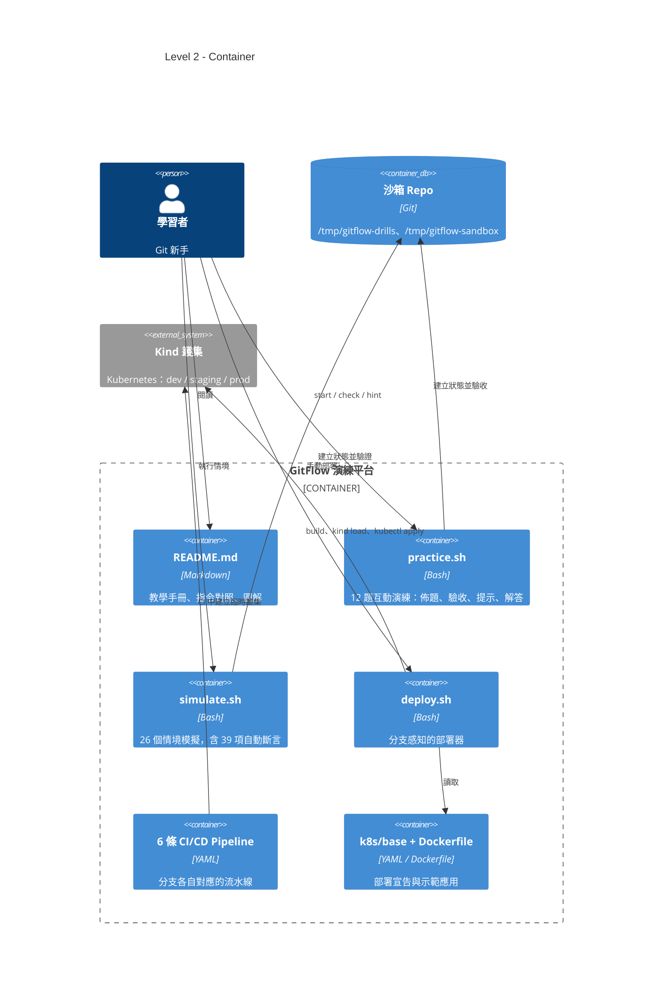

三支腳本的分工是刻意切開的：

| 單元 | 你做什麼 | 它做什麼 | 需要 Docker？ |
|------|----------|----------|---------------|
| `practice.sh` | **你自己下 git 指令** | 佈題、逐項驗收、給診斷式回饋 | 否 |
| `simulate.sh` | 看 | 自動跑完整情境並自我驗證 | 否 |
| `deploy.sh` | 指定分支 | 建置映像、載入叢集、滾動更新 | 是 |

### Level 3 — Component（元件分解）

拆開兩個核心單元的內部結構。

**`practice.sh` — 演練引擎**

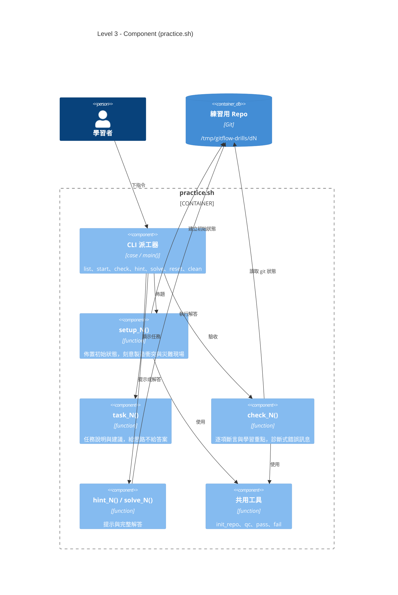

> 每一題就是 `setup_N` / `task_N` / `check_N` / `hint_N` / `solve_N` 五個函式。
> 要新增第 13 題，照著這個介面寫五個函式、在 `TITLES` 陣列加一行即可，不必動派工器。

**`deploy.sh` — 分支感知部署器**

```mermaid
flowchart LR
    IN["<b>輸入</b><br/>分支名（或當前分支）"]
    RT["<b>① 分支路由</b><br/>case 對應表<br/>決定 ns / replicas / host"]
    PC["<b>② 前置檢查</b><br/>docker · kind · kubectl<br/>叢集存在？context 正確？"]
    BD["<b>③ 映像建置</b><br/>docker build --build-arg<br/>版本 · 分支 · SHA 烙進映像"]
    LD["<b>④ 映像載入</b><br/>kind load docker-image<br/>推進三個節點"]
    AP["<b>⑤ 套用 Manifest</b><br/>apply · set image · scale<br/>Ingress 為選用（優雅降級）"]
    RO["<b>⑥ 滾動更新守衛</b><br/>rollout status<br/>失敗 → 自動 rollout undo"]

    IN --> RT --> PC --> BD --> LD --> AP --> RO
    RO -->|"失敗"| UD["⛑ 自動回滾"]

    classDef comp fill:#85bbf0,stroke:#5d82a8,color:#000
    classDef danger fill:#f8cecc,stroke:#b85450,color:#000
    class IN,RT,PC,BD,LD,AP,RO comp
    class UD danger
```

### Level 4 — Code（關鍵資料結構）

整套平台的行為，最終收斂到這一張對應表：

```bash
# scripts/deploy.sh —— 分支路由（唯一的真相來源）
case "$BRANCH" in
  main|master) NS=prod    ; REPLICAS=3 ; HOST=demo.localtest.me     ; SUFFIX=""     ;;
  release/*)   NS=staging ; REPLICAS=2 ; HOST=stg.demo.localtest.me ; SUFFIX="-rc"  ;;
  hotfix/*)    NS=staging ; REPLICAS=2 ; HOST=stg.demo.localtest.me ; SUFFIX="-hf"  ;;
  develop)     NS=dev     ; REPLICAS=1 ; HOST=dev.demo.localtest.me ; SUFFIX="-dev" ;;
  feature/*)   exit 0 ;;   # 只跑 CI，不部署到常駐環境
  *)           exit 1 ;;   # 不符 GitFlow 命名 → 直接擋下
esac
```

| 分支 | Namespace | Replicas | 映像 Tag 樣式 | 對應 Pipeline |
|------|-----------|----------|---------------|---------------|
| `main` | `prod` | 3 | `1.1.0.77f1e19` | ⑤ production-release |
| `release/*` | `staging` | 2 | `1.1.0-rc.ddf9df0` | ③ release-cd |
| `hotfix/*` | `staging` | 2 | `1.0.1-hf.a3c91b2` | ④ hotfix-cd |
| `develop` | `dev` | 1 | `1.0.0-dev.d5059e4` | ② develop-cd |
| `feature/*` | （臨時叢集） | 1 | `pr-<n>` | ① feature-ci |

### Level 5 — Deployment（部署視圖）

前面四張圖講「軟體怎麼組成」，這張講「實際跑在哪裡」——
GitFlow 的三種分支如何落到同一座 Kind 叢集的三個 namespace。

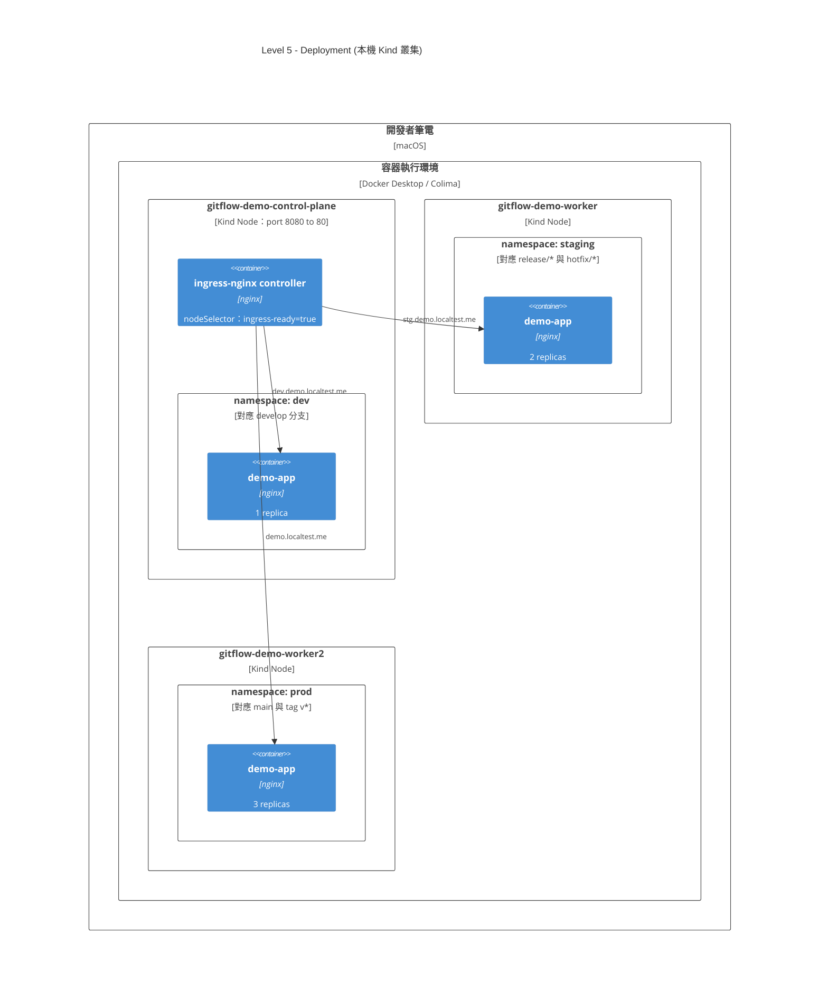

幾個實測得到的重點：

- **Ingress controller 必須跑在 control-plane 上**。只有該節點在 `kind-cluster.yaml` 裡做了
  `extraPortMappings`（host 8080 → node 80），被排到 worker 就完全不通。
  新版 ingress-nginx 的 kind manifest 已拿掉 `ingress-ready` 的 nodeSelector，需自行補上，
  詳見[附錄 A.4](#實測踩到的兩個坑kind--ingress-nginx)。
- **三個環境共用一座叢集**，靠 namespace 隔離、靠 host 分流。正式環境請讓 prod 使用獨立叢集。
- **Pod 實際落在哪個 worker 由排程器決定**，圖上的擺放只是示意；namespace 才是真正的隔離邊界。

### 動態視圖：一次完整發版

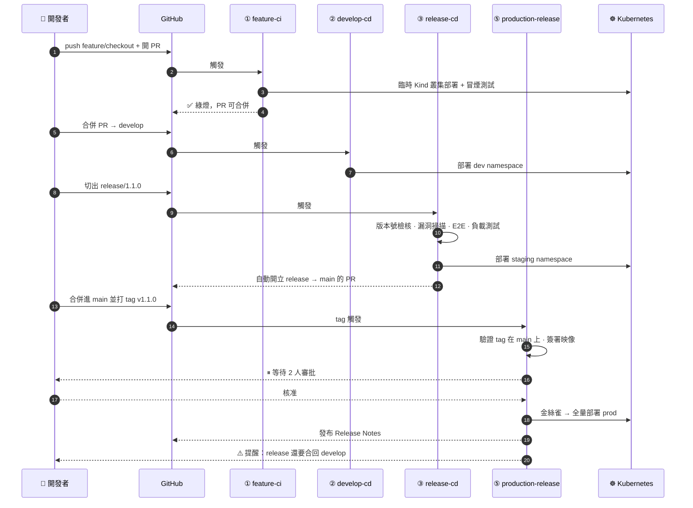

---

## 1. 環境準備

### 1.1 安裝 Git

```bash
# macOS
brew install git

# Ubuntu / Debian
sudo apt update && sudo apt install -y git

# Windows：下載 Git for Windows（內含 Git Bash）
# https://git-scm.com/download/win

git --version   # 確認安裝
```

### 1.2 首次設定（全域）

```bash
git config --global user.name  "Rex Wang"
git config --global user.email "cping.wang.2068@gmail.com"

# 預設主分支名稱（新版慣例用 main）
git config --global init.defaultBranch main

# 中文檔名不要被轉成 \xxx 的八進位編碼
git config --global core.quotepath false

# 換行符號處理：macOS/Linux 用 input，Windows 用 true
git config --global core.autocrlf input

# 預設編輯器
git config --global core.editor "vim"      # 或 "code --wait"

# pull 時預設用 rebase，避免製造無意義的 merge commit
git config --global pull.rebase true

# 好用的別名
git config --global alias.st  status
git config --global alias.co  checkout
git config --global alias.br  branch
git config --global alias.cm  "commit -m"
git config --global alias.lg  "log --oneline --graph --decorate --all"
git config --global alias.last "log -1 HEAD --stat"
git config --global alias.unstage "reset HEAD --"

# 檢視所有設定與其來源檔案
git config --list --show-origin
```

> 設定檔優先順序（後者覆蓋前者）：
> `/etc/gitconfig`（system） → `~/.gitconfig`（global） → `.git/config`（local） → 指令參數

### 1.3 產生並註冊 SSH 金鑰

```bash
ssh-keygen -t ed25519 -C "cping.wang.2068@gmail.com"
# 一路 Enter（可設 passphrase）

eval "$(ssh-agent -s)"
ssh-add ~/.ssh/id_ed25519

cat ~/.ssh/id_ed25519.pub      # 複製這串，貼到 GitHub → Settings → SSH keys

ssh -T git@github.com          # 測試連線
# > Hi xxx! You've successfully authenticated...
```

### 1.4 `.gitignore` 範本

```gitignore
# 依賴
node_modules/
vendor/
__pycache__/
*.pyc

# 建置產物
dist/
build/
target/
*.log

# 環境與機密（永遠不要 commit）
.env
.env.local
*.pem
*.key
secrets.yaml

# 編輯器與作業系統
.vscode/
.idea/
.DS_Store
Thumbs.db
```

> **已經 commit 進去才加 .gitignore？** `.gitignore` 只對「尚未被追蹤」的檔案有效，需先移出索引：
> ```bash
> git rm -r --cached .env
> git commit -m "chore: 移除誤入版控的 .env"
> ```
> ⚠️ 檔案仍留在歷史中。若含真實金鑰，**必須立刻輪換該金鑰**，並用 `git filter-repo` 或 BFG 清除歷史。

---

## 2. Git 核心概念

### 2.1 三大區域

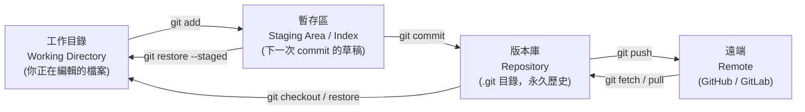

| 區域 | 說明 | 查看指令 |
|------|------|----------|
| Working Directory | 你在編輯器裡看到的檔案 | `git diff` |
| Staging Area (Index) | 已 `add`、準備進入下次 commit | `git diff --staged` |
| Repository (HEAD) | 已 commit 的歷史 | `git log` |

### 2.2 Git 的物件模型

Git 本質是一個**內容定址的檔案系統**，只有四種物件：

| 物件 | 內容 | 比喻 |
|------|------|------|
| **blob** | 檔案內容（不含檔名） | 檔案本體 |
| **tree** | 目錄結構：檔名 → blob/tree | 資料夾 |
| **commit** | 指向一個 tree + 父 commit + 作者 + 訊息 | 快照＋履歷 |
| **tag** | 指向一個 commit 的具名標記（annotated tag） | 書籤 |

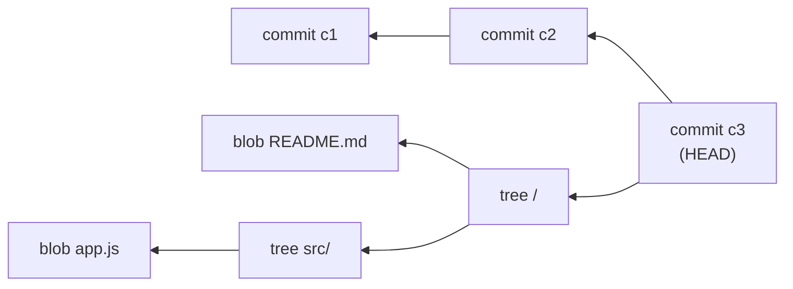

實際看看：

```bash
git log --format=%H -1                    # 取得 commit SHA
git cat-file -p HEAD                      # 看 commit 物件內容
git cat-file -p HEAD^{tree}               # 看 tree
git rev-parse HEAD                        # 解析任何 refs → SHA
```

> **重點觀念**：Git 儲存的是**完整快照**，不是差異（diff）。差異是顯示時才算出來的。

### 2.3 HEAD、分支、標籤

- **分支（branch）** = 一個「會移動的指標」，指向某個 commit（檔案就是 `.git/refs/heads/<name>`，內容只有 41 bytes 的 SHA）
- **HEAD** = 指向「你目前在哪個分支」的指標（`.git/HEAD`）
- **detached HEAD** = HEAD 直接指向某個 commit 而非分支，此時 commit 不屬於任何分支，容易遺失

```bash
cat .git/HEAD                 # ref: refs/heads/main
cat .git/refs/heads/main      # 3f2a1c...
git branch -v                 # 所有分支與最新 commit
```

因為分支只是指標，**開分支的成本趨近於零**——這正是 GitFlow 這類分支模型可行的基礎。

---

## 3. Git 基本操作

### 3.1 建立版本庫

```bash
# 從零開始
mkdir my-project && cd my-project
git init
git init -b main            # 直接指定初始分支名

# 從遠端複製
git clone git@github.com:user/repo.git
git clone git@github.com:user/repo.git my-dir     # 指定目錄名
git clone --depth 1 <url>                          # 淺複製，只抓最新一版（CI 常用）
git clone --branch develop <url>                   # 只 checkout 指定分支
```

### 3.2 日常循環：改 → add → commit

```bash
git status                  # 隨時確認狀態（最常用的指令）
git status -s               # 精簡格式

git add file.txt            # 加入單一檔案
git add src/                # 加入整個目錄
git add .                   # 加入當前目錄所有變更
git add -A                  # 加入所有變更（含刪除）
git add -p                  # ★ 互動式：逐段挑選要 stage 的內容

git commit -m "feat: 新增使用者登入 API"
git commit                  # 開編輯器寫多行訊息
git commit -am "訊息"        # 對「已追蹤」檔案 add + commit 一次完成
git commit --amend          # 修改最後一次 commit（訊息或內容）
git commit --amend --no-edit  # 補檔案進上一個 commit，訊息不變
```

> `git add -p` 是把「一次做了三件事」的髒工作目錄，拆成三個乾淨 commit 的關鍵工具。

### 3.3 查看歷史

```bash
git log
git log --oneline                          # 一行一個 commit
git log --oneline --graph --decorate --all # ★ 圖形化全貌（推薦設成別名 lg）
git log -5                                 # 最近 5 筆
git log --author="Rex"                     # 篩選作者
git log --since="2 weeks ago"              # 篩選時間
git log --grep="登入"                       # 搜尋 commit 訊息
git log -S "functionName"                  # ★ 找出「哪個 commit 動到這段程式碼」
git log -p file.txt                        # 某檔案的完整變更歷程
git log --stat                             # 顯示每個 commit 動了哪些檔案幾行
git log main..develop                      # develop 有、main 沒有的 commit
git log --follow file.txt                  # 跨越改名追蹤檔案

git show <sha>                             # 看單一 commit 詳情
git blame file.txt                         # 每一行是誰、何時改的
git reflog                                 # ★ 你所有 HEAD 移動紀錄（救命用）
```

### 3.4 比較差異

```bash
git diff                    # 工作目錄 vs 暫存區
git diff --staged           # 暫存區 vs HEAD（= 這次 commit 會提交什麼）
git diff HEAD               # 工作目錄 vs HEAD（所有未 commit 變更）
git diff main develop       # 兩分支差異
git diff main...develop     # 從共同祖先算起，develop 的變更
git diff --stat             # 只看統計
git diff <sha1> <sha2> -- file.txt   # 指定檔案在兩版本間的差異
```

### 3.5 刪除與移動

```bash
git rm file.txt             # 刪除檔案並 stage
git rm --cached file.txt    # 只移出版控，檔案保留在磁碟
git mv old.txt new.txt      # 等同 mv + git rm + git add
```

---

## 4. 分支與合併

### 4.1 分支操作

```bash
git branch                      # 列出本地分支
git branch -a                   # 含遠端分支
git branch -vv                  # 含追蹤關係與最新 commit

git branch feature/login        # 建立分支（不切換）
git switch feature/login        # 切換（Git 2.23+ 推薦）
git switch -c feature/login     # 建立並切換 ★
git checkout -b feature/login   # 舊寫法，等效

git switch -                    # 切回上一個分支
git switch -c hotfix main       # 從 main 建立分支

git branch -m old new           # 重新命名
git branch -d feature/login     # 刪除（未合併會擋下來）
git branch -D feature/login     # 強制刪除
git push origin --delete feature/login   # 刪除遠端分支
```

### 4.2 合併的三種形態

#### (a) Fast-forward（快轉）

目標分支沒有新 commit，指標直接前移，**不產生 merge commit**。

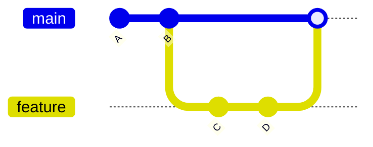

```bash
git switch main
git merge feature/login         # 可 ff 時自動 ff
```

#### (b) No-fast-forward（強制產生合併節點）★ GitFlow 採用

保留「這幾個 commit 屬於同一個 feature」的歷史結構。

```bash
git merge --no-ff feature/login -m "Merge feature/login into develop"
```

#### (c) Three-way merge（三方合併）

兩邊都有新 commit，Git 以共同祖先為基準自動合併，衝突時需人工介入。

```bash
git merge feature/login
```

| 方式 | 何時發生 | 歷史樣貌 | 建議 |
|------|----------|----------|------|
| fast-forward | 目標分支無新 commit | 線性 | 小修補可用 |
| `--no-ff` | 手動指定 | 有明確合併節點 | **GitFlow 標準做法** |
| three-way | 雙方都有新 commit | 分岔後匯流 | 自然發生 |

### 4.3 衝突處理 SOP

```bash
git merge feature/login
# CONFLICT (content): Merge conflict in src/app.js
# Automatic merge failed; fix conflicts and then commit the result.
```

衝突檔案長這樣：

```text
<<<<<<< HEAD
const port = 3000;          ← 目前分支（main）的版本
=======
const port = 8080;          ← 併入分支（feature/login）的版本
>>>>>>> feature/login
```

**處理步驟：**

```bash
git status                       # 1. 看哪些檔案衝突（Unmerged paths）
# 2. 編輯檔案，刪掉 <<<<<<< ======= >>>>>>> 標記，保留正確內容
git add src/app.js               # 3. 標記為已解決
git status                       # 4. 確認全部解決
git commit                       # 5. 完成合併（訊息已預填）

# 中途反悔：
git merge --abort                # 完全回到 merge 前的狀態
```

**實用工具：**

```bash
git mergetool                    # 開啟設定好的三方比對工具
git diff --name-only --diff-filter=U   # 只列出衝突中的檔案
git checkout --ours  file.txt    # 整檔採用「目前分支」版本
git checkout --theirs file.txt   # 整檔採用「併入分支」版本

# 顯示共同祖先版本，看得更清楚（強烈建議開啟）
git config --global merge.conflictstyle zdiff3
```

> **降低衝突的實務做法**：分支存活時間短（≤ 3 天）、頻繁從 develop 同步、避免多人同時改同一檔案、格式化規則統一（Prettier/gofmt）。

---

## 5. 遠端協作

### 5.1 遠端管理

```bash
git remote -v                                   # 查看遠端
git remote add origin git@github.com:u/r.git    # 新增
git remote set-url origin <new-url>             # 改網址
git remote rename origin upstream               # 改名
git remote remove origin                        # 移除
git remote show origin                          # 詳細資訊（含追蹤關係）
```

### 5.2 抓取與推送

```bash
git fetch origin                # ★ 只下載，不動你的工作目錄（安全）
git fetch --all --prune         # 抓全部並清掉遠端已刪的分支

git pull                        # = fetch + merge
git pull --rebase               # = fetch + rebase（歷史更乾淨）

git push origin main
git push -u origin feature/login  # 第一次推送並建立追蹤關係
git push                          # 之後直接這樣
git push --tags                   # 推送標籤
git push --force-with-lease       # ★ 安全版強推（別人有新 commit 時會擋下）
```

> ⚠️ **永遠不要對共用分支（main / develop）用 `git push --force`。**
> 需要強推時（例如 rebase 過自己的 feature 分支），一律用 `--force-with-lease`。

### 5.3 追蹤分支

```bash
git branch -u origin/develop           # 為當前分支設定上游
git branch -vv                         # 檢視追蹤關係與領先/落後數
git switch -c local-name origin/remote-name    # 從遠端分支建立本地分支
```

### 5.4 標籤與發布

```bash
git tag                                   # 列出
git tag -a v1.2.0 -m "Release 1.2.0"      # ★ annotated tag（正式發版用）
git tag v1.2.0-lightweight                # lightweight tag（僅指標）
git tag -a v1.1.0 <sha>                   # 為歷史 commit 補打標籤
git show v1.2.0                           # 檢視
git push origin v1.2.0                    # 推送單一標籤
git push origin --tags                    # 推送所有標籤
git tag -d v1.2.0                         # 刪本地
git push origin :refs/tags/v1.2.0         # 刪遠端
git describe --tags                       # 目前 commit 相對最近標籤的描述
```

---

## 6. 回溯與改寫歷史

### 6.1 撤銷變更對照表

| 情境 | 指令 |
|------|------|
| 丟棄工作目錄的修改 | `git restore file.txt` |
| 把檔案移出暫存區（保留修改） | `git restore --staged file.txt` |
| 修改最後一次 commit 訊息 | `git commit --amend` |
| 撤銷 commit，變更留在暫存區 | `git reset --soft HEAD~1` |
| 撤銷 commit，變更留在工作目錄 | `git reset HEAD~1`（預設 `--mixed`） |
| 撤銷 commit，**變更全部丟掉** | `git reset --hard HEAD~1` ⚠️ |
| 用一個新 commit 抵銷舊 commit | `git revert <sha>` ★ 共用分支唯一正解 |
| 回到某個歷史狀態（安全） | `git revert --no-commit <sha>..HEAD` |
| 救回誤刪的 commit | `git reflog` → `git reset --hard <sha>` |

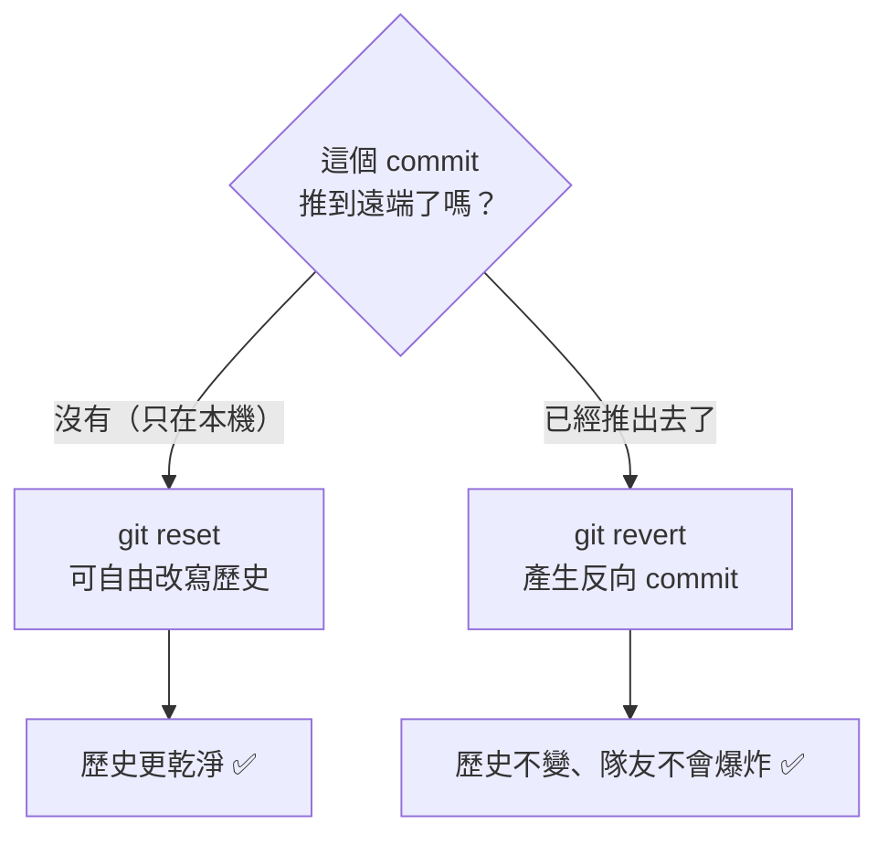

> **鐵律**：`reset` 用於**還沒 push** 的 commit；`revert` 用於**已經 push** 的 commit。

### 6.2 stash：暫存未完成的工作

```bash
git stash                        # 收起所有未 commit 的變更
git stash push -m "登入頁做到一半"  # 附說明
git stash -u                     # 含未追蹤檔案
git stash list                   # 列出所有 stash
git stash show -p stash@{0}      # 看內容
git stash pop                    # 取回最新一筆並從堆疊移除
git stash apply stash@{1}        # 取回指定筆但保留在堆疊
git stash drop stash@{0}         # 刪除
git stash clear                  # 全清 ⚠️
```

### 6.3 cherry-pick：挑選單一 commit

```bash
git cherry-pick <sha>            # 把某 commit 套用到當前分支
git cherry-pick <sha1> <sha2>    # 多個
git cherry-pick <sha1>..<sha2>   # 範圍（不含 sha1）
git cherry-pick -n <sha>         # 只套用不 commit
git cherry-pick --continue       # 解完衝突後繼續
git cherry-pick --abort          # 放棄
```

> 典型用途：hotfix 已修好在 `main`，要把同一修正帶進 `develop`（GitFlow 通常直接 merge，但單一 commit 情境用 cherry-pick 更精準）。

### 6.4 rebase：把分支基底搬家

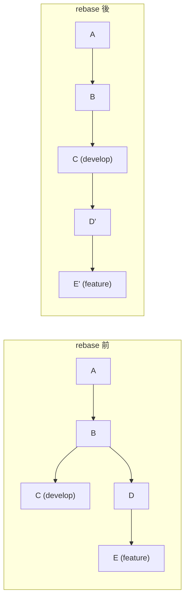

```bash
git switch feature/login
git rebase develop               # 把 feature 的 commit 重新接到 develop 之後

# 衝突時
git rebase --continue            # 解完衝突繼續
git rebase --skip                # 跳過這個 commit
git rebase --abort               # 放棄，回到 rebase 前

# 互動式 rebase：整理最近 3 個 commit
git rebase -i HEAD~3
```

互動式 rebase 可用動作：

```text
pick   3f2a1c  feat: 新增登入表單
squash 8b4d9e  fix: 修 typo          ← 併入上一個 commit
fixup  1c7e2a  fix: 再修 typo        ← 併入且丟棄訊息
reword 9a3f5b  feat: 加驗證          ← 只改訊息
edit   2d8c4f  refactor: 抽出函式    ← 停下來讓你修改
drop   5e1b7d  chore: 測試用 log     ← 刪掉這個 commit
# 上下調換行的順序 = 調換 commit 順序
```

> ⚠️ **rebase 黃金法則**：**絕不 rebase 已經推到共用分支的 commit。**
> rebase 會產生「新的 SHA」，別人基於舊 SHA 的工作全部對不上。
> 安全範圍：只有自己在用的 feature 分支。

### 6.5 reflog：後悔藥

```bash
git reflog
# 3f2a1c HEAD@{0}: reset: moving to HEAD~3
# 8b4d9e HEAD@{1}: commit: feat: 重要功能   ← 想救回這個
# ...

git reset --hard 8b4d9e          # 救回來
git branch recovered 8b4d9e      # 或開新分支保存
```

> reflog 預設保留 90 天，只存在於**本機**。就算 `reset --hard` 也幾乎救得回來。

### 6.6 其他救援工具

```bash
git bisect start                 # 二分搜尋找出引入 bug 的 commit
git bisect bad                   # 目前是壞的
git bisect good v1.0.0           # v1.0.0 是好的
# Git 自動 checkout 中間點 → 測試 → 回答 good/bad → 重複
git bisect reset                 # 結束

git fsck --lost-found            # 找孤兒物件
git clean -n                     # 預覽會刪掉哪些未追蹤檔案
git clean -fd                    # 實際刪除 ⚠️
```

---

## 7. GitFlow 模型

### 7.1 什麼是 GitFlow

由 Vincent Driessen 於 2010 年提出的分支模型，核心是用**固定角色的分支**把「開發中」與「已上線」徹底隔離，適合**有明確版本號、定期發版**的產品。

### 7.2 五種分支

| 分支 | 生命週期 | 從哪來 | 合併回哪 | 命名 | 用途 |
|------|----------|--------|----------|------|------|
| **main**（master） | 永久 | — | — | `main` | 只放**已上線**的版本，每個 commit 都有 tag |
| **develop** | 永久 | main | — | `develop` | 整合中的下一版，CI 的主戰場 |
| **feature** | 短期 | develop | develop | `feature/*` | 開發新功能 |
| **release** | 短期 | develop | main + develop | `release/*` | 發版前的凍結、測試、修 bug |
| **hotfix** | 短期 | **main** | main + develop | `hotfix/*` | 線上緊急修復 |

### 7.3 完整流程圖

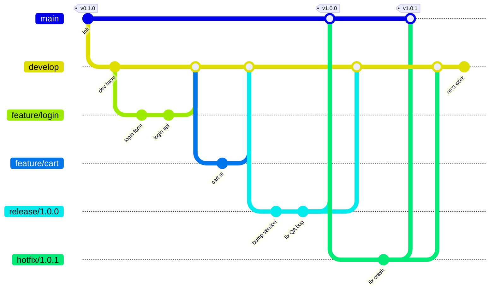

### 7.4 各分支的規則

#### `main`
- **禁止直接 commit**，只接受來自 `release/*` 與 `hotfix/*` 的合併
- 每次合併必須打 **annotated tag**（`v1.0.0`）
- 任何時刻 checkout 出來都應該是可上線的

#### `develop`
- 所有 feature 的匯流點
- **禁止直接 commit**（實務上透過 PR 合併）
- CI 必須全綠

#### `feature/*`
- 從 `develop` 開，合回 `develop`（用 `--no-ff`）
- **不可**直接合進 `main`
- 命名建議帶票號：`feature/PROJ-123-user-login`
- 存活時間建議 ≤ 3 天，過久必然衝突地獄

#### `release/*`
- 從 `develop` 開，同時合進 `main` 與 `develop`
- 開出來後 `develop` 就可以開始下一版的功能開發（**這是 GitFlow 最大的價值**）
- release 分支上**只允許 bug 修復、版本號、文件**，不接受新功能
- 命名：`release/1.2.0`

#### `hotfix/*`
- **從 `main` 開**（不是 develop！），合回 `main` 與 `develop`
- 若當下有 release 分支存在，應合進 `release/*` 而非 `develop`（否則會被 release 覆蓋掉）
- 命名：`hotfix/1.2.1`

### 7.5 環境對應

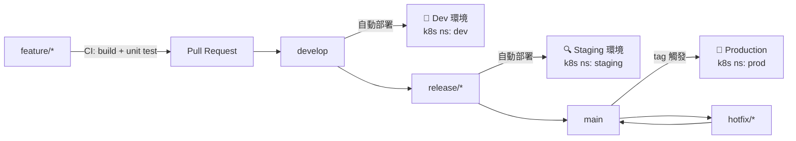

> 這張對應圖會在[附錄 A](#附錄-akind--kubernetes-部署) 用 Kind 實際跑一遍。

---

## 8. git-flow 指令與純 Git 對照

### 8.1 安裝 git-flow (AVH edition)

```bash
# macOS
brew install git-flow-avh

# Ubuntu / Debian
sudo apt install -y git-flow

# 手動安裝（通用）
curl -fsSL https://raw.githubusercontent.com/petervanderdoes/gitflow-avh/develop/contrib/gitflow-installer.sh | bash

git flow version
```

### 8.2 初始化

```bash
git flow init
# 互動式詢問各分支名稱，全部按 Enter 用預設即可
# Branch name for production releases: [main]
# Branch name for "next release" development: [develop]
# Feature branches? [feature/]
# Release branches? [release/]
# Hotfix branches?  [hotfix/]
# Version tag prefix? [] → 建議輸入 v

git flow init -d      # 全用預設，不問問題
```

### 8.3 完整指令對照表

| 操作 | git-flow 指令 | 等價的純 Git 指令 |
|------|---------------|-------------------|
| **初始化** | `git flow init -d` | `git switch -c develop main`<br/>`git push -u origin develop` |
| **開新功能** | `git flow feature start login` | `git switch develop && git pull`<br/>`git switch -c feature/login` |
| **推送功能分支** | `git flow feature publish login` | `git push -u origin feature/login` |
| **取得他人功能分支** | `git flow feature pull origin login` | `git switch -c feature/login origin/feature/login` |
| **完成功能** | `git flow feature finish login` | `git switch develop && git pull`<br/>`git merge --no-ff feature/login`<br/>`git branch -d feature/login`<br/>`git push origin develop` |
| **開始發版** | `git flow release start 1.2.0` | `git switch develop && git pull`<br/>`git switch -c release/1.2.0` |
| **發布 release 分支** | `git flow release publish 1.2.0` | `git push -u origin release/1.2.0` |
| **完成發版** | `git flow release finish 1.2.0` | `git switch main && git pull`<br/>`git merge --no-ff release/1.2.0`<br/>`git tag -a v1.2.0 -m "Release 1.2.0"`<br/>`git switch develop`<br/>`git merge --no-ff release/1.2.0`<br/>`git branch -d release/1.2.0`<br/>`git push origin main develop --tags` |
| **開始 hotfix** | `git flow hotfix start 1.2.1` | `git switch main && git pull`<br/>`git switch -c hotfix/1.2.1` |
| **完成 hotfix** | `git flow hotfix finish 1.2.1` | `git switch main`<br/>`git merge --no-ff hotfix/1.2.1`<br/>`git tag -a v1.2.1 -m "Hotfix 1.2.1"`<br/>`git switch develop`<br/>`git merge --no-ff hotfix/1.2.1`<br/>`git branch -d hotfix/1.2.1`<br/>`git push origin main develop --tags` |
| **列出進行中的功能** | `git flow feature list` | `git branch --list 'feature/*'` |

### 8.4 常用旗標

```bash
git flow feature finish -k login      # -k 保留分支不刪除
git flow feature finish -F login      # -F 先 fetch
git flow release finish -m "1.2.0" 1.2.0   # -m 指定 tag 訊息（避免開編輯器）
git flow release finish -p 1.2.0      # -p 完成後自動 push
git flow release finish -n 1.2.0      # -n 不打 tag
```

> **實務建議**：團隊若使用 GitHub/GitLab PR 流程，**不要用 `git flow feature finish`**（它會在本機直接合併，繞過 Code Review）。
> 正確做法是 `git flow feature publish` → 在平台開 PR → Review 通過後由平台合併。

---

## 9. GitFlow 完整實戰演練

以下腳本**可以整段複製到終端機執行**，會建立一個獨立的練習用 repo，完整跑過 feature → release → hotfix 的循環。

### 9.1 建立練習環境

```bash
cd /tmp && rm -rf gitflow-demo && mkdir gitflow-demo && cd gitflow-demo
git init -b main

cat > README.md <<'EOF'
# Demo App
一個用來練習 GitFlow 的示範專案。
EOF

cat > VERSION <<'EOF'
0.1.0
EOF

git add .
git commit -m "chore: 初始化專案"
git tag -a v0.1.0 -m "Initial release"

# 建立 develop 分支
git switch -c develop
git log --oneline --graph --decorate --all
```

### 9.2 Feature：開發登入功能

```bash
# ── 開新功能 ────────────────────────────────
git switch develop
git switch -c feature/user-login

mkdir -p src
cat > src/login.js <<'EOF'
export function login(username, password) {
  if (!username || !password) throw new Error('缺少帳號或密碼');
  return { token: 'fake-jwt-token', username };
}
EOF
git add src/login.js
git commit -m "feat(auth): 新增 login() 基本實作"

cat >> src/login.js <<'EOF'

export function logout() {
  return { ok: true };
}
EOF
git add src/login.js
git commit -m "feat(auth): 新增 logout()"

# ── 完成功能：合回 develop ───────────────────
git switch develop
git merge --no-ff feature/user-login -m "Merge branch 'feature/user-login' into develop"
git branch -d feature/user-login

git log --oneline --graph --decorate --all
```

### 9.3 Feature：平行開發購物車（模擬多人協作）

```bash
git switch develop
git switch -c feature/shopping-cart

cat > src/cart.js <<'EOF'
export function addToCart(items, item) {
  return [...items, item];
}
EOF
git add src/cart.js
git commit -m "feat(cart): 新增 addToCart()"

git switch develop
git merge --no-ff feature/shopping-cart -m "Merge branch 'feature/shopping-cart' into develop"
git branch -d feature/shopping-cart
```

### 9.4 Release：發布 1.0.0

```bash
# ── 從 develop 切出 release 分支 ─────────────
git switch develop
git switch -c release/1.0.0

# release 分支上只做：版本號、文件、bug 修復
echo "1.0.0" > VERSION
git add VERSION
git commit -m "chore(release): 版本號提升至 1.0.0"

# QA 測出小 bug，在 release 分支修
cat > src/login.js <<'EOF'
export function login(username, password) {
  if (!username || !password) throw new Error('缺少帳號或密碼');
  if (password.length < 8) throw new Error('密碼長度不足 8 碼');
  return { token: 'fake-jwt-token', username };
}

export function logout() {
  return { ok: true };
}
EOF
git add src/login.js
git commit -m "fix(auth): 補上密碼長度驗證"

# ★ 此時 develop 已可繼續開發下一版功能，互不影響

# ── 完成發版：合進 main 並打 tag ──────────────
git switch main
git merge --no-ff release/1.0.0 -m "Merge branch 'release/1.0.0'"
git tag -a v1.0.0 -m "Release 1.0.0"

# ── 同時把 release 上的修正帶回 develop ────────
git switch develop
git merge --no-ff release/1.0.0 -m "Merge branch 'release/1.0.0' into develop"

git branch -d release/1.0.0
git log --oneline --graph --decorate --all
```

### 9.5 Hotfix：線上緊急修復

```bash
# ★ 注意：hotfix 從 main 開，不是 develop
git switch main
git switch -c hotfix/1.0.1

cat > src/login.js <<'EOF'
export function login(username, password) {
  if (!username || !password) throw new Error('缺少帳號或密碼');
  if (typeof password !== 'string') throw new Error('密碼格式錯誤');
  if (password.length < 8) throw new Error('密碼長度不足 8 碼');
  return { token: 'fake-jwt-token', username };
}

export function logout() {
  return { ok: true };
}
EOF
echo "1.0.1" > VERSION
git add -A
git commit -m "fix(auth): 修復非字串密碼導致的 crash"

# ── 合回 main 並打 tag ───────────────────────
git switch main
git merge --no-ff hotfix/1.0.1 -m "Merge branch 'hotfix/1.0.1'"
git tag -a v1.0.1 -m "Hotfix 1.0.1"

# ── 一定要同步回 develop，否則下一版會退版 ─────
git switch develop
git merge --no-ff hotfix/1.0.1 -m "Merge branch 'hotfix/1.0.1' into develop"

git branch -d hotfix/1.0.1
```

### 9.6 檢視最終成果

```bash
git log --oneline --graph --decorate --all
git tag -l -n1
git branch -a
```

預期的歷史圖大致如下：

```text
*   Merge branch 'hotfix/1.0.1' into develop  (develop)
|\
| * fix(auth): 修復非字串密碼導致的 crash
|/
| *   Merge branch 'hotfix/1.0.1'  (main, tag: v1.0.1)
| |\
| |/
|/|
* |   Merge branch 'release/1.0.0' into develop
|\ \
| | *   Merge branch 'release/1.0.0'  (tag: v1.0.0)
| |/
| * fix(auth): 補上密碼長度驗證
| * chore(release): 版本號提升至 1.0.0
|/
*   Merge branch 'feature/shopping-cart' into develop
|\
| * feat(cart): 新增 addToCart()
|/
*   Merge branch 'feature/user-login' into develop
|\
| * feat(auth): 新增 logout()
| * feat(auth): 新增 login() 基本實作
|/
* chore: 初始化專案  (tag: v0.1.0)
```

### 9.7 用 git-flow CLI 跑同一套流程

```bash
cd /tmp && rm -rf gitflow-cli-demo && mkdir gitflow-cli-demo && cd gitflow-cli-demo
git init -b main
echo "# Demo" > README.md && git add . && git commit -m "chore: init"

git flow init -d                              # 初始化

git flow feature start user-login             # → feature/user-login
echo "login" > login.js && git add . && git commit -m "feat: login"
git flow feature finish user-login            # → 合回 develop 並刪分支

git flow release start 1.0.0                  # → release/1.0.0
echo "1.0.0" > VERSION && git add . && git commit -m "chore: bump 1.0.0"
git flow release finish -m "Release 1.0.0" 1.0.0   # → main + tag + develop

git flow hotfix start 1.0.1                   # → hotfix/1.0.1（從 main）
echo "fix" >> login.js && git add . && git commit -m "fix: crash"
git flow hotfix finish -m "Hotfix 1.0.1" 1.0.1     # → main + tag + develop

git log --oneline --graph --decorate --all
```

---

## 10. Commit 規範與版本號

### 10.1 Conventional Commits

```text
<type>(<scope>): <subject>
<空行>
<body>
<空行>
<footer>
```

| type | 用途 | 影響版本號 |
|------|------|-----------|
| `feat` | 新功能 | MINOR |
| `fix` | 修 bug | PATCH |
| `docs` | 只改文件 | — |
| `style` | 格式（不影響邏輯） | — |
| `refactor` | 重構（非新功能非修 bug） | — |
| `perf` | 效能改善 | PATCH |
| `test` | 測試 | — |
| `build` | 建置系統或相依 | — |
| `ci` | CI 設定 | — |
| `chore` | 雜項 | — |
| `revert` | 回退 | — |

**範例：**

```text
feat(auth): 支援 OAuth2 第三方登入

新增 Google 與 GitHub 兩家 provider 的登入流程，
token 統一由 AuthService 管理，有效期 2 小時。

Closes #123
BREAKING CHANGE: AuthService.login() 的簽章由 (user, pwd) 改為 (credentials)
```

> `BREAKING CHANGE:` 或 type 後加 `!`（如 `feat!:`）→ 提升 **MAJOR** 版本。

### 10.2 好的 commit 訊息守則

- 標題用**祈使句**、≤ 50 字元、結尾不加句號：✅ `fix: 修正登入逾時` ❌ `修正了登入逾時的問題。`
- 標題說明「做了什麼」，body 說明「**為什麼**」
- 一個 commit 只做一件事（用 `git add -p` 拆）
- 不要 `update`、`fix bug`、`wip`、`asdf` 這種訊息

### 10.3 語意化版本 SemVer

```text
v MAJOR . MINOR . PATCH
     │       │       └── 修 bug，向下相容
     │       └────────── 新功能，向下相容
     └────────────────── 破壞性變更，不相容
```

| 情境 | 從 | 到 |
|------|-----|-----|
| 修一個 crash | 1.4.2 | 1.4.**3** |
| 新增 API endpoint | 1.4.2 | 1.**5**.0 |
| 移除舊 API | 1.4.2 | **2**.0.0 |
| 發布前預覽 | — | 2.0.0-rc.1 |

### 10.4 用 commit-msg hook 強制規範

`.git/hooks/commit-msg`（記得 `chmod +x`）：

```bash
#!/usr/bin/env bash
PATTERN='^(feat|fix|docs|style|refactor|perf|test|build|ci|chore|revert)(\([a-z0-9/_-]+\))?!?: .{1,72}$'
FIRST_LINE=$(head -n1 "$1")

# 允許 merge / revert commit
if echo "$FIRST_LINE" | grep -qE '^(Merge|Revert) '; then exit 0; fi

if ! echo "$FIRST_LINE" | grep -qE "$PATTERN"; then
  echo "❌ Commit 訊息不符合 Conventional Commits 規範"
  echo "   格式：<type>(<scope>): <subject>"
  echo "   範例：feat(auth): 新增 OAuth2 登入"
  echo "   你的：$FIRST_LINE"
  exit 1
fi
```

> 團隊共用 hooks 請放 `.githooks/` 並執行 `git config core.hooksPath .githooks`，
> 或改用 [husky](https://typicode.github.io/husky/) / [pre-commit](https://pre-commit.com/)。

---

## 11. 團隊協作規範

### 11.1 Pull Request 流程

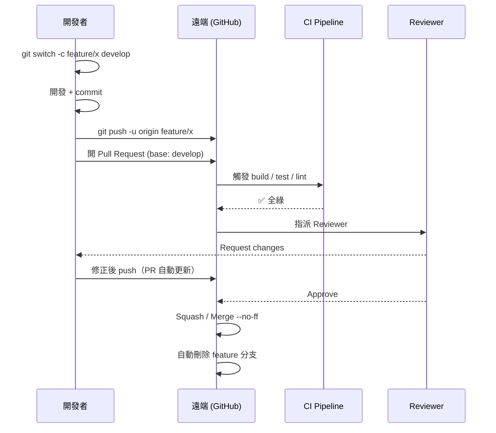

### 11.2 PR 檢查清單

```markdown
## 變更說明
<!-- 這個 PR 做了什麼？為什麼需要？ -->

## 關聯 Issue
Closes #

## 變更類型
- [ ] Bug fix（不破壞既有功能）
- [ ] New feature（不破壞既有功能）
- [ ] Breaking change
- [ ] 文件更新

## 檢查清單
- [ ] 自我 review 過程式碼
- [ ] 已加上必要的註解（複雜邏輯處）
- [ ] 已更新相關文件
- [ ] 沒有產生新的 warning
- [ ] 已加上對應的測試，且本機全數通過
- [ ] 相依的變更已先行合併
- [ ] 沒有把 secret / 憑證 commit 進去
```

### 11.3 分支保護規則（GitHub Settings → Branches）

對 `main` 與 `develop` 建議開啟：

- ✅ Require a pull request before merging（至少 1 位 approval）
- ✅ Require status checks to pass before merging（CI 綠燈才可合）
- ✅ Require branches to be up to date before merging
- ✅ Require conversation resolution before merging
- ✅ Do not allow bypassing the above settings
- ❌ Allow force pushes（**務必關閉**）
- ❌ Allow deletions（**務必關閉**）

### 11.4 CODEOWNERS

`.github/CODEOWNERS`：

```text
*                   @team-leads
/src/auth/          @security-team
/infra/             @devops-team
/k8s/               @devops-team
*.tf                @devops-team
```

### 11.5 Code Review 原則

**Reviewer：**
- 先看整體設計，再看細節
- 區分「必須改」與「建議」：用 `nit:` 前綴標示非阻擋性意見
- 對事不對人：「這個函式在 X 情況下會 panic」而非「你怎麼會這樣寫」
- 24 小時內回應，別讓 PR 卡著

**Author：**
- PR 控制在 400 行以內（超過就拆）
- 標題清楚、描述完整、附截圖或測試結果
- 每一則意見都要回覆（採納或說明為何不採納）

---

## 12. 分支策略比較

| | **GitFlow** | **GitHub Flow** | **GitLab Flow** | **Trunk-Based** |
|---|---|---|---|---|
| 長期分支 | main + develop | main | main + env 分支 | main |
| 短期分支 | feature/release/hotfix | feature | feature | 極短命 feature |
| 發版方式 | release 分支 + tag | 合併即部署 | 逐級推進環境 | 持續部署 + feature flag |
| 分支存活 | 數天～數週 | 數小時～數天 | 數小時～數天 | < 1 天 |
| 複雜度 | 高 | 低 | 中 | 低（但需強測試） |
| **適合** | 有版本號的產品、需維護多版本、有 QA 凍結期、桌面/嵌入式/企業軟體 | SaaS、持續部署、小團隊 | 需要明確環境階段的團隊 | 高頻部署、成熟 CI/CD、大型團隊 |
| **不適合** | 一天部署 10 次的 SaaS | 需要維護多個版本 | — | 測試覆蓋率低的團隊 |

### 何時**不該**用 GitFlow

- 你的產品是 SaaS，只有一個線上版本，且每天部署多次 → 用 GitHub Flow
- 團隊小於 5 人、沒有 QA 凍結期 → GitFlow 的儀式感會拖慢你
- feature 分支經常活超過一週 → 先解決「拆任務」的問題，換模型救不了

### 何時 GitFlow 很好用

- 需要同時維護 v1.x 與 v2.x
- 有明確的 QA / UAT 凍結期
- 發版需要走審批流程
- App Store / 韌體 / 客戶端安裝檔這類「發出去就收不回來」的產品

---

## 13. Git 互動演練場

> 前面十二章是「讀」，這一章是「做」。
> `drills/practice.sh` 會幫你把情境佈置好（包含刻意製造的衝突與災難現場），
> **指令由你自己下**，再由它逐項驗收並給出診斷式回饋。

### 13.1 怎麼用

```bash
chmod +x drills/practice.sh

./drills/practice.sh list         # 列出 12 題
./drills/practice.sh start 5      # 佈置第 5 題並顯示任務
cd /tmp/gitflow-drills/d5         # ← 在這裡下你自己的 git 指令
./drills/practice.sh check 5      # 驗收（在哪個目錄執行都可以）
./drills/practice.sh hint 5       # 卡住時看提示（不含答案）
./drills/practice.sh solve 5      # 真的想不出來才看解答（會自動做完）
./drills/practice.sh reset 5      # 重來一次
./drills/practice.sh clean        # 全部清掉
```

> 練習全部在 `/tmp/gitflow-drills/` 的沙箱 repo 中進行，**不會動到你任何既有專案**。
> 只需要 `git`，不需要 Docker 或 Kubernetes。

### 13.2 12 題一覽

| # | 難度 | 練習 | 你會學到 |
|---|------|------|----------|
| 1 | ⭐ | 第一個 commit：add / commit / .gitignore | 追蹤與忽略的分界 |
| 2 | ⭐ | 三大區域：工作目錄 / 暫存區 / 版本庫 | `restore` 與 `restore --staged` 的天壤之別 |
| 3 | ⭐ | 分支：branch / switch，建立 GitFlow 骨架 | 分支只是指標，開分支近乎零成本 |
| 4 | ⭐⭐ | 合併：fast-forward vs `--no-ff` | 為什麼 GitFlow 堅持 `--no-ff` |
| 5 | ⭐⭐ | **★ 製造並解決合併衝突** | 解衝突五步驟、`zdiff3`、`--abort` |
| 6 | ⭐ | 標籤：annotated vs lightweight | 為何發版一定要 `-a` |
| 7 | ⭐⭐ | 撤銷三兄弟：restore / reset / revert | 「推出去了沒」決定用哪一個 |
| 8 | ⭐⭐ | stash：把做到一半的工作收起來 | `-u` 的陷阱、pop vs apply |
| 9 | ⭐⭐ | cherry-pick：只挑一個 commit | SHA 會變、何時該用它 |
| 10 | ⭐⭐⭐ | rebase：把分支換基底 | rebase 黃金法則、何時該改用 merge |
| 11 | ⭐⭐ | reflog：救回 `reset --hard` 掉的 commit | Git 幾乎刪不掉東西 |
| 12 | ⭐⭐⭐ | **★ 完整 GitFlow 小循環（總複習）** | feature → release → main + tag → develop |

### 13.3 實際長什麼樣

以最重要的**第 5 題（衝突處理）**為例：

```console
$ ./drills/practice.sh start 5

┌────────────────────────────────────────────────────────────┐
│ 練習 5  ⭐⭐  ★ 製造並解決合併衝突                            │
└────────────────────────────────────────────────────────────┘

📋 任務
  develop 與 feature/discount 改到了同一個檔案的相鄰行：
    · develop           freeShipping: 1000 → 500
    · feature/discount  discount: 0.1 → 0.2

  請在 develop 上執行 --no-ff 合併，解決衝突，
  最終 pricing.js 必須同時保留兩邊的修改：
    discount: 0.2  且  freeShipping: 500

💡 建議
  解衝突的順序永遠是這五步：
    1. git status                      看哪些檔案卡住（Unmerged paths）
    2. 編輯檔案                        刪掉 <<<<<<< ======= >>>>>>> 三種標記
    3. git add <file>                  標記為已解決
    4. git status                      確認沒有遺漏
    5. git commit                      完成合併（訊息已預填）

  做錯了不用怕：git merge --abort 隨時可以回到合併前，什麼都沒發生。

📂 練習目錄：/tmp/gitflow-drills/d5
   cd /tmp/gitflow-drills/d5
```

自己動手之後驗收：

```console
$ ./drills/practice.sh check 5

┌────────────────────────────────────────────────────────────┐
│ 驗收：練習 5  ★ 製造並解決合併衝突                           │
└────────────────────────────────────────────────────────────┘
  ✔ 沒有殘留的衝突標記
  ✔ 保留了 feature 的修改（discount: 0.2）
  ✔ 保留了 develop 的修改（freeShipping: 500）
  ✔ HEAD 是合併節點

🎓 學習重點
  衝突不是錯誤，是 Git 在說「這兩個改動我不敢替你決定」。
  它只比對文字，不理解語意 —— 所以解完一定要跑測試。

🎉 全部通過！
   下一題：./drills/practice.sh start 6
```

驗收訊息是**診斷式**的，做錯時會直接告訴你錯在哪個觀念：

```text
✘ HEAD 不是合併節點 —— 你可能做成了 fast-forward（少了 --no-ff）
✘ conf.txt 的修改被丟掉了 —— --staged 參數不能省
✘ wip.txt 不見了 —— stash 時少了 -u，未追蹤檔案沒被收進去
✘ 壞 commit 從歷史中消失了 —— 你用了 reset，但題目說它已經推出去了
✘ ★ release 沒有合回 develop —— 這是 GitFlow 最常見的錯誤（下一版會退版）
```

### 13.4 給初學者的學習路線

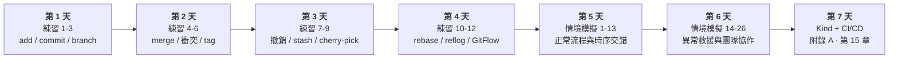

**六個建議**

1. **每個動作前後都 `git status`。** 新手九成的混亂，來自不知道自己現在在哪個狀態。
2. **把 `git log --oneline --graph --decorate --all` 設成別名。** 看得到圖，觀念才立得起來。
3. **刻意把事情搞砸，再救回來。** 練習 11 就是為此設計的 —— 知道救得回來，你才敢用 Git。
4. **先學會 `--abort`，再學那個指令本身。** `merge --abort`、`rebase --abort`、`cherry-pick --abort` 是你的安全網。
5. **commit 要小而頻繁。** Git 唯一救不回來的，是你從未 commit 過的東西。
6. **先分辨「推出去了沒」，再決定用 reset 還是 revert。** 這一題答錯，會害到整個團隊。

**新手最常見的五個誤解**

| 誤解 | 真相 |
|------|------|
| 「commit 就等於備份到雲端」 | commit 只寫在本機 `.git`，要 `push` 才會上遠端 |
| 「.gitignore 可以擋掉任何檔案」 | 對**已追蹤**的檔案無效，要先 `git rm --cached` |
| 「衝突代表我做錯了」 | 衝突是正常的協作結果，Git 只是不敢替你決定 |
| 「`reset --hard` 之後就沒救了」 | `git reflog` 幾乎都救得回來（預設保留 90 天） |
| 「rebase 比 merge 高級，應該都用 rebase」 | 共用分支上 rebase 會害慘同事，見練習 10 |

---

## 14. GitFlow 情境模擬全集

> 這一章把 GitFlow 在真實專案裡會遇到的狀況分成 6 類、26 個情境，
> 每個情境都有**背景 → 操作 → 重點**，指令可直接複製執行。
> 全部情境都能用 `./scenarios/simulate.sh <編號>` 在沙箱 repo 中實際跑一遍（見 [14.7](#147-情境模擬器)）。
>
> 與[第 13 章](#13-git-互動演練場)的差別：
> **演練場是你動手**（練基本功）；**模擬器是自動演示**（看複雜時序怎麼走）。

| 類別 | 情境 | 難度 |
|------|------|------|
| [A. 正常流程](#a-正常流程) | 1–4 | ⭐ |
| [B. 衝突處理](#b-衝突處理) | 5–8 | ⭐⭐ |
| [C. 時序交錯](#c-時序交錯最刁鑽) | 9–13 | ⭐⭐⭐ |
| [D. 異常與救援](#d-異常與救援) | 14–20 | ⭐⭐⭐ |
| [E. 長期維護](#e-長期維護多版本並行) | 21–23 | ⭐⭐⭐ |
| [F. 團隊協作](#f-團隊協作) | 24–26 | ⭐⭐ |

---

### A. 正常流程

#### 情境 1：標準功能開發

**背景**：接到票號 PROJ-101，要新增使用者登入。

```bash
git switch develop && git pull origin develop
git switch -c feature/PROJ-101-user-login

# ... 開發 ...
git add -p && git commit -m "feat(auth): 新增登入表單"
git add -p && git commit -m "feat(auth): 串接登入 API"

git push -u origin feature/PROJ-101-user-login
# → 在 GitHub 開 PR (base: develop) → CI 綠燈 → Review 通過 → 平台合併
```

**重點**：
- 開分支前一定先 `pull`，否則基底是舊的
- 分支名帶票號，之後 `git log --grep=PROJ-101` 找得回來
- 用 PR 合併，不要本機 `git flow feature finish`（會繞過 Review）

---

#### 情境 2：多個 feature 平行開發（互不干擾）

**背景**：A 做登入、B 做購物車，改的是不同檔案。

```bash
# 開發者 A
git switch develop && git switch -c feature/login
echo "login" > src/login.js && git add . && git commit -m "feat: login"

# 開發者 B（同時間）
git switch develop && git switch -c feature/cart
echo "cart" > src/cart.js && git add . && git commit -m "feat: cart"

# A 先合併
git switch develop && git merge --no-ff feature/login -m "Merge feature/login"

# B 合併前先同步 develop，確認沒問題
git switch feature/cart
git merge develop            # 或 rebase develop（分支僅自己在用時）
git switch develop && git merge --no-ff feature/cart -m "Merge feature/cart"
```

**重點**：**後合併的人負責解衝突**。B 應在開 PR 前先把 develop 併進自己的分支，讓 PR 是乾淨的。

---

#### 情境 3：標準發版

**背景**：develop 上累積了 5 個 feature，要發 v1.2.0。

```bash
git switch develop && git pull
git switch -c release/1.2.0

echo "1.2.0" > VERSION
git commit -am "chore(release): bump to 1.2.0"
git push -u origin release/1.2.0          # → 自動部署到 staging，QA 開始測

# QA 回報小 bug，就地修（不回 develop 改）
git commit -am "fix(cart): 修正折扣計算誤差"
git push

# QA 通過 → 完成發版
git switch main && git pull
git merge --no-ff release/1.2.0 -m "Merge branch 'release/1.2.0'"
git tag -a v1.2.0 -m "Release 1.2.0"

git switch develop
git merge --no-ff release/1.2.0 -m "Merge branch 'release/1.2.0' into develop"

git push origin main develop --follow-tags
git branch -d release/1.2.0
git push origin --delete release/1.2.0
```

**重點**：
- release 分支開出去的那一刻，**develop 就解凍**，可以開始收下一版的 feature
- release 上只准 bug fix、版本號、文件；**任何新功能一律退回 develop**
- 一定要**兩邊都合**（main + develop），只合 main 會讓修正在下一版消失

---

#### 情境 4：線上緊急修復

**背景**：v1.2.0 上線後 30 分鐘，發現結帳頁面 crash。

```bash
git switch main && git pull
git switch -c hotfix/1.2.1                # ★ 從 main 開，不是 develop

git commit -am "fix(checkout): 修正 null 導致的 crash"
echo "1.2.1" > VERSION
git commit -am "chore(release): bump to 1.2.1"
git push -u origin hotfix/1.2.1           # → 走快速通道部署到 staging 驗證

# 驗證通過
git switch main
git merge --no-ff hotfix/1.2.1 -m "Merge branch 'hotfix/1.2.1'"
git tag -a v1.2.1 -m "Hotfix 1.2.1"

git switch develop
git merge --no-ff hotfix/1.2.1 -m "Merge branch 'hotfix/1.2.1' into develop"

git push origin main develop --follow-tags
git branch -d hotfix/1.2.1
```

**重點**：hotfix 的基底**必須是 main**。從 develop 開會把還沒發布的功能一起帶上線。

---

### B. 衝突處理

#### 情境 5：兩個 feature 改到同一個檔案

**背景**：A 和 B 都改了 `src/config.js` 的同一行。

```bash
git switch develop
git merge --no-ff feature/b
# CONFLICT (content): Merge conflict in src/config.js
```

```bash
git status                                    # 看 Unmerged paths
git diff --name-only --diff-filter=U          # 只列衝突檔

# 開啟衝突樣式，看得到共同祖先版本
git config --global merge.conflictstyle zdiff3
```

```text
<<<<<<< HEAD
export const TIMEOUT = 5000;      ← develop（含 A 的修改）
||||||| 共同祖先
export const TIMEOUT = 3000;      ← 兩人分家前的原始值
=======
export const TIMEOUT = 10000;     ← feature/b
>>>>>>> feature/b
```

```bash
# 人工判斷後改成正確內容，然後
git add src/config.js
git commit                                    # 訊息已預填
```

**重點**：`zdiff3` 顯示共同祖先，能看出「誰改了什麼」，是解衝突的關鍵資訊。

---

#### 情境 6：feature 分支落後 develop 太久

**背景**：feature 開了 3 週，develop 已前進 80 個 commit。

```bash
# 做法一：rebase（分支只有自己在用）→ 歷史線性乾淨
git switch feature/x
git fetch origin
git rebase origin/develop
# 每個 commit 逐一重放，衝突時：
#   解衝突 → git add <file> → git rebase --continue
#   放棄  → git rebase --abort
git push --force-with-lease                   # ★ 絕不用 --force

# 做法二：merge（分支有多人在用）→ 不改寫他人 SHA
git switch feature/x
git merge origin/develop
git push
```

| | rebase | merge |
|---|---|---|
| 歷史 | 線性 | 有合併節點 |
| SHA | **會改變** | 不變 |
| 適用 | 只有自己用的分支 | 多人共用的分支 |
| 衝突 | 可能要解多次（每個 commit） | 只解一次 |

**重點**：真正的解法是**別讓 feature 活超過 3 天**。拆小票、用 feature flag。

---

#### 情境 7：release 分支的修正回併 develop 時衝突

**背景**：release/1.2.0 上修了 bug，同時 develop 上有人重構了同一段程式。

```bash
git switch develop
git merge --no-ff release/1.2.0
# CONFLICT in src/cart.js
```

**處置**：
1. 這是**語意衝突**，不是文字衝突 — 要判斷「重構後的新結構下，這個 bug 修正該怎麼寫」
2. 找 release 的修正者 + 重構者一起看
3. 解完務必跑測試：`npm test` / `go test ./...`

```bash
git add src/cart.js
git commit
npm test                                      # ★ 一定要驗
```

**重點**：Git 只會告訴你「文字對不上」，**不會告訴你「邏輯錯了」**。release 回併 develop 之後的測試不能省。

---

#### 情境 8：rebase 過程中連續衝突，想放棄

```bash
git rebase develop
# 解到第 4 個 commit 已經崩潰

git rebase --abort            # 完全回到 rebase 前，什麼都沒發生

# 改用 merge 一次解決
git merge develop
```

**重點**：`--abort` 隨時可用，rebase 不是不歸路。若同一段衝突反覆出現，可開啟 rerere 讓 Git 記住你的解法：

```bash
git config --global rerere.enabled true       # reuse recorded resolution
```

---

### C. 時序交錯（最刁鑽）

#### 情境 9：release 凍結期間，develop 繼續開發下一版

**背景**：release/1.2.0 在 QA，同時要開始做 1.3.0 的功能。

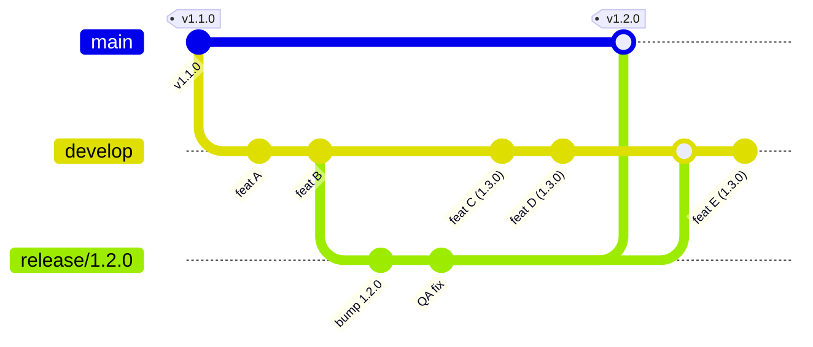

```bash
# QA 團隊在 release/1.2.0
git switch release/1.2.0
git commit -am "fix: QA 回報的問題"

# 開發團隊同時在 develop 做 1.3.0
git switch develop
git switch -c feature/PROJ-201-new-dashboard
# ... 正常開發、正常合回 develop ...
```

**重點**：**這就是 GitFlow 存在的唯一理由**。若沒有 release 分支，QA 期間 develop 就必須凍結，全隊停工等 QA。

---

#### 情境 10：release 進行中發生 hotfix

**背景**：release/1.2.0 還在 staging 測，此時 v1.1.0（線上版）出了緊急 bug。

```bash
git switch main && git switch -c hotfix/1.1.1
git commit -am "fix: 線上緊急修復"

# ① 合進 main + tag（優先，先救火）
git switch main
git merge --no-ff hotfix/1.1.1 -m "Merge hotfix/1.1.1"
git tag -a v1.1.1 -m "Hotfix 1.1.1"

# ② ★ 合進 release/1.2.0（不是 develop！）
git switch release/1.2.0
git merge --no-ff hotfix/1.1.1 -m "Merge hotfix/1.1.1 into release/1.2.0"

# ③ develop 不用另外合 —— release 完成時會自然把它帶進去
#    但若 release 可能被廢棄，則 develop 也要合一份保險
```

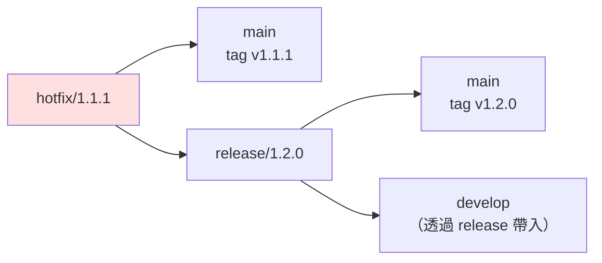

**重點**：release 存在時，hotfix 要合進 **main + release**。
若只合 main + develop，release/1.2.0 上線時會**把這個修復覆蓋掉**（回歸 bug）。

---

#### 情境 11：hotfix 與 release 同時要上線

**背景**：hotfix/1.1.1 與 release/1.2.0 幾乎同時完成。

**正確順序：**

```bash
# ① hotfix 先合 main 並打 tag
git switch main
git merge --no-ff hotfix/1.1.1 && git tag -a v1.1.1 -m "Hotfix 1.1.1"

# ② hotfix 合進 release（讓 release 包含這個修復）
git switch release/1.2.0 && git merge --no-ff hotfix/1.1.1

# ③ release 重新跑完整 QA（因為內容變了！）

# ④ release 合 main 並打 tag
git switch main
git merge --no-ff release/1.2.0 && git tag -a v1.2.0 -m "Release 1.2.0"

# ⑤ release 合回 develop
git switch develop && git merge --no-ff release/1.2.0
```

**重點**：tag 的**時間順序**必須與版本號順序一致（v1.1.1 早於 v1.2.0）。
步驟 ③ 不能省 — release 內容被改動過，先前的 QA 結果已失效。

---

#### 情境 12：兩個 release 分支同時存在

**背景**：release/1.2.0 卡在客戶驗收，商業壓力下必須先切 release/1.3.0。

```bash
git switch develop
git switch -c release/1.3.0        # develop 已含 1.3.0 的功能
```

**風險與處置：**

| 風險 | 處置 |
|------|------|
| 1.2.0 的 QA 修正不會自動進 1.3.0 | 每次 1.2.0 有修正，**手動 cherry-pick 到 1.3.0** |
| 版本號與 tag 順序混亂 | 嚴格規定 1.2.0 必須先 tag 才能 tag 1.3.0 |
| 兩份 staging 環境 | 用 namespace 隔離：`staging-1-2-0`、`staging-1-3-0` |

```bash
# 1.2.0 有修正時
git switch release/1.2.0 && git commit -am "fix: QA issue"
git switch release/1.3.0 && git cherry-pick <sha>
```

**重點**：這是 GitFlow 的**反模式**。真的遇到，代表 release 週期太長，應該檢討發版節奏，而不是靠更多分支硬撐。

---

#### 情境 13：release 被判定不上線（廢棄）

**背景**：release/1.2.0 驗收未通過，功能整批延期。

```bash
# 方案 A：修好再上（首選）—— 留在 release 分支繼續修
git switch release/1.2.0
git commit -am "fix: 驗收問題"

# 方案 B：整批延期 —— 廢棄 release，功能留在 develop
git switch develop
git merge --no-ff release/1.2.0 -m "Merge release/1.2.0 into develop (廢棄，保留修正)"
git branch -D release/1.2.0
git push origin --delete release/1.2.0
# ★ main 完全不動，線上仍是 v1.1.x

# 方案 C：抽掉某個功能後再上
git switch release/1.2.0
git revert -m 1 <feature-X-的-merge-commit-sha>
git commit --amend -m "revert: 移除功能 X，延至 1.3.0"
```

**重點**：
- release 廢棄時**一定要先合回 develop**，否則 release 上的 QA 修正全部白做
- 方案 C 的 revert 之後，功能 X 要重新進版時會踩到[情境 17](#情境-17已合併的-feature-要抽掉) 的陷阱

---

### D. 異常與救援

#### 情境 14：feature 誤從 main 開出

**背景**：忘了先切 develop，直接從 main 開了 feature 分支，已經 commit 了 3 次。

```bash
git log --oneline --graph main develop feature/x     # 先確認基底

# ★ 把 feature/x 從 main 之後的 commit，接到 develop 上
git rebase --onto develop main feature/x

# 語法：git rebase --onto <新基底> <舊基底> <要搬的分支>
git log --oneline --graph --all                      # 確認結果
```

**重點**：`rebase --onto` 是「換基底」的精準工具。若已 push 過，之後要 `--force-with-lease`。

---

#### 情境 15：誤在 main 上直接 commit

```bash
git switch main
git log --oneline -3
# 8b4d9e (HEAD -> main) feat: 不該在這裡的功能   ← 誤 commit
# 3f2a1c (tag: v1.2.0) Merge branch 'release/1.2.0'

# ── 尚未 push ──────────────────────────────
git switch -c feature/rescue          # ① 先開分支保住這個 commit
git switch main
git reset --hard origin/main          # ② main 回到遠端狀態
# ③ 之後從 feature/rescue 走正常 PR 流程進 develop

# ── 已經 push（main 有保護時通常推不上去）────
git revert 8b4d9e                     # 用反向 commit 抵銷
git push origin main
git switch develop
git cherry-pick 8b4d9e                # 把功能帶到正確的分支
```

**重點**：開啟 main 的分支保護就不會發生這件事。預防勝於治療。

---

#### 情境 16：誤把 feature 直接合進 main

```bash
git log --oneline --graph main -5
# a1b2c3 (HEAD -> main) Merge branch 'feature/x'      ← 誤合的 merge commit

# ── 尚未 push ──
git reset --hard HEAD~1               # 直接回到合併前

# ── 已 push ──
git revert -m 1 a1b2c3                # -m 1 = 保留 main 這一邊（第一父）
git push origin main
# 然後走正常流程：feature/x → develop → release → main
```

**重點**：revert 一個 **merge commit** 必須用 `-m` 指定要保留哪一個父。
`-m 1` = 保留被合併進去的目標分支（通常是 main/develop）。

---

#### 情境 17：已合併的 feature 要抽掉

**背景**：feature/X 已經合進 develop，但客戶砍了這個需求。

```bash
git log --oneline --graph develop
# c4d5e6 Merge branch 'feature/X' into develop        ← 要抽掉的合併

git switch develop
git revert -m 1 c4d5e6 -m "revert: 移除功能 X（需求取消）"
git push origin develop
```

**⚠️ 最大陷阱**：日後功能 X 復活，**直接重新 merge 分支是無效的** —
Git 認為那些 commit 已經合併過，不會再帶進來，結果是「合了但程式碼沒回來」。

**正確做法（二選一）：**

```bash
# 做法一：revert 那個 revert（推薦）
git revert <revert-commit-的-sha>

# 做法二：重建分支
git switch -c feature/X-v2 <feature/X-最後一個-commit>
git rebase develop                     # 產生全新 SHA
# → 走正常 PR 流程
```

---

#### 情境 18：tag 打錯了

```bash
# 情況 A：tag 打在錯的 commit（尚未 push）
git tag -d v1.2.0
git tag -a v1.2.0 <正確的-sha> -m "Release 1.2.0"

# 情況 B：已 push（★ 高風險：別人可能已經抓走）
git tag -d v1.2.0
git push origin :refs/tags/v1.2.0            # 刪遠端 tag
git tag -a v1.2.0 <正確的-sha> -m "Release 1.2.0"
git push origin v1.2.0
# → 必須公告全隊：git fetch --tags --force

# 情況 C：版本號打錯（v1.2.0 應為 v1.3.0）
# 最安全：不刪舊 tag，直接補打正確的，並在 Release Notes 註明作廢
git tag -a v1.3.0 <same-sha> -m "Release 1.3.0 (v1.2.0 標記錯誤，已作廢)"
```

**重點**：tag 是**不可變的公開契約**。CI/CD、套件註冊表、客戶下載連結都可能綁著它。能不動就不動。

---

#### 情境 19：develop 被 force push 覆蓋

**背景**：同事誤 `git push --force`，develop 上少了 20 個 commit。

```bash
# ① 任何一位有舊版的人，本機都還留著紀錄
git reflog show origin/develop
# 或
git reflog                                    # 找 force push 前的 SHA

# ② 找到正確的 SHA 後救回來
git switch -c rescue-develop <好的-sha>
git log --oneline | head -25                  # 確認 20 個 commit 都在

# ③ 覆蓋回遠端（需臨時解除分支保護）
git push origin rescue-develop:develop --force-with-lease

# ④ 通知全隊
git fetch origin && git reset --hard origin/develop
```

**預防**：分支保護關閉 force push，這是**一次設定、永久受益**的事。

---

#### 情境 20：機密或大檔進了版控

```bash
# ── 尚未 push ──
git reset --soft HEAD~1
git rm --cached .env
echo ".env" >> .gitignore
git commit -m "chore: 移除誤入版控的 .env"

# ── 已 push（★ 順序很重要）──
# ① 立刻輪換那把金鑰／密碼 —— 它已經外洩了，清歷史救不回來
# ② 再清理歷史
pip install git-filter-repo
git filter-repo --path .env --invert-paths --force
git remote add origin <url>            # filter-repo 會移除 remote
git push origin --force --all
git push origin --force --tags
# ③ 通知所有人重新 clone（舊 clone 仍含機密）
```

**預防**：

```bash
# pre-commit hook 擋機密
brew install gitleaks
gitleaks protect --staged --redact
```

---

### E. 長期維護（多版本並行）

#### 情境 21：同時維護 v1.x 與 v2.x

**背景**：v2.0.0 已發布，但有大客戶仍在 v1.9，需要繼續收 bug 修復。

```bash
# 建立長期支援分支（從 v1.9.0 這個 tag）
git switch -c support/1.x v1.9.0
git push -u origin support/1.x

# git-flow 內建指令
git flow support start 1.x v1.9.0
```

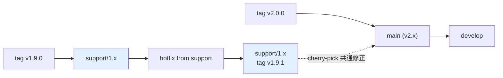

```bash
# v1.x 的緊急修復
git switch support/1.x
git switch -c hotfix/1.9.1
git commit -am "fix: 修復 v1.x 的安全問題"
git switch support/1.x && git merge --no-ff hotfix/1.9.1
git tag -a v1.9.1 -m "Support release 1.9.1"

# 若這個 bug v2 也有 → cherry-pick 到 develop
git switch develop
git cherry-pick <fix-sha>              # 可能需手改（v2 程式結構已不同）
```

**重點**：`support/*` 分支**永不合回 main**。兩條線各自獨立演進，共通修正靠 cherry-pick 同步。

---

#### 情境 22：為舊版客戶做 hotfix

**背景**：線上是 v2.3.0，某客戶還停在 v2.1.0，需要一個只給他們的修補。

```bash
git switch -c hotfix/2.1.1 v2.1.0      # ★ 從舊 tag 開，不是從 main
git commit -am "fix: 修復 2.1.x 的問題"
git tag -a v2.1.1 -m "Hotfix 2.1.1 for legacy customers"
git push origin hotfix/2.1.1 v2.1.1

# ⚠️ 這個 hotfix 不合回 main（main 已是 2.3.x，更新）
# 但要確認同一個 bug 在 main/develop 上是否也存在
git log --oneline v2.1.0..main -- <相關檔案>
```

**重點**：檢查「新版是否也有這個 bug」，別讓修補只停在舊版分支。

---

#### 情境 23：一個修正要進多個版本

**背景**：安全漏洞，v1.9、v2.1、v2.3、develop 都要修。

```bash
# ① 在最舊的分支上修（最容易向前移植）
git switch support/1.x
git switch -c hotfix/1.9.2
git commit -am "fix(security): 修補 XSS 漏洞"
FIX=$(git rev-parse HEAD)

# ② 依序 cherry-pick 到每條線
for BR in support/2.1 support/2.3 main develop; do
  git switch "$BR"
  git cherry-pick "$FIX" || {
    echo "⚠️ $BR 需人工處理"; git cherry-pick --abort;
  }
done

# ③ 每條線各自打 tag、各自跑完整測試
```

**重點**：從**最舊**的分支往新的移植，成功率遠高於反過來（新程式碼常依賴舊版沒有的東西）。

---

### F. 團隊協作

#### 情境 24：多人共用同一個 feature 分支

```bash
# A 建立並發布
git switch -c feature/big-refactor develop
git push -u origin feature/big-refactor

# B 加入
git fetch origin
git switch -c feature/big-refactor origin/feature/big-refactor

# 日常同步（★ 共用分支上絕不 rebase）
git pull --no-rebase origin feature/big-refactor   # 用 merge 而非 rebase
git push origin feature/big-refactor
```

**重點**：共用分支**只 merge、不 rebase**。有人 rebase 過共用分支，其他人下次 pull 就會看到大量假衝突。

若團隊 `pull.rebase=true` 是全域設定，共用分支要明確指定 `--no-rebase`。

---

#### 情境 25：feature 依賴另一個未合併的 feature

**背景**：feature/api 還在 Review，feature/ui 需要用它的成果。

```bash
# 方案 A：疊在上面（stacked branches）
git switch -c feature/ui feature/api        # ★ 從 feature/api 開，不是 develop
# PR 的 base 也要設成 feature/api

# feature/api 合併進 develop 後，把 ui 換基底
git switch feature/ui
git rebase --onto develop feature/api feature/ui
git push --force-with-lease
# PR base 改回 develop

# 方案 B：先把 api 的介面部分獨立成小 PR 快速合併（推薦）
# 方案 C：ui 先用 mock/interface 開發，之後再串接
```

**重點**：stacked branches 一旦超過 2 層就難以維護。優先考慮方案 B — **把 PR 拆小、快速合併**。

---

#### 情境 26：PR 卡太久，develop 已經跑遠

```bash
git switch feature/x
git fetch origin

# 看落後多少
git rev-list --left-right --count origin/develop...feature/x
# 87   12      ← develop 領先 87，你領先 12

# 同步
git rebase origin/develop            # 或 git merge origin/develop
git push --force-with-lease
```

**根治做法：**

| 做法 | 說明 |
|------|------|
| PR ≤ 400 行 | 超過就拆成多個 PR |
| Feature flag | 未完成的功能先合進 develop，用開關隱藏 |
| Review SLA | 24 小時內必須有第一次回覆 |
| Draft PR | 早期就開，讓大家看得到進度 |

---

### 14.7 情境模擬器

本專案附帶 `scenarios/simulate.sh`，會在 `/tmp/gitflow-sandbox/` 建立乾淨的沙箱 repo，
把上述情境真的跑一次（含衝突、救援與驗證），**不會動到你任何既有的專案**。

```bash
chmod +x scenarios/simulate.sh

./scenarios/simulate.sh list        # 列出所有情境
./scenarios/simulate.sh 10          # 只跑情境 10（release 期間的 hotfix）
./scenarios/simulate.sh 1 3 4 9 10  # 跑指定幾個
./scenarios/simulate.sh all         # 全部跑一遍
./scenarios/simulate.sh clean       # 清掉沙箱
```

每個情境會**自我驗證**（全 26 個情境共 39 項斷言，實機執行全數通過）。
以最關鍵的情境 10 為例，實際輸出：

```console
$ ./scenarios/simulate.sh 10

════════════════════════════════════════════════════════════
 情境 10：release 進行中發生 hotfix（★ 最容易做錯）
════════════════════════════════════════════════════════════
▶ 切出 release/1.1.0，QA 進行中
▶ 此時線上 v1.0.0 出事 → 從 main 開 hotfix/1.0.1
▶ ① hotfix → main + tag（先救火）
▶ ② hotfix → release/1.1.0 （★ 關鍵：不是 develop！）
✔ 驗證：release/1.1.0 已包含 hotfix 修正
▶ ③ release 完成 → main + develop
✔ 驗證：v1.1.0 上線後仍保有 hotfix（沒有回歸）
✔ 驗證：develop 也透過 release 拿到修正

--- git log --oneline --graph --all ---
*   Merge branch 'release/1.1.0' into develop
|\
| *   Merge branch 'hotfix/1.0.1' into release/1.1.0
| |\
| | * fix: 線上緊急修復
...

⚠ 若步驟 ② 改成合進 develop 而非 release，v1.1.0 上線時會把 hotfix 覆蓋掉 → 回歸 bug
```

**推薦的閱讀／執行順序**

| 你的情況 | 建議跑哪幾個 |
|----------|-------------|
| 剛學會 GitFlow，想確認自己理解正確 | `1 2 3 4` |
| 準備第一次帶 release | `3 9 13` |
| 準備第一次處理線上事故 | `4 10 11` |
| 團隊常發生合併地獄 | `5 6 7 8 26` |
| 有人把 main 搞壞了 | `15 16 17 19` |
| 要開始維護多個版本 | `21 22 23` |
| **只挑一個看** | `10`（release 期間的 hotfix，最容易做錯） |

---

## 15. 多 Pipeline 設計

GitFlow 的每種分支有不同的**風險等級**與**目的**，因此不該共用同一條 pipeline。
本章把 CI/CD 拆成 **6 條獨立流水線**，各自有不同的觸發條件、檢查強度與審批要求。

> 檔案放在 [`ci-examples/github-actions/`](ci-examples/github-actions/)，**目前為未啟用狀態**
> （不在 `.github/workflows/` 底下，GitHub 不會觸發）。啟用方式見[專案檔案結構](#專案檔案結構)的說明。

### 15.1 全景圖

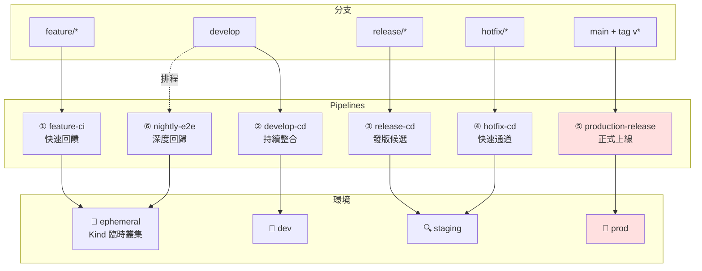

### 15.2 Pipeline 矩陣

| # | Pipeline | 觸發 | 檢查項目 | 部署目標 | 時間預算 | 人工審批 |
|---|----------|------|----------|----------|----------|----------|
| ① | `feature-ci` | push `feature/**`、PR → develop | lint、unit test、build、secret 掃描 | Kind 臨時叢集（PR 專屬） | **< 5 min** | 否 |
| ② | `develop-cd` | push `develop` | ① + 整合測試 + 覆蓋率門檻 | `dev` namespace | < 15 min | 否 |
| ③ | `release-cd` | push `release/**` | ② + E2E + 效能 + 相依漏洞掃描 | `staging` namespace | < 30 min | 否（部署 staging） |
| ④ | `hotfix-cd` | push `hotfix/**` | 精簡：unit + 冒煙測試 | `staging`（快速通道） | **< 8 min** | 是（上 prod 前） |
| ⑤ | `production-release` | push tag `v*` | 映像簽章驗證、manifest diff | `prod` namespace | < 20 min | **是（2 人）** |
| ⑥ | `nightly-e2e` | 每日 02:00 排程 | 完整 GitFlow 回歸、多版本相容、負載測試 | Kind 臨時叢集 | < 90 min | 否 |

### 15.3 Pipeline ①：feature-ci（快速回饋）

`ci-examples/github-actions/01-feature-ci.yml`

```yaml
name: "① feature-ci"

on:
  push:
    branches: ['feature/**']
  pull_request:
    branches: [develop]

concurrency:                      # 同分支新 push 取消舊的跑，省 runner
  group: feature-ci-${{ github.ref }}
  cancel-in-progress: true

permissions:
  contents: read
  pull-requests: write

jobs:
  guard:
    name: 分支規範檢查
    runs-on: ubuntu-latest
    steps:
      - uses: actions/checkout@v4
        with: { fetch-depth: 0 }

      - name: 分支命名必須符合 GitFlow
        if: github.event_name == 'push'
        run: |
          B="${GITHUB_REF#refs/heads/}"
          [[ "$B" =~ ^feature/[a-z0-9._-]+$ ]] || {
            echo "::error::分支名 '$B' 不符 feature/<name> 規範"; exit 1; }

      - name: feature 的 PR 只能指向 develop
        if: github.event_name == 'pull_request'
        run: |
          [[ "${{ github.base_ref }}" == "develop" ]] || {
            echo "::error::feature 分支只能合併到 develop，不可直接進 main"; exit 1; }

      - name: Commit 訊息需符合 Conventional Commits
        if: github.event_name == 'pull_request'
        run: |
          PAT='^(feat|fix|docs|style|refactor|perf|test|build|ci|chore|revert)(\([a-z0-9/_-]+\))?!?: .{1,72}$'
          BAD=0
          while read -r line; do
            [[ "$line" =~ ^(Merge|Revert)\  ]] && continue
            echo "$line" | grep -qE "$PAT" || { echo "❌ $line"; BAD=1; }
          done < <(git log --format=%s origin/${{ github.base_ref }}..HEAD)
          exit $BAD

  quality:
    name: 靜態檢查與單元測試
    runs-on: ubuntu-latest
    needs: guard
    steps:
      - uses: actions/checkout@v4

      - name: Secret 掃描
        uses: gitleaks/gitleaks-action@v2
        env:
          GITHUB_TOKEN: ${{ secrets.GITHUB_TOKEN }}

      - name: Lint
        run: echo "npm run lint / golangci-lint run / ruff check ."

      - name: Unit test（含覆蓋率）
        run: echo "npm test -- --coverage"

      - name: 建置映像
        run: |
          docker build \
            --build-arg APP_VERSION="$(cat VERSION 2>/dev/null || echo 0.0.0-dev)" \
            --build-arg GIT_BRANCH="${GITHUB_REF_NAME}" \
            --build-arg GIT_SHA="${GITHUB_SHA::7}" \
            -t demo-app:${GITHUB_SHA::7} ./app

  preview:
    name: PR 預覽環境（Kind 臨時叢集）
    runs-on: ubuntu-latest
    needs: quality
    if: github.event_name == 'pull_request'
    steps:
      - uses: actions/checkout@v4

      - uses: helm/kind-action@v1
        with:
          cluster_name: pr-${{ github.event.number }}
          config: kind-cluster.yaml

      - name: 部署到臨時叢集並冒煙測試
        run: |
          NS="pr-${{ github.event.number }}"
          docker build -t demo-app:pr ./app
          kind load docker-image demo-app:pr --name "pr-${{ github.event.number }}"
          kubectl create namespace "$NS"
          kubectl -n "$NS" apply -f k8s/base/deployment.yaml
          kubectl -n "$NS" set image deployment/demo-app web=demo-app:pr
          kubectl -n "$NS" rollout status deployment/demo-app --timeout=180s
          kubectl -n "$NS" run smoke --image=curlimages/curl --rm -i --restart=Never -- \
            curl -sf "http://demo-app.${NS}.svc.cluster.local"

      - name: 在 PR 留言結果
        uses: actions/github-script@v7
        with:
          script: |
            github.rest.issues.createComment({
              issue_number: context.issue.number,
              owner: context.repo.owner,
              repo: context.repo.repo,
              body: '✅ 預覽環境部署成功（Kind ephemeral cluster）\n\n映像：`demo-app:pr`'
            })
```

> **Kind 叢集在 job 結束時隨 runner 一起消失**，這正是 PR 預覽環境最省成本的做法 —— 不需要維護一座常駐叢集。

---

### 15.4 Pipeline ②：develop-cd（持續整合 → dev 環境）

`ci-examples/github-actions/02-develop-cd.yml`

```yaml
name: "② develop-cd"

on:
  push:
    branches: [develop]

concurrency:
  group: develop-cd
  cancel-in-progress: false        # ★ 部署不可取消，排隊執行

permissions:
  contents: read
  packages: write

env:
  REGISTRY: ghcr.io
  IMAGE: ${{ github.repository }}/demo-app

jobs:
  build:
    runs-on: ubuntu-latest
    outputs:
      tag: ${{ steps.meta.outputs.tag }}
    steps:
      - uses: actions/checkout@v4

      - id: meta
        run: |
          VER="$(cat VERSION 2>/dev/null || echo 0.0.0)"
          echo "tag=${VER}-dev.${GITHUB_SHA::7}" >> $GITHUB_OUTPUT

      - uses: docker/login-action@v3
        with:
          registry: ${{ env.REGISTRY }}
          username: ${{ github.actor }}
          password: ${{ secrets.GITHUB_TOKEN }}

      - uses: docker/build-push-action@v6
        with:
          context: ./app
          push: true
          tags: ${{ env.REGISTRY }}/${{ env.IMAGE }}:${{ steps.meta.outputs.tag }}
          build-args: |
            APP_VERSION=${{ steps.meta.outputs.tag }}
            GIT_BRANCH=develop
            GIT_SHA=${{ github.sha }}

  test:
    runs-on: ubuntu-latest
    needs: build
    strategy:
      fail-fast: false
      matrix:
        suite: [unit, integration, contract]
    steps:
      - uses: actions/checkout@v4
      - name: 執行 ${{ matrix.suite }} 測試
        run: echo "npm run test:${{ matrix.suite }}"

      - name: 覆蓋率門檻（< 80% 就擋）
        if: matrix.suite == 'unit'
        run: echo "檢查 coverage >= 80%"

  deploy-dev:
    runs-on: ubuntu-latest
    needs: [build, test]
    environment:
      name: development
      url: https://dev.demo.example.com
    steps:
      - uses: actions/checkout@v4

      - name: 設定 kubeconfig
        run: |
          echo "${{ secrets.KUBECONFIG_DEV }}" | base64 -d > /tmp/kubeconfig
          echo "KUBECONFIG=/tmp/kubeconfig" >> $GITHUB_ENV

      - name: 部署到 dev namespace
        run: |
          kubectl -n dev apply -f k8s/base/
          kubectl -n dev set image deployment/demo-app \
            web=${{ env.REGISTRY }}/${{ env.IMAGE }}:${{ needs.build.outputs.tag }}
          kubectl -n dev annotate deployment/demo-app \
            kubernetes.io/change-cause="develop@${GITHUB_SHA::7}" --overwrite
          kubectl -n dev rollout status deployment/demo-app --timeout=180s

      - name: 部署失敗自動回滾
        if: failure()
        run: kubectl -n dev rollout undo deployment/demo-app
```

---

### 15.5 Pipeline ③：release-cd（發版候選 → staging）

`ci-examples/github-actions/03-release-cd.yml`

```yaml
name: "③ release-cd"

on:
  push:
    branches: ['release/**']

concurrency:
  group: release-cd-${{ github.ref }}
  cancel-in-progress: false

jobs:
  validate:
    name: 發版前置檢查
    runs-on: ubuntu-latest
    outputs:
      version: ${{ steps.v.outputs.version }}
    steps:
      - uses: actions/checkout@v4
        with: { fetch-depth: 0 }

      - id: v
        name: 分支名與 VERSION 檔必須一致
        run: |
          BR_VER="${GITHUB_REF#refs/heads/release/}"
          FILE_VER="$(cat VERSION)"
          [[ "$BR_VER" == "$FILE_VER" ]] || {
            echo "::error::分支 release/$BR_VER 與 VERSION 檔 ($FILE_VER) 不一致"; exit 1; }
          [[ "$BR_VER" =~ ^[0-9]+\.[0-9]+\.[0-9]+$ ]] || {
            echo "::error::版本號 '$BR_VER' 不符 SemVer"; exit 1; }
          echo "version=$BR_VER" >> $GITHUB_OUTPUT

      - name: tag 不可重複
        run: |
          git fetch --tags
          git rev-parse "v${{ steps.v.outputs.version }}" >/dev/null 2>&1 && {
            echo "::error::tag v${{ steps.v.outputs.version }} 已存在"; exit 1; } || true

      - name: release 分支不得含新功能 commit
        run: |
          NEW_FEATS=$(git log --format=%s origin/develop..HEAD | grep -c '^feat' || true)
          if [ "$NEW_FEATS" -gt 0 ]; then
            echo "::warning::release 分支上有 $NEW_FEATS 個 feat commit，請確認是否應退回 develop"
            git log --format='  %s' origin/develop..HEAD | grep '^  feat' || true
          fi

  security:
    runs-on: ubuntu-latest
    needs: validate
    steps:
      - uses: actions/checkout@v4
      - name: 相依套件漏洞掃描
        run: echo "npm audit --audit-level=high / trivy fs ."
      - name: 容器映像掃描
        run: |
          docker build -t demo-app:scan ./app
          echo "trivy image --severity HIGH,CRITICAL --exit-code 1 demo-app:scan"

  e2e:
    name: E2E（Kind 全流程）
    runs-on: ubuntu-latest
    needs: validate
    steps:
      - uses: actions/checkout@v4
      - uses: helm/kind-action@v1
        with: { cluster_name: rc, config: kind-cluster.yaml }
      - name: 部署完整堆疊並跑 E2E
        run: |
          docker build -t demo-app:rc ./app
          kind load docker-image demo-app:rc --name rc
          kubectl create namespace rc
          kubectl -n rc apply -f k8s/base/
          kubectl -n rc set image deployment/demo-app web=demo-app:rc
          kubectl -n rc rollout status deployment/demo-app --timeout=240s
          echo "npx playwright test --grep @e2e"

  perf:
    runs-on: ubuntu-latest
    needs: validate
    steps:
      - uses: actions/checkout@v4
      - name: 負載測試（p95 門檻）
        run: echo "k6 run --vus 50 --duration 3m tests/load.js"

  deploy-staging:
    runs-on: ubuntu-latest
    needs: [validate, security, e2e, perf]
    environment:
      name: staging
      url: https://stg.demo.example.com
    steps:
      - uses: actions/checkout@v4
      - name: 部署到 staging
        run: |
          echo "kubectl -n staging set image deployment/demo-app web=...:${{ needs.validate.outputs.version }}-rc.${GITHUB_SHA::7}"
          echo "kubectl -n staging rollout status deployment/demo-app"

  open-pr:
    name: 自動開立 release → main 的 PR
    runs-on: ubuntu-latest
    needs: deploy-staging
    permissions: { contents: read, pull-requests: write }
    steps:
      - uses: actions/checkout@v4
      - uses: actions/github-script@v7
        with:
          script: |
            const head = context.ref.replace('refs/heads/', '');
            const version = head.replace('release/', '');
            const { data: existing } = await github.rest.pulls.list({
              owner: context.repo.owner, repo: context.repo.repo,
              head: `${context.repo.owner}:${head}`, base: 'main', state: 'open',
            });
            if (existing.length) return;
            await github.rest.pulls.create({
              owner: context.repo.owner, repo: context.repo.repo,
              title: `Release ${version}`, head, base: 'main',
              body: [
                `## Release ${version}`, '',
                '- [ ] QA 於 staging 驗證通過',
                '- [ ] Release Notes 已撰寫',
                '- [ ] 資料庫 migration 已確認',
                '- [ ] 回滾方案已確認',
                '', '合併後請立即打上 `v' + version + '` tag 以觸發 production pipeline。',
              ].join('\n'),
            });
```

---

### 15.6 Pipeline ④：hotfix-cd（快速通道）

`ci-examples/github-actions/04-hotfix-cd.yml`

```yaml
name: "④ hotfix-cd"

on:
  push:
    branches: ['hotfix/**']

concurrency:
  group: hotfix-cd-${{ github.ref }}
  cancel-in-progress: true

jobs:
  fast-check:
    name: 精簡檢查（目標 < 8 分鐘）
    runs-on: ubuntu-latest
    timeout-minutes: 10
    outputs:
      version: ${{ steps.v.outputs.version }}
    steps:
      - uses: actions/checkout@v4
        with: { fetch-depth: 0 }

      - id: v
        run: echo "version=${GITHUB_REF#refs/heads/hotfix/}" >> $GITHUB_OUTPUT

      - name: ★ hotfix 必須以 main 為基底
        run: |
          git fetch origin main
          BASE=$(git merge-base origin/main HEAD)
          MAIN=$(git rev-parse origin/main)
          if [ "$BASE" != "$MAIN" ]; then
            echo "::error::hotfix 分支不是從最新的 main 開出來的"
            echo "請執行：git rebase --onto origin/main \$(git merge-base origin/main HEAD)"
            exit 1
          fi

      - name: hotfix 只能是 PATCH 版本號遞增
        run: |
          git fetch --tags
          LAST=$(git describe --tags --abbrev=0 origin/main)
          echo "上一版：$LAST → 本次：v${{ steps.v.outputs.version }}"
          echo "${{ steps.v.outputs.version }}" | grep -qE '^[0-9]+\.[0-9]+\.[1-9][0-9]*$' || {
            echo "::error::hotfix 版本號必須是 PATCH 遞增（x.y.Z）"; exit 1; }

      - name: hotfix 變更範圍檢查（過大就警告）
        run: |
          CHANGED=$(git diff --shortstat origin/main...HEAD)
          echo "變更：$CHANGED"
          LINES=$(git diff --numstat origin/main...HEAD | awk '{s+=$1+$2} END {print s+0}')
          [ "$LINES" -lt 300 ] || echo "::warning::hotfix 變更 $LINES 行，超出建議範圍（<300），請確認不是偽裝的 feature"

      - name: Unit test + 冒煙測試
        run: echo "npm run test:unit && npm run test:smoke"

  deploy-staging:
    runs-on: ubuntu-latest
    needs: fast-check
    environment: { name: staging }
    steps:
      - run: echo "kubectl -n staging set image deployment/demo-app web=...:hotfix-${GITHUB_SHA::7}"

  notify:
    runs-on: ubuntu-latest
    needs: deploy-staging
    steps:
      - name: 通知值班人員驗證
        run: |
          echo "🚨 Hotfix v${{ needs.fast-check.outputs.version }} 已部署到 staging"
          echo "驗證通過後，請合併 hotfix → main 並打 tag 以觸發 production pipeline"
          echo "★ 別忘了同時合併回 develop"

  remind-develop-sync:
    name: 提醒同步回 develop
    runs-on: ubuntu-latest
    needs: fast-check
    permissions: { contents: read, pull-requests: write }
    steps:
      - uses: actions/checkout@v4
        with: { fetch-depth: 0 }
      - uses: actions/github-script@v7
        with:
          script: |
            const head = context.ref.replace('refs/heads/', '');
            for (const base of ['main', 'develop']) {
              const { data: ex } = await github.rest.pulls.list({
                owner: context.repo.owner, repo: context.repo.repo,
                head: `${context.repo.owner}:${head}`, base, state: 'open' });
              if (ex.length) continue;
              await github.rest.pulls.create({
                owner: context.repo.owner, repo: context.repo.repo,
                title: `[Hotfix] ${head} → ${base}`, head, base,
                body: `Hotfix 必須同時合併回 \`main\` 與 \`develop\`，此 PR 為自動建立。`,
              }).catch(() => {});
            }
```

> **為何 hotfix 要獨立一條 pipeline？**
> 因為它的目標是**分鐘級**修復。跑完整 30 分鐘的 release pipeline，線上就多壞 30 分鐘。
> 代價是檢查較淺 — 所以用「必須從 main 開」「變更 < 300 行」「必須人工審批上 prod」來補回安全性。

---

### 15.7 Pipeline ⑤：production-release（正式上線）

`ci-examples/github-actions/05-production-release.yml`

```yaml
name: "⑤ production-release"

on:
  push:
    tags: ['v*.*.*']

concurrency:
  group: production-release
  cancel-in-progress: false

permissions:
  contents: write
  packages: write
  id-token: write            # 供 cosign keyless 簽章使用

jobs:
  verify:
    name: 上線前驗證
    runs-on: ubuntu-latest
    outputs:
      version: ${{ steps.v.outputs.version }}
    steps:
      - uses: actions/checkout@v4
        with: { fetch-depth: 0 }

      - id: v
        run: echo "version=${GITHUB_REF#refs/tags/v}" >> $GITHUB_OUTPUT

      - name: ★ tag 必須位於 main 分支上
        run: |
          git fetch origin main
          git merge-base --is-ancestor "$GITHUB_SHA" origin/main || {
            echo "::error::tag ${GITHUB_REF_NAME} 不在 main 分支上，拒絕上線"; exit 1; }

      - name: VERSION 檔需與 tag 一致
        run: |
          [[ "$(cat VERSION)" == "${{ steps.v.outputs.version }}" ]] || {
            echo "::error::VERSION 檔與 tag 不一致"; exit 1; }

      - name: 產生 Changelog
        run: |
          PREV=$(git describe --tags --abbrev=0 "${GITHUB_REF_NAME}^" 2>/dev/null || echo "")
          RANGE=${PREV:+$PREV..}${GITHUB_REF_NAME}
          {
            echo "## What's Changed"; echo
            echo "### ✨ Features";  git log --format='- %s (%h)' $RANGE | grep '^- feat' || echo "- 無"
            echo; echo "### 🐛 Fixes"; git log --format='- %s (%h)' $RANGE | grep '^- fix'  || echo "- 無"
            echo; echo "**Full Changelog**: ${PREV:-初版}...${GITHUB_REF_NAME}"
          } > CHANGELOG_RELEASE.md
          cat CHANGELOG_RELEASE.md

      - uses: actions/upload-artifact@v4
        with: { name: changelog, path: CHANGELOG_RELEASE.md }

  build-sign:
    runs-on: ubuntu-latest
    needs: verify
    steps:
      - uses: actions/checkout@v4
      - uses: docker/login-action@v3
        with:
          registry: ghcr.io
          username: ${{ github.actor }}
          password: ${{ secrets.GITHUB_TOKEN }}
      - uses: docker/build-push-action@v6
        id: push
        with:
          context: ./app
          push: true
          tags: |
            ghcr.io/${{ github.repository }}/demo-app:${{ needs.verify.outputs.version }}
            ghcr.io/${{ github.repository }}/demo-app:latest
          build-args: |
            APP_VERSION=${{ needs.verify.outputs.version }}
            GIT_BRANCH=main
            GIT_SHA=${{ github.sha }}
      - uses: sigstore/cosign-installer@v3
      - name: 簽署映像
        run: |
          cosign sign --yes \
            ghcr.io/${{ github.repository }}/demo-app@${{ steps.push.outputs.digest }}

  deploy-prod:
    name: 部署到 Production（需人工審批）
    runs-on: ubuntu-latest
    needs: [verify, build-sign]
    environment:
      name: production           # ★ 在 GitHub Settings 設定 required reviewers
      url: https://demo.example.com
    steps:
      - uses: actions/checkout@v4

      - name: 顯示 manifest 差異供審查
        run: echo "kubectl -n prod diff -f k8s/base/ || true"

      - name: 金絲雀部署（先 10% 流量）
        run: |
          echo "kubectl -n prod set image deployment/demo-app-canary web=...:${{ needs.verify.outputs.version }}"
          echo "kubectl -n prod rollout status deployment/demo-app-canary --timeout=300s"

      - name: 觀察錯誤率 5 分鐘
        run: echo "檢查 Prometheus：error_rate < 1% 且 p95 < 500ms"

      - name: 全量部署
        run: |
          echo "kubectl -n prod set image deployment/demo-app web=...:${{ needs.verify.outputs.version }}"
          echo "kubectl -n prod rollout status deployment/demo-app --timeout=600s"

      - name: 上線後冒煙測試
        run: echo "curl -sf https://demo.example.com/healthz"

      - name: ⛑ 失敗自動回滾
        if: failure()
        run: |
          echo "kubectl -n prod rollout undo deployment/demo-app"
          echo "kubectl -n prod rollout status deployment/demo-app"

  github-release:
    runs-on: ubuntu-latest
    needs: [verify, deploy-prod]
    steps:
      - uses: actions/download-artifact@v4
        with: { name: changelog }
      - uses: softprops/action-gh-release@v2
        with:
          body_path: CHANGELOG_RELEASE.md
          generate_release_notes: false

  sync-develop:
    name: 檢查 main 是否已同步回 develop
    runs-on: ubuntu-latest
    needs: deploy-prod
    steps:
      - uses: actions/checkout@v4
        with: { fetch-depth: 0 }
      - run: |
          git fetch origin main develop
          BEHIND=$(git rev-list --count origin/develop..origin/main)
          if [ "$BEHIND" -gt 0 ]; then
            echo "::warning::main 有 $BEHIND 個 commit 尚未合回 develop"
            git log --oneline origin/develop..origin/main
            echo "請執行：git switch develop && git merge --no-ff main && git push"
          else
            echo "✅ develop 已包含 main 的所有變更"
          fi
```

---

### 15.8 Pipeline ⑥：nightly-e2e（深度回歸）

`ci-examples/github-actions/06-nightly-e2e.yml`

```yaml
name: "⑥ nightly-e2e"

on:
  schedule:
    - cron: '0 18 * * *'        # UTC 18:00 = 台北 02:00
  workflow_dispatch:            # 允許手動觸發

jobs:
  gitflow-health:
    name: GitFlow 健康檢查
    runs-on: ubuntu-latest
    steps:
      - uses: actions/checkout@v4
        with: { fetch-depth: 0 }

      - name: main 與 develop 的分歧狀況
        run: |
          git fetch origin
          echo "### main → develop 未同步的 commit"
          git log --oneline origin/develop..origin/main || true
          echo "### develop 領先 main 的 commit 數"
          git rev-list --count origin/main..origin/develop

      - name: 找出長壽 feature 分支（> 7 天）
        run: |
          NOW=$(date +%s)
          git for-each-ref --format='%(refname:short) %(committerdate:unix)' refs/remotes/origin/feature | \
          while read -r br ts; do
            DAYS=$(( (NOW - ts) / 86400 ))
            [ "$DAYS" -gt 7 ] && echo "::warning::$br 已 $DAYS 天未更新，建議合併或關閉"
          done || true

      - name: 檢查是否有多個 release 分支並存
        run: |
          N=$(git branch -r --list 'origin/release/*' | wc -l)
          [ "$N" -le 1 ] || echo "::warning::目前有 $N 個 release 分支並存（GitFlow 反模式）"

      - name: 未合併的 hotfix 檢查
        run: |
          for h in $(git branch -r --list 'origin/hotfix/*'); do
            git merge-base --is-ancestor "$h" origin/develop || \
              echo "::warning::$h 尚未合併回 develop"
          done || true

  full-regression:
    name: 多版本 Kind 相容性回歸
    runs-on: ubuntu-latest
    strategy:
      fail-fast: false
      matrix:
        k8s: [v1.32.0, v1.33.0, v1.34.0]
    steps:
      - uses: actions/checkout@v4
      - uses: helm/kind-action@v1
        with:
          cluster_name: nightly-${{ strategy.job-index }}
          node_image: kindest/node:${{ matrix.k8s }}
          config: kind-cluster.yaml

      - name: 部署三個環境並驗證
        run: |
          docker build -t demo-app:nightly ./app
          kind load docker-image demo-app:nightly --name nightly-${{ strategy.job-index }}
          for NS in dev staging prod; do
            kubectl create namespace "$NS"
            kubectl -n "$NS" apply -f k8s/base/deployment.yaml
            kubectl -n "$NS" set image deployment/demo-app web=demo-app:nightly
            kubectl -n "$NS" rollout status deployment/demo-app --timeout=240s
            echo "✅ $NS on k8s ${{ matrix.k8s }}"
          done

      - name: 回滾演練
        run: |
          kubectl -n prod set image deployment/demo-app web=demo-app:nightly
          kubectl -n prod rollout status deployment/demo-app --timeout=120s
          kubectl -n prod rollout undo deployment/demo-app
          kubectl -n prod rollout status deployment/demo-app --timeout=120s
          echo "✅ 回滾機制正常"

  load-test:
    runs-on: ubuntu-latest
    needs: full-regression
    steps:
      - uses: actions/checkout@v4
      - run: echo "k6 run --vus 200 --duration 10m tests/load.js"
```

---

### 15.9 Pipeline 設計原則

| 原則 | 說明 |
|------|------|
| **分層檢查** | 越靠近 production，檢查越嚴；越靠近開發者，回饋越快 |
| **Fail fast** | 便宜的檢查（lint、分支命名）排最前面，貴的（E2E、負載）排後面 |
| **concurrency 控制** | feature：`cancel-in-progress: true`（省資源）；部署類：`false`（不可中斷） |
| **環境即審批** | 用 GitHub Environment 的 required reviewers 做人工閘門，而非在腳本裡寫 `if` |
| **回滾優先於修復** | 每條部署 pipeline 都要有 `if: failure()` 的自動回滾 |
| **Pipeline 也要版控** | workflow 檔案跟著 GitFlow 走，修改 pipeline 也要開 PR |
| **臨時叢集** | PR 預覽與 E2E 用 Kind 隨開隨關，不維護常駐測試環境 |
| **不可變映像** | 同一個 SHA 建出的映像，從 dev 一路用到 prod，不重新 build |

### 15.10 分支保護與 pipeline 的對應

| 分支 | 必過的 status checks | 審批人數 |
|------|---------------------|----------|
| `develop` | `① guard`、`① quality` | 1 |
| `release/**` | `② test`、`③ security`、`③ e2e` | 1 |
| `main` | `③ deploy-staging`、`④ fast-check`（hotfix 時） | **2** |
| tag `v*` | — （由 environment 的 required reviewers 把關） | **2** |

---

## 附錄 A：Kind + Kubernetes 部署

本附錄示範如何在本機用 **Kind**（Kubernetes IN Docker）建立叢集，
並把 GitFlow 的 `develop` / `release` / `main` 分支對應到 `dev` / `staging` / `prod` 三個 namespace。

### A.1 前置需求

```bash
# 必要：容器執行環境（擇一）
# 1) Docker Desktop  →  https://www.docker.com/products/docker-desktop/
# 2) Colima（macOS 輕量替代方案）
brew install colima docker
colima start --cpu 4 --memory 8 --disk 60

# 確認 daemon 有在跑
docker info | head -5
```

> ⚠️ Kind 是「把 Kubernetes 節點跑成 Docker 容器」，**沒有執行中的 Docker/Podman daemon 就無法建立叢集**。

### A.2 安裝 Kind 與 kubectl

```bash
# macOS
brew install kind kubectl

# Linux (amd64)
[ "$(uname -m)" = "x86_64" ] && ARCH=amd64 || ARCH=arm64
curl -Lo ./kind "https://kind.sigs.k8s.io/dl/latest/kind-linux-${ARCH}"
chmod +x ./kind && sudo mv ./kind /usr/local/bin/kind

curl -LO "https://dl.k8s.io/release/$(curl -Ls https://dl.k8s.io/release/stable.txt)/bin/linux/${ARCH}/kubectl"
chmod +x kubectl && sudo mv kubectl /usr/local/bin/

# 驗證
kind version
kubectl version --client
```

### A.3 建立叢集

`kind-cluster.yaml`：

```yaml
kind: Cluster
apiVersion: kind.x-k8s.io/v1alpha4
name: gitflow-demo
nodes:
  - role: control-plane
    kubeadmConfigPatches:
      - |
        kind: InitConfiguration
        nodeRegistration:
          kubeletExtraArgs:
            node-labels: "ingress-ready=true"
    extraPortMappings:
      - containerPort: 80          # Ingress HTTP
        hostPort: 8080
        protocol: TCP
      - containerPort: 443         # Ingress HTTPS
        hostPort: 8443
        protocol: TCP
  - role: worker
  - role: worker
```

```bash
kind create cluster --config kind-cluster.yaml

# 常用管理指令
kind get clusters
kubectl cluster-info --context kind-gitflow-demo
kubectl get nodes -o wide
kubectl config use-context kind-gitflow-demo

# 刪除
kind delete cluster --name gitflow-demo
```

實機輸出（Kind 0.32）：

```text
NAME                         STATUS   ROLES           AGE   VERSION
gitflow-demo-control-plane   Ready    control-plane   47s   v1.36.1
gitflow-demo-worker          Ready    <none>          33s   v1.36.1
gitflow-demo-worker2         Ready    <none>          34s   v1.36.1
```

> Kubernetes 版本由 Kind 的版本決定（Kind 0.32 → k8s 1.36.1）。
> 要指定版本請用 `kind create cluster --image kindest/node:v1.34.0`。

### A.4 安裝 Ingress Controller

```bash
kubectl apply -f https://raw.githubusercontent.com/kubernetes/ingress-nginx/main/deploy/static/provider/kind/deploy.yaml

kubectl wait --namespace ingress-nginx \
  --for=condition=ready pod \
  --selector=app.kubernetes.io/component=controller \
  --timeout=180s
```

#### 實測踩到的兩個坑（Kind + ingress-nginx）

**坑 1：controller 被排到 worker 節點，Ingress 完全不通**

`kind-cluster.yaml` 的 `extraPortMappings` 只開在 control-plane 上，但新版的
ingress-nginx kind provider manifest **已經拿掉 `ingress-ready` 的 nodeSelector**，
controller 可能被排到 worker，導致 host 的 8080 埠打不到任何東西。

```bash
# 確認它跑在哪個節點
kubectl -n ingress-nginx get pod -o wide -l app.kubernetes.io/component=controller
# NAME                            ...   NODE
# ingress-nginx-controller-xxx    ...   gitflow-demo-worker      ← ✘ 不通

# 釘回有 port mapping 的節點
kubectl -n ingress-nginx patch deployment ingress-nginx-controller --type=json \
  -p='[{"op":"add","path":"/spec/template/spec/nodeSelector/ingress-ready","value":"true"}]'

kubectl -n ingress-nginx rollout status deployment/ingress-nginx-controller
# NAME                            ...   NODE
# ingress-nginx-controller-yyy    ...   gitflow-demo-control-plane   ← ✔ 通了
```

**坑 2：controller 還沒起來就 apply Ingress，被 admission webhook 拒絕**

```text
Error from server (InternalError): failed calling webhook "validate.nginx.ingress.kubernetes.io":
dial tcp 10.96.46.42:443: connect: connection refused
```

controller 的映像要拉 ~110MB，第一次可能等 30 秒以上。
`scripts/deploy.sh` 對此做了**優雅降級**：等不到 controller 就跳過 Ingress，改提示用
`port-forward`，讓部署本身不會因為 Ingress 而失敗。

**坑 3：先 apply 再 patch host，會被判定為 host 重複**

base manifest 裡的 host 只能有一個預設值。若像下面這樣「先 apply、再 patch 成正確的 host」：

```bash
kubectl -n dev apply -f k8s/base/ingress.yaml     # host 還是預設的 demo.localtest.me
kubectl -n dev patch ingress demo-app ...          # 才改成 dev.demo.localtest.me
```

一旦 prod 已經用掉了 `demo.localtest.me`，`apply` 那一步就會被 webhook 擋下：

```text
admission webhook "validate.nginx.ingress.kubernetes.io" denied the request:
host "demo.localtest.me" and path "/" is already defined in ingress prod/demo-app
```

**正解是在 apply 之前就把 host 換好**（`scripts/deploy.sh` 採用的做法）：

```bash
TMP_ING="$(mktemp)"
sed "s|host: .*|host: ${HOST}|" k8s/base/ingress.yaml > "$TMP_ING"
kubectl -n "$NS" apply -f "$TMP_ING"
rm -f "$TMP_ING"
```

> 正式專案請改用 Kustomize 的 overlay 或 Helm 的 values 來做環境差異化，
> 這裡用 `sed` 是為了讓範例不引入額外工具。

驗證三個環境真的各自獨立：

```console
$ for h in dev.demo stg.demo demo; do
    curl -s -H "Host: ${h}.localtest.me" http://localhost:8080/ | grep -oE '<b>[^<]*</b>|<code>[^<]*</code>'
  done

dev.demo.localtest.me      1.2.0-dev.0589c2b   develop         dev
stg.demo.localtest.me      1.1.0-rc.ddf9df0    release/1.1.0   staging
demo.localtest.me          1.1.0.77f1e19       main            prod
```

### A.5 建立對應 GitFlow 的三個環境

```bash
kubectl create namespace dev
kubectl create namespace staging
kubectl create namespace prod

kubectl label namespace dev     gitflow-branch=develop
kubectl label namespace staging gitflow-branch=release
kubectl label namespace prod    gitflow-branch=main

kubectl get ns -L gitflow-branch
```

### A.6 應用程式與 Manifest

`app/Dockerfile`：

```dockerfile
FROM nginx:1.27-alpine
ARG APP_VERSION=dev
ARG GIT_BRANCH=unknown
ARG GIT_SHA=unknown
RUN printf '<!doctype html><html><head><meta charset="utf-8"><title>GitFlow Demo</title></head>\
<body style="font-family:sans-serif;padding:3rem">\
<h1>GitFlow Demo App</h1>\
<p>Version: <b>%s</b></p><p>Branch: <b>%s</b></p><p>Commit: <code>%s</code></p>\
</body></html>' "$APP_VERSION" "$GIT_BRANCH" "$GIT_SHA" > /usr/share/nginx/html/index.html
EXPOSE 80
```

`k8s/base/deployment.yaml`：

```yaml
apiVersion: apps/v1
kind: Deployment
metadata:
  name: demo-app
  labels:
    app: demo-app
spec:
  replicas: 2
  selector:
    matchLabels:
      app: demo-app
  template:
    metadata:
      labels:
        app: demo-app
    spec:
      containers:
        - name: web
          image: demo-app:dev          # 由 CI 覆寫成實際 tag
          imagePullPolicy: IfNotPresent
          ports:
            - containerPort: 80
          resources:
            requests: { cpu: 50m,  memory: 64Mi }
            limits:   { cpu: 200m, memory: 128Mi }
          readinessProbe:
            httpGet: { path: /, port: 80 }
            initialDelaySeconds: 2
            periodSeconds: 5
          livenessProbe:
            httpGet: { path: /, port: 80 }
            initialDelaySeconds: 10
            periodSeconds: 15
---
apiVersion: v1
kind: Service
metadata:
  name: demo-app
spec:
  selector:
    app: demo-app
  ports:
    - port: 80
      targetPort: 80
```

`k8s/base/ingress.yaml`：

```yaml
apiVersion: networking.k8s.io/v1
kind: Ingress
metadata:
  name: demo-app
  annotations:
    nginx.ingress.kubernetes.io/rewrite-target: /
spec:
  ingressClassName: nginx
  rules:
    - host: demo.localtest.me       # localtest.me 一律解析到 127.0.0.1
      http:
        paths:
          - path: /
            pathType: Prefix
            backend:
              service:
                name: demo-app
                port:
                  number: 80
```

### A.7 一鍵部署腳本

完整腳本見 [`scripts/deploy.sh`](scripts/deploy.sh)。核心是[前面 C4 Level 4](#level-4--code關鍵資料結構) 那張分支路由表，
外加五個步驟：建置映像 → `kind load` 進節點 → 套用 manifest → 覆寫映像/replica/host → 等待滾動更新（失敗自動回滾）。

```bash
chmod +x scripts/deploy.sh

git switch develop       && ./scripts/deploy.sh    # → dev     (1 replica)
git switch release/1.1.0 && ./scripts/deploy.sh    # → staging (2 replicas)
git switch main          && ./scripts/deploy.sh    # → prod    (3 replicas)
```

**實機執行結果**

```console
$ ./scripts/deploy.sh develop
────────────────────────────────────────────
  分支    : develop
  環境    : dev  (replicas=1)
  映像    : demo-app:1.0.0-dev.d5059e4
  網址    : http://dev.demo.localtest.me:8080
────────────────────────────────────────────
▶ [1/5] 建置映像
▶ [2/5] 載入映像到 Kind 節點
▶ [3/5] 確保 namespace 存在
▶ [4/5] 套用 manifest
▶ [5/5] 等待滾動更新
deployment "demo-app" successfully rolled out
✅ 部署完成
   http://dev.demo.localtest.me:8080
```

三個分支各部署一次後，三個環境同時線上：

```console
$ kubectl get deploy -A -l app=demo-app \
    -o custom-columns='NAMESPACE:.metadata.namespace,READY:.status.readyReplicas,\
IMAGE:.spec.template.spec.containers[0].image,CHANGE-CAUSE:.metadata.annotations.kubernetes\.io/change-cause'

NAMESPACE   READY   IMAGE                        CHANGE-CAUSE
dev         1       demo-app:1.0.0-dev.d5059e4   develop@d5059e4
staging     2       demo-app:1.1.0-rc.ddf9df0    release/1.1.0@ddf9df0
prod        3       demo-app:1.1.0.77f1e19       main@77f1e19
```

> `CHANGE-CAUSE` 欄位是靠 `kubectl annotate ... kubernetes.io/change-cause` 寫入的。
> 上線出事時，`kubectl rollout history` 一眼就能看出「這一版是從哪個分支的哪個 commit 來的」——
> 這是把 GitFlow 接上 K8s 時最值得做的一件小事。

**三個環境的隔離驗證**

```console
$ for h in dev.demo stg.demo demo; do curl -s -H "Host: ${h}.localtest.me" http://localhost:8080/; done
Version: 1.0.0-dev.d5059e4  Branch: develop        Environment: dev
Version: 1.1.0-rc.ddf9df0   Branch: release/1.1.0  Environment: staging
Version: 1.1.0.77f1e19      Branch: main           Environment: prod
```

映像把「自己來自哪個分支」烙進 `index.html`，所以打開網頁就能確認部署對不對 ——
這是驗證分支策略最直觀的方式。

### A.8 GitHub Actions：GitFlow → K8s 自動部署

完整的 6 條 pipeline 已獨立成[第 15 章](#15-多-pipeline-設計)，
可執行的檔案在 [`ci-examples/github-actions/`](ci-examples/github-actions/)。與本附錄相關的重點：

| Pipeline | 與 Kind 的關係 |
|----------|---------------|
| ① `feature-ci` | 用 `helm/kind-action` 開**臨時叢集**做 PR 預覽，job 結束即銷毀 |
| ③ `release-cd` | 在臨時叢集跑完整 E2E，再部署到常駐的 staging |
| ⑥ `nightly-e2e` | 用 matrix 在 k8s 1.34 / 1.35 / 1.36 上各跑一次，驗證相容性與回滾機制 |

CI 中建立 Kind 叢集只要三行：

```yaml
      - uses: helm/kind-action@v1
        with:
          cluster_name: ci
          config: kind-cluster.yaml
```

> **不要維護常駐的測試叢集。** PR 預覽與 E2E 用 Kind 隨開隨關，
> 每次都是乾淨環境，成本只有 runner 的幾分鐘，也不會有「測試環境被別人佔用」的問題。


### A.9 K8s 常用除錯指令

```bash
kubectl get all -n dev                        # 該 namespace 全部資源
kubectl get pods -n dev -w                    # 持續觀察 pod 狀態
kubectl describe pod <pod> -n dev             # ★ 看 Events，90% 的問題在這
kubectl logs <pod> -n dev                     # 看日誌
kubectl logs <pod> -n dev --previous          # 看上一個掛掉的容器的日誌
kubectl logs -f deployment/demo-app -n dev    # 持續追蹤
kubectl exec -it <pod> -n dev -- sh           # 進容器
kubectl port-forward svc/demo-app 8000:80 -n dev   # 本機直連 service

kubectl rollout history deployment/demo-app -n dev  # 部署歷史
kubectl rollout undo deployment/demo-app -n dev     # ★ 一鍵回滾
kubectl rollout undo deployment/demo-app -n dev --to-revision=2

kubectl get events -n dev --sort-by=.lastTimestamp  # 依時間排序的事件
kubectl top pods -n dev                             # 資源用量（需 metrics-server）
```

### A.10 Kind 常見問題

| 問題 | 原因 | 解法 |
|------|------|------|
| `failed to connect to the docker API at unix:///var/run/docker.sock` | 沒有執行中的容器 daemon | 啟動 Docker Desktop，或 `colima start --cpu 4 --memory 8 --disk 60` |
| Pod 卡在 `ErrImagePull` | **Kind 節點看不到本機 docker 映像** | `kind load docker-image <image> --name <cluster>` |
| `ImagePullBackOff` 但已 load | `imagePullPolicy: Always` 逼它去 registry 抓 | 改成 `IfNotPresent` |
| **Ingress 回 connection refused** | controller 被排到沒有 port mapping 的 worker | 見 [A.4 坑 1](#實測踩到的兩個坑kind--ingress-nginx)：patch nodeSelector `ingress-ready=true` |
| **apply Ingress 被 webhook 拒絕** | controller 尚未就緒（映像要拉 ~110MB） | `kubectl wait -n ingress-nginx --for=condition=ready pod -l app.kubernetes.io/component=controller` |
| 叢集建立超時 | 記憶體不足 | Docker Desktop / Colima 調高至 ≥ 8GB |
| Pod 一直 `Pending` | 資源不足或無可用節點 | `kubectl describe pod` 看 Events |
| k8s 版本跟預期不同 | 版本由 Kind 版本決定 | `kind create cluster --image kindest/node:v1.34.0` |
| 清理磁碟 | Kind 映像佔空間 | `kind delete cluster --all && docker system prune -af` |
| **Colima：hostPort 打不通** | VM 的 port forwarding 未生效 | `docker port <control-plane>` 確認映射；或改用 `kubectl port-forward` |

---

## 附錄 B：疑難排解 FAQ

### B.1 認證與連線

```bash
# Permission denied (publickey)
ssh -T git@github.com -v            # 查看握手細節
ssh-add -l                          # 確認金鑰已載入 agent
ssh-add ~/.ssh/id_ed25519

# 想從 HTTPS 換成 SSH
git remote set-url origin git@github.com:user/repo.git

# HTTPS 每次都要輸密碼（macOS）
git config --global credential.helper osxkeychain
```

### B.2 常見錯誤與解法

| 錯誤訊息 | 原因 | 解法 |
|---------|------|------|
| `Updates were rejected because the remote contains work...` | 遠端有你沒有的 commit | `git pull --rebase` 後再 push |
| `fatal: refusing to merge unrelated histories` | 兩個歷史無共同祖先 | `git pull --allow-unrelated-histories` |
| `error: Your local changes would be overwritten` | 有未 commit 的變更 | `git stash` → 操作 → `git stash pop` |
| `detached HEAD state` | checkout 到某個 commit | `git switch -c temp` 保存，或 `git switch main` |
| `branch is not fully merged` | 刪除未合併分支 | 確認後 `git branch -D` |
| `Cannot rebase: You have unstaged changes` | 工作目錄不乾淨 | `git stash` 或先 commit |
| `Auto-merging ... CONFLICT` | 合併衝突 | 見 [4.3 節](#43-衝突處理-sop) |

### B.3 我把東西搞砸了

```bash
# 1. 誤刪分支
git reflog                                   # 找到分支最後的 commit
git switch -c recovered-branch <sha>

# 2. 誤 reset --hard
git reflog                                   # 找 reset 前的 HEAD
git reset --hard HEAD@{1}

# 3. 誤 commit 到錯的分支
git reset --soft HEAD~1                      # 撤銷 commit，變更留著
git stash
git switch correct-branch
git stash pop
git commit -m "..."

# 4. 誤把大檔 / 機密 commit 了（尚未 push）
git reset --soft HEAD~1
git rm --cached secret.env
echo "secret.env" >> .gitignore
git commit -m "chore: 移除機密檔案"

# 5. 已 push 的機密（★ 先輪換金鑰，再清歷史）
pip install git-filter-repo
git filter-repo --path secret.env --invert-paths --force
git push origin --force --all
git push origin --force --tags
# 通知所有協作者重新 clone

# 6. 想放棄本地全部變更，完全同步遠端
git fetch origin
git reset --hard origin/main
git clean -fd
```

### B.4 GitFlow 特有問題

| 問題 | 解法 |
|------|------|
| hotfix 忘了合回 develop | `git switch develop && git merge --no-ff hotfix/x`；若分支已刪，用 `git merge --no-ff <tag>` 或 cherry-pick |
| release 期間有 hotfix 上線 | 把 hotfix **同時**合進 `main`、`release/*`；release 完成時自然帶進 develop |
| feature 分支落後 develop 太多 | `git switch feature/x && git rebase develop`（分支僅自己使用）或 `git merge develop`（多人共用） |
| 需要同時維護 v1.x 與 v2.x | 建立長期分支 `support/1.x`（`git flow support start 1.x v1.9.0`），hotfix 從該分支開 |
| `git flow feature finish` 繞過了 Code Review | 改用 `git flow feature publish` + 平台 PR 合併 |
| develop 上有不該進下一版的功能 | 用 feature flag 隱藏，或 `git revert` 後另開分支保存 |

---

## 附錄 C：指令速查表

### 設定

```bash
git config --global user.name "Name"
git config --global user.email "a@b.c"
git config --list --show-origin
```

### 基本

```bash
git init / git clone <url>
git status / git status -s
git add <file> / git add -A / git add -p
git commit -m "msg" / git commit --amend
git log --oneline --graph --decorate --all
git diff / git diff --staged
git show <sha> / git blame <file>
```

### 分支

```bash
git branch -a / git branch -vv
git switch <branch> / git switch -c <branch>
git merge --no-ff <branch>
git merge --abort
git branch -d <branch> / git branch -D <branch>
git rebase <base> / git rebase -i HEAD~N
```

### 遠端

```bash
git remote -v / git remote add origin <url>
git fetch --all --prune
git pull --rebase
git push -u origin <branch>
git push --force-with-lease
git push origin --delete <branch>
```

### 撤銷

```bash
git restore <file>                 # 丟棄工作目錄修改
git restore --staged <file>        # 取消 stage
git reset --soft HEAD~1            # 撤 commit，留暫存區
git reset --hard HEAD~1            # 撤 commit，全丟 ⚠️
git revert <sha>                   # 反向 commit（已 push 用這個）
git reflog                         # 後悔藥
git stash / git stash pop
git cherry-pick <sha>
```

### 標籤

```bash
git tag -a v1.0.0 -m "Release 1.0.0"
git push origin --tags
git tag -d v1.0.0
git push origin :refs/tags/v1.0.0
```

### GitFlow

```bash
git flow init -d
git flow feature start  <name>   /  publish <name>  /  finish <name>
git flow release start  <ver>    /  publish <ver>   /  finish -m "msg" <ver>
git flow hotfix  start  <ver>                       /  finish -m "msg" <ver>
git flow feature list
```

### Kind / Kubernetes

```bash
kind create cluster --config kind-cluster.yaml
kind load docker-image <image> --name <cluster>
kind get clusters / kind delete cluster --name <name>

kubectl get nodes,pods,svc -A
kubectl -n <ns> apply -f <file>
kubectl -n <ns> set image deployment/<d> <c>=<image>
kubectl -n <ns> rollout status deployment/<d>
kubectl -n <ns> rollout undo deployment/<d>
kubectl -n <ns> logs -f deployment/<d>
kubectl -n <ns> describe pod <pod>
kubectl -n <ns> port-forward svc/<svc> 8000:80
```

### 本專案的演練工具

```bash
./drills/practice.sh list          # 12 題互動演練（你動手）
./drills/practice.sh start <n>     # 佈題
./drills/practice.sh check <n>     # 驗收
./drills/practice.sh hint  <n>     # 提示
./drills/practice.sh solve <n>     # 解答

./scenarios/simulate.sh list       # 26 個情境（自動演示）
./scenarios/simulate.sh 10         # 跑單一情境
./scenarios/simulate.sh all        # 全部跑一遍

./scripts/deploy.sh <branch>       # 依分支部署到對應 namespace
```

---

## 附錄 D：其他 CI 平台範本

[第 15 章](#15-多-pipeline-設計)以 GitHub Actions 示範，同一套「分支 → pipeline → 環境」的
設計原則在其他平台一樣適用。以下是等價實作。

### D.1 GitLab CI

`.gitlab-ci.yml` —— GitLab 用單一檔案 + `rules` 做分支分流：

```yaml
stages: [guard, test, build, deploy, release]

variables:
  IMAGE: $CI_REGISTRY_IMAGE/demo-app

# ── 可重用的規則片段 ─────────────────────────────
.on_feature: &on_feature
  rules:
    - if: '$CI_COMMIT_BRANCH =~ /^feature\//'
.on_develop: &on_develop
  rules:
    - if: '$CI_COMMIT_BRANCH == "develop"'
.on_release: &on_release
  rules:
    - if: '$CI_COMMIT_BRANCH =~ /^release\//'
.on_hotfix: &on_hotfix
  rules:
    - if: '$CI_COMMIT_BRANCH =~ /^hotfix\//'
.on_tag: &on_tag
  rules:
    - if: '$CI_COMMIT_TAG =~ /^v\d+\.\d+\.\d+$/'

# ── ① 分支規範（所有分支都跑）────────────────────
branch-guard:
  stage: guard
  script:
    - |
      case "$CI_COMMIT_BRANCH" in
        main|develop|feature/*|release/*|hotfix/*|support/*|"") ;;
        *) echo "分支 '$CI_COMMIT_BRANCH' 不符 GitFlow 規範"; exit 1 ;;
      esac

# ── ② feature：只驗證，不部署 ──────────────────
feature:test:
  <<: *on_feature
  stage: test
  script:
    - npm run lint && npm test

# ── ③ develop → dev ────────────────────────────
develop:deploy:
  <<: *on_develop
  stage: deploy
  environment:
    name: development
    url: https://dev.demo.example.com
  script:
    - docker build -t $IMAGE:$CI_COMMIT_SHORT_SHA ./app
    - docker push $IMAGE:$CI_COMMIT_SHORT_SHA
    - kubectl -n dev set image deployment/demo-app web=$IMAGE:$CI_COMMIT_SHORT_SHA
    - kubectl -n dev rollout status deployment/demo-app --timeout=180s

# ── ④ release → staging（含完整檢查）────────────
release:validate:
  <<: *on_release
  stage: guard
  script:
    - BR_VER="${CI_COMMIT_BRANCH#release/}"
    - '[ "$BR_VER" = "$(cat VERSION)" ] || { echo "分支名與 VERSION 不一致"; exit 1; }'
    - git fetch --tags
    - '! git rev-parse "v$BR_VER" >/dev/null 2>&1 || { echo "tag 已存在"; exit 1; }'

release:deploy:
  <<: *on_release
  stage: deploy
  needs: [release:validate]
  environment: { name: staging }
  script:
    - kubectl -n staging set image deployment/demo-app web=$IMAGE:$CI_COMMIT_SHORT_SHA
    - kubectl -n staging rollout status deployment/demo-app --timeout=300s

# ── ⑤ hotfix：快速通道 ─────────────────────────
hotfix:deploy:
  <<: *on_hotfix
  stage: deploy
  environment: { name: staging }
  script:
    - git fetch origin main
    - '[ "$(git merge-base origin/main HEAD)" = "$(git rev-parse origin/main)" ] || { echo "hotfix 必須從 main 開"; exit 1; }'
    - kubectl -n staging set image deployment/demo-app web=$IMAGE:$CI_COMMIT_SHORT_SHA

# ── ⑥ tag → production（需人工按鈕）─────────────
prod:deploy:
  <<: *on_tag
  stage: release
  when: manual                     # ★ GitLab 的人工閘門
  allow_failure: false
  environment:
    name: production
    url: https://demo.example.com
  script:
    - git merge-base --is-ancestor $CI_COMMIT_SHA origin/main || { echo "tag 不在 main 上"; exit 1; }
    - kubectl -n prod set image deployment/demo-app web=$IMAGE:${CI_COMMIT_TAG#v}
    - kubectl -n prod rollout status deployment/demo-app --timeout=600s
  after_script:
    - '[ "$CI_JOB_STATUS" = "failed" ] && kubectl -n prod rollout undo deployment/demo-app || true'
```

| GitHub Actions | GitLab CI |
|----------------|-----------|
| 多個 workflow 檔案 | 單一 `.gitlab-ci.yml` + `rules` |
| `environment` + required reviewers | `when: manual` + Protected environments |
| `concurrency` | `resource_group` |
| `needs:` | `needs:` / `stage` |
| `if: failure()` | `after_script` 檢查 `$CI_JOB_STATUS` |

### D.2 Jenkins（Multibranch Pipeline）

`Jenkinsfile` —— Jenkins 用單一檔案 + `when` 條件：

```groovy
pipeline {
  agent any

  environment {
    IMAGE   = "registry.example.com/demo-app"
    SHA     = "${env.GIT_COMMIT.take(7)}"
    VERSION = sh(script: 'cat VERSION 2>/dev/null || echo 0.0.0', returnStdout: true).trim()
  }

  stages {
    stage('分支規範檢查') {
      steps {
        script {
          if (!(env.BRANCH_NAME ==~ /^(main|develop|feature\/.+|release\/.+|hotfix\/.+|support\/.+)$/)) {
            error "分支 '${env.BRANCH_NAME}' 不符 GitFlow 規範"
          }
        }
      }
    }

    stage('Lint & Unit Test') {
      steps { sh 'npm run lint && npm test' }
    }

    stage('hotfix 前置條件') {
      when { branch pattern: 'hotfix/.*', comparator: 'REGEXP' }
      steps {
        sh '''
          git fetch origin main
          [ "$(git merge-base origin/main HEAD)" = "$(git rev-parse origin/main)" ] \
            || { echo "hotfix 必須從最新的 main 開出"; exit 1; }
        '''
      }
    }

    stage('release 版本號檢核') {
      when { branch pattern: 'release/.*', comparator: 'REGEXP' }
      steps {
        sh '''
          BR_VER="${BRANCH_NAME#release/}"
          [ "$BR_VER" = "$(cat VERSION)" ] || { echo "分支名與 VERSION 不一致"; exit 1; }
        '''
      }
    }

    stage('Build & Push') {
      steps {
        sh """
          docker build --build-arg APP_VERSION=${VERSION} \
                       --build-arg GIT_BRANCH=${BRANCH_NAME} \
                       --build-arg GIT_SHA=${SHA} \
                       -t ${IMAGE}:${SHA} ./app
          docker push ${IMAGE}:${SHA}
        """
      }
    }

    stage('Deploy') {
      steps {
        script {
          def target = [
            'develop': [ns: 'dev',     replicas: 1],
          ][env.BRANCH_NAME]
          if (env.BRANCH_NAME.startsWith('release/') ||
              env.BRANCH_NAME.startsWith('hotfix/'))  target = [ns: 'staging', replicas: 2]
          if (env.BRANCH_NAME == 'main')              target = [ns: 'prod',    replicas: 3]

          if (target == null) {
            echo "分支 ${env.BRANCH_NAME} 不部署（只跑 CI）"
            return
          }
          if (target.ns == 'prod') {
            timeout(time: 30, unit: 'MINUTES') {
              input message: "確認部署 ${VERSION} 到 Production？", submitter: 'release-managers'
            }
          }
          sh """
            kubectl -n ${target.ns} set image deployment/demo-app web=${IMAGE}:${SHA}
            kubectl -n ${target.ns} scale deployment/demo-app --replicas=${target.replicas}
            kubectl -n ${target.ns} rollout status deployment/demo-app --timeout=300s
          """
        }
      }
      post {
        failure {
          script {
            def ns = env.BRANCH_NAME == 'main' ? 'prod' :
                     env.BRANCH_NAME == 'develop' ? 'dev' : 'staging'
            sh "kubectl -n ${ns} rollout undo deployment/demo-app || true"
          }
        }
      }
    }
  }

  post {
    always { cleanWs() }
  }
}
```

> Jenkins 的 `input` step 就是人工審批閘門，`submitter` 可限定只有特定群組能按。

### D.3 Argo CD（GitOps 版本）

GitOps 把「部署什麼」也放進 Git，CI 只負責**更新 manifest 中的映像 tag**，
由 Argo CD 監看倉庫並同步到叢集。

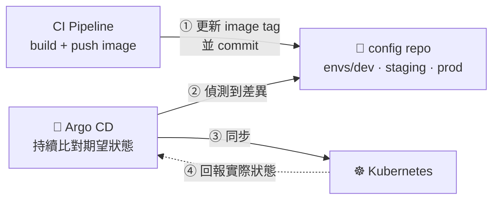

`argocd/dev.yaml`：

```yaml
apiVersion: argoproj.io/v1alpha1
kind: Application
metadata:
  name: demo-app-dev
  namespace: argocd
spec:
  project: default
  source:
    repoURL: https://github.com/<org>/demo-app-config.git
    targetRevision: develop          # ★ 追蹤 develop 分支
    path: envs/dev
  destination:
    server: https://kubernetes.default.svc
    namespace: dev
  syncPolicy:
    automated: { prune: true, selfHeal: true }   # dev 全自動
---
apiVersion: argoproj.io/v1alpha1
kind: Application
metadata:
  name: demo-app-prod
  namespace: argocd
spec:
  source:
    repoURL: https://github.com/<org>/demo-app-config.git
    targetRevision: main             # ★ 追蹤 main 分支
    path: envs/prod
  destination:
    server: https://kubernetes.default.svc
    namespace: prod
  syncPolicy: {}                     # ★ prod 不自動同步，人工按 Sync
```

CI 端只需要一步：

```bash
# 在 config repo 上更新映像 tag 並 commit
yq -i ".image.tag = \"${VERSION}-${SHA}\"" envs/dev/values.yaml
git commit -am "chore(deploy): dev → ${VERSION}-${SHA}"
git push
# 剩下的交給 Argo CD
```

| | 傳統 Push 式 CD | GitOps (Argo CD) |
|---|---|---|
| 誰動叢集 | CI 拿著 kubeconfig 推 | 叢集內的 Argo CD 自己拉 |
| 憑證 | CI 需要叢集寫入權限 | CI 只需 config repo 的推送權 |
| 稽核 | 看 CI log | **看 Git 歷史**（每次部署都是一個 commit） |
| 回滾 | `kubectl rollout undo` | `git revert` config repo |
| 漂移偵測 | 無 | `selfHeal` 自動修正手動改動 |
| GitFlow 對應 | 分支觸發 pipeline | **分支對應 Application 的 targetRevision** |

> GitOps 與 GitFlow 搭配得很自然：`develop`/`release/*`/`main` 分別對應
> dev/staging/prod 三個 Argo CD Application 的 `targetRevision`，
> 分支模型直接變成部署模型。

---

## 延伸閱讀

- [Pro Git（繁體中文全書，免費）](https://git-scm.com/book/zh-tw/v2)
- [Vincent Driessen — A successful Git branching model（GitFlow 原文）](https://nvie.com/posts/a-successful-git-branching-model/)
- [gitflow-avh 官方文件](https://github.com/petervanderdoes/gitflow-avh/wiki)
- [Conventional Commits](https://www.conventionalcommits.org/zh-hant/)
- [Semantic Versioning](https://semver.org/lang/zh-TW/)
- [Kind 官方文件](https://kind.sigs.k8s.io/)
- [Learn Git Branching（互動式練習）](https://learngitbranching.js.org/?locale=zh_TW)
- [Oh Shit, Git!?!](https://ohshitgit.com/)
- [C4 Model 官方網站](https://c4model.com/)
- [Argo CD 官方文件](https://argo-cd.readthedocs.io/)
- [ingress-nginx for Kind](https://kind.sigs.k8s.io/docs/user/ingress/)

---

## 授權

本手冊以 [CC BY 4.0](https://creativecommons.org/licenses/by/4.0/deed.zh-hant) 釋出，歡迎自由使用與改作。
