# Git 與 GitFlow 教學手冊

> 一份從零開始、可直接複製貼上操作的 Git／GitFlow 實戰手冊，
> 附帶以 **Kind** 建立本機 Kubernetes 叢集、並將 GitFlow 分支對應到部署環境的完整範例。

- **適用對象**：剛接觸 Git 的新手、想導入分支策略的團隊、需要把分支流程接上 CI/CD 的工程師
- **環境**：macOS / Linux / Windows (WSL2 或 Git Bash)
- **實機驗證環境**：macOS 15 (arm64)、Git 2.55.0、Kind 0.32.0、kubectl 1.36.3、Kubernetes 1.36.1（Colima 提供 Docker runtime）

> 本手冊附帶的三支腳本都經過實機執行驗證：
> `drills/practice.sh`（12 題演練，驗收邏輯全數通過）、
> `scenarios/simulate.sh`（26 個情境、39 項自動驗證全綠）、
> `scripts/deploy.sh`（dev / staging / prod 三個環境實際部署成功）。

---

## 目錄

| # | 章節 | 內容 |
|---|------|------|
| 1 | [環境準備](#1-環境準備) | 安裝、設定、SSH 金鑰 |
| 2 | [Git 核心概念](#2-git-核心概念) | 三大區域、物件模型、HEAD |
| 3 | [Git 基本操作](#3-git-基本操作) | init / add / commit / log / diff |
| 4 | [分支與合併](#4-分支與合併) | branch / merge / 衝突處理 |
| 5 | [遠端協作](#5-遠端協作) | remote / fetch / pull / push |
| 6 | [回溯與改寫歷史](#6-回溯與改寫歷史) | reset / revert / stash / rebase |
| 7 | [GitFlow 模型](#7-gitflow-模型) | 五種分支、生命週期、規則 |
| 8 | [git-flow 指令對照](#8-git-flow-指令與純-git-對照) | CLI vs 純 Git |
| 9 | [GitFlow 完整實戰演練](#9-gitflow-完整實戰演練) | 可複製的完整腳本 |
| 10 | [Commit 規範與版本號](#10-commit-規範與版本號) | Conventional Commits / SemVer |
| 11 | [團隊協作規範](#11-團隊協作規範) | PR / Code Review / 保護分支 |
| 12 | [分支策略比較](#12-分支策略比較) | GitFlow vs GitHub Flow vs Trunk-Based ｜ **GitFlow vs GitOps** |
| 13 | [Git 互動演練場](#13-git-互動演練場) | ★ 12 題動手練習，自動驗收 |

**主線到此為止 —— 第 1～13 章建議照順序讀完。** 以下為查閱型內容，各自獨立成頁：

| # | 章節 | 內容 |
|---|------|------|
| 14 | 📄 [GitFlow 情境模擬全集](docs/scenarios.md) | ★ 26 種真實場景與處置 SOP |
| 15 | 📄 [多 Pipeline 設計](docs/pipelines.md) | ★ 分支對應的 6 條 CI/CD 流水線 |
| D | 📄 [附錄 D：其他 CI 平台範本](docs/pipelines.md#附錄-d其他-ci-平台範本) | GitLab CI / Jenkins / Argo CD |
| A | 📄 [附錄 A：Kind + Kubernetes 部署](docs/kubernetes.md) | 本機叢集與 GitFlow 環境對應 |
| B | [附錄 B：疑難排解](#附錄-b疑難排解-faq) | 常見錯誤與解法 |
| C | [附錄 C：指令速查表](#附錄-c指令速查表) | 一頁式 cheat sheet |

### 快速開始

```bash
# ① 完全新手 —— 從 12 題動手練習開始（只需要 git，不需要 Docker）
./drills/practice.sh list
./drills/practice.sh start 1

# ② 想看 GitFlow 各種場景怎麼跑 —— 26 個情境自動演示
./scenarios/simulate.sh list
./scenarios/simulate.sh 10          # 最刁鑽的一題：release 期間發生 hotfix

# ③ 想連 CI/CD 一起練 —— 建立本機 K8s 叢集並部署
kind create cluster --config kind-cluster.yaml
./scripts/deploy.sh develop         # → dev namespace
```

### 專案檔案結構

```text
git-gitflow-tutorial/
├── README.md                      # 本手冊主線（第 1～13 章 + 附錄 B、C）
├── docs/                          # 查閱型內容，各自獨立成頁
│   ├── scenarios.md               #   第 14 章：26 種 GitFlow 情境
│   ├── pipelines.md               #   第 15 章 + 附錄 D：CI/CD 流水線
│   └── kubernetes.md              #   附錄 A：Kind + K8s 部署
├── VERSION                        # 版本號（release / hotfix 會更新）
├── drills/
│   └── practice.sh                # ★ 12 題互動演練場（你動手，它驗收）
├── scenarios/
│   └── simulate.sh                # ★ 26 種 GitFlow 情境模擬器（自動演示）
├── app/
│   └── Dockerfile                 # 示範應用（會顯示自己來自哪個分支）
├── k8s/base/
│   ├── deployment.yaml
│   └── ingress.yaml
├── kind-cluster.yaml              # Kind 叢集定義（1 control-plane + 2 worker）
├── scripts/
│   ├── deploy.sh                  # 分支 → namespace 部署腳本
│   └── verify-docs.sh             # ★ 文件與腳本一致性檢查（防漂移）
└── ci-examples/
    └── github-actions/            # ★ 6 條獨立 pipeline（範例，未啟用）
        ├── 01-feature-ci.yml      #   feature/**        → 臨時 Kind 叢集
        ├── 02-develop-cd.yml      #   develop           → dev
        ├── 03-release-cd.yml      #   release/**        → staging
        ├── 04-hotfix-cd.yml       #   hotfix/**         → staging（快速通道）
        ├── 05-production-release.yml  # tag v*          → prod（需審批）
        └── 06-nightly-e2e.yml     #   排程              → 深度回歸
```

> **為什麼 pipeline 放在 `ci-examples/` 而不是 `.github/workflows/`？**
> 放在 `.github/workflows/` 會被 GitHub **自動觸發執行**。本專案是教材，
> pipeline 是拿來讀與改的範例，因此刻意放在一般目錄下，不會消耗你的 Actions 額度、
> 也不會誤觸任何環境。
>
> 想真的啟用時：
> ```bash
> mkdir -p .github && git mv ci-examples/github-actions .github/workflows
> ```
> 啟用前請先在 repo 設定好 `KUBECONFIG_DEV` 等 secret 與 environment 審批規則。

---

## 演練平台架構（C4 Model）

用 [C4 Model](https://c4model.com/) 說明這套演練平台本身是怎麼組成的。
由外而內五張圖：**誰在用 → 有哪些可執行單元 → 單元內部怎麼分工 → 關鍵資料結構 → 實際跑在哪裡**。

> 以下使用 Mermaid 原生的 C4 語法（`C4Context` / `C4Container` / `C4Component` / `C4Deployment`），
> 每一張都已實際渲染驗證過。

### Level 1 — System Context（系統情境）

誰會用這套平台、它跟外部世界的邊界在哪。

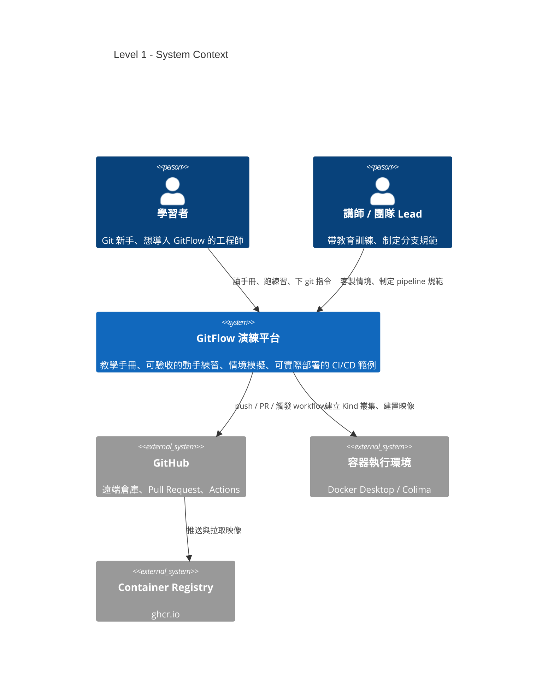

| 元素 | 類型 | 說明 |
|------|------|------|
| 學習者 | Person | 跑 12 題演練、讀手冊、在沙箱下 git 指令 |
| 講師 / 團隊 Lead | Person | 客製情境、把分支規範寫進 pipeline |
| GitFlow 演練平台 | System | 本專案：手冊 + 演練工具 + 部署範例 |
| GitHub | External | 遠端倉庫、Pull Request、Actions |
| 容器執行環境 | External | Kind 需要它才能把節點跑成容器 |
| Container Registry | External | CI 推送映像的目的地（ghcr.io） |

### Level 2 — Container（可執行單元）

平台內部有哪些「可以獨立跑起來」的單元，彼此怎麼互動。

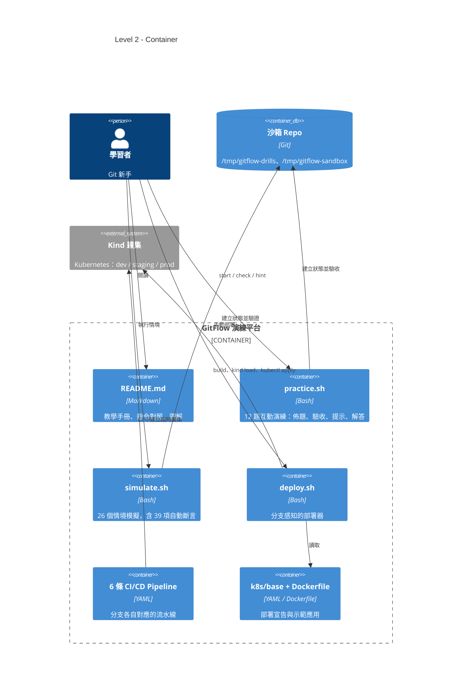

三支腳本的分工是刻意切開的：

| 單元 | 你做什麼 | 它做什麼 | 需要 Docker？ |
|------|----------|----------|---------------|
| `practice.sh` | **你自己下 git 指令** | 佈題、逐項驗收、給診斷式回饋 | 否 |
| `simulate.sh` | 看 | 自動跑完整情境並自我驗證 | 否 |
| `deploy.sh` | 指定分支 | 建置映像、載入叢集、滾動更新 | 是 |

### Level 3 — Component（元件分解）

拆開兩個核心單元的內部結構。

**`practice.sh` — 演練引擎**

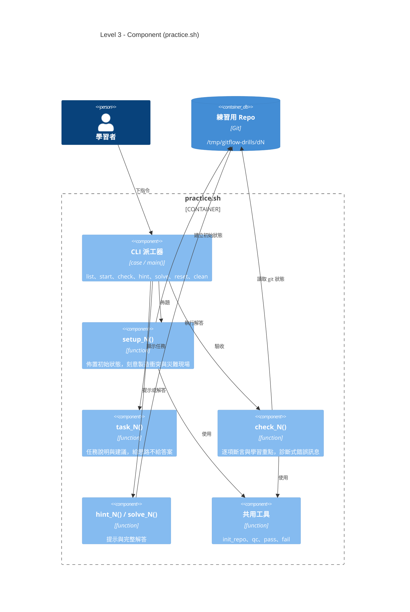

> 每一題就是 `setup_N` / `task_N` / `check_N` / `hint_N` / `solve_N` 五個函式。
> 要新增第 13 題，照著這個介面寫五個函式、在 `TITLES` 陣列加一行即可，不必動派工器。

**`deploy.sh` — 分支感知部署器**

```mermaid
flowchart LR
    IN["<b>輸入</b><br/>分支名（或當前分支）"]
    RT["<b>① 分支路由</b><br/>case 對應表<br/>決定 ns / replicas / host"]
    PC["<b>② 前置檢查</b><br/>docker · kind · kubectl<br/>叢集存在？context 正確？"]
    BD["<b>③ 映像建置</b><br/>docker build --build-arg<br/>版本 · 分支 · SHA 烙進映像"]
    LD["<b>④ 映像載入</b><br/>kind load docker-image<br/>推進三個節點"]
    AP["<b>⑤ 套用 Manifest</b><br/>apply · set image · scale<br/>Ingress 為選用（優雅降級）"]
    RO["<b>⑥ 滾動更新守衛</b><br/>rollout status<br/>失敗 → 自動 rollout undo"]

    IN --> RT --> PC --> BD --> LD --> AP --> RO
    RO -->|"失敗"| UD["⛑ 自動回滾"]

    classDef comp fill:#85bbf0,stroke:#5d82a8,color:#000
    classDef danger fill:#f8cecc,stroke:#b85450,color:#000
    class IN,RT,PC,BD,LD,AP,RO comp
    class UD danger
```

### Level 4 — Code（關鍵資料結構）

整套平台的行為，最終收斂到這一張對應表：

```bash
# scripts/deploy.sh —— 分支路由（唯一的真相來源）
case "$BRANCH" in
  main|master) NS=prod    ; REPLICAS=3 ; HOST=demo.localtest.me     ; SUFFIX=""     ;;
  release/*)   NS=staging ; REPLICAS=2 ; HOST=stg.demo.localtest.me ; SUFFIX="-rc"  ;;
  hotfix/*)    NS=staging ; REPLICAS=2 ; HOST=stg.demo.localtest.me ; SUFFIX="-hf"  ;;
  develop)     NS=dev     ; REPLICAS=1 ; HOST=dev.demo.localtest.me ; SUFFIX="-dev" ;;
  feature/*)   exit 0 ;;   # 只跑 CI，不部署到常駐環境
  *)           exit 1 ;;   # 不符 GitFlow 命名 → 直接擋下
esac
```

| 分支 | Namespace | Replicas | 映像 Tag 樣式 | 對應 Pipeline |
|------|-----------|----------|---------------|---------------|
| `main` | `prod` | 3 | `1.1.0.77f1e19` | ⑤ production-release |
| `release/*` | `staging` | 2 | `1.1.0-rc.ddf9df0` | ③ release-cd |
| `hotfix/*` | `staging` | 2 | `1.0.1-hf.a3c91b2` | ④ hotfix-cd |
| `develop` | `dev` | 1 | `1.0.0-dev.d5059e4` | ② develop-cd |
| `feature/*` | （臨時叢集） | 1 | `pr-<n>` | ① feature-ci |

### Level 5 — Deployment（部署視圖）

前面四張圖講「軟體怎麼組成」，這張講「實際跑在哪裡」——
GitFlow 的三種分支如何落到同一座 Kind 叢集的三個 namespace。

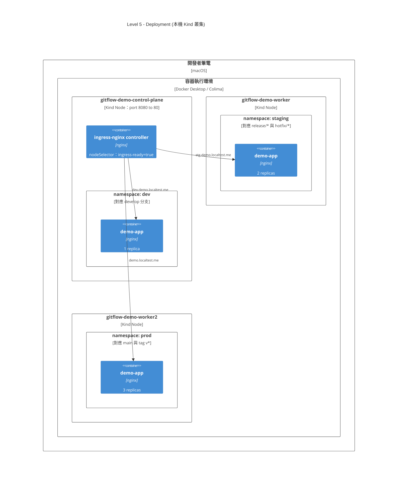

幾個實測得到的重點：

- **Ingress controller 必須跑在 control-plane 上**。只有該節點在 `kind-cluster.yaml` 裡做了
  `extraPortMappings`（host 8080 → node 80），被排到 worker 就完全不通。
  新版 ingress-nginx 的 kind manifest 已拿掉 `ingress-ready` 的 nodeSelector，需自行補上，
  詳見[附錄 A.4](docs/kubernetes.md#實測踩到的兩個坑kind--ingress-nginx)。
- **三個環境共用一座叢集**，靠 namespace 隔離、靠 host 分流。正式環境請讓 prod 使用獨立叢集。
- **Pod 實際落在哪個 worker 由排程器決定**，圖上的擺放只是示意；namespace 才是真正的隔離邊界。

### 動態視圖：一次完整發版

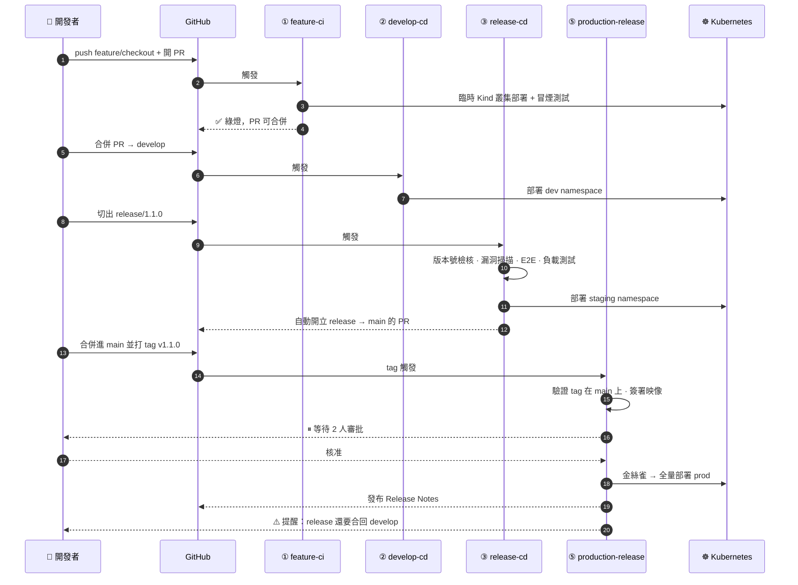

---

## 1. 環境準備

### 1.1 安裝 Git

```bash
# macOS
brew install git

# Ubuntu / Debian
sudo apt update && sudo apt install -y git

# Windows：下載 Git for Windows（內含 Git Bash）
# https://git-scm.com/download/win

git --version   # 確認安裝
```

### 1.2 首次設定（全域）

```bash
git config --global user.name  "Rex Wang"
git config --global user.email "cping.wang.2068@gmail.com"

# 預設主分支名稱（新版慣例用 main）
git config --global init.defaultBranch main

# 中文檔名不要被轉成 \xxx 的八進位編碼
git config --global core.quotepath false

# 換行符號處理：macOS/Linux 用 input，Windows 用 true
git config --global core.autocrlf input

# 預設編輯器
git config --global core.editor "vim"      # 或 "code --wait"

# pull 時預設用 rebase，避免製造無意義的 merge commit
git config --global pull.rebase true

# 好用的別名
git config --global alias.st  status
git config --global alias.co  checkout
git config --global alias.br  branch
git config --global alias.cm  "commit -m"
git config --global alias.lg  "log --oneline --graph --decorate --all"
git config --global alias.last "log -1 HEAD --stat"
git config --global alias.unstage "reset HEAD --"

# 檢視所有設定與其來源檔案
git config --list --show-origin
```

> 設定檔優先順序（後者覆蓋前者）：
> `/etc/gitconfig`（system） → `~/.gitconfig`（global） → `.git/config`（local） → 指令參數

### 1.3 產生並註冊 SSH 金鑰

```bash
ssh-keygen -t ed25519 -C "cping.wang.2068@gmail.com"
# 一路 Enter（可設 passphrase）

eval "$(ssh-agent -s)"
ssh-add ~/.ssh/id_ed25519

cat ~/.ssh/id_ed25519.pub      # 複製這串，貼到 GitHub → Settings → SSH keys

ssh -T git@github.com          # 測試連線
# > Hi xxx! You've successfully authenticated...
```

### 1.4 `.gitignore` 範本

```gitignore
# 依賴
node_modules/
vendor/
__pycache__/
*.pyc

# 建置產物
dist/
build/
target/
*.log

# 環境與機密（永遠不要 commit）
.env
.env.local
*.pem
*.key
secrets.yaml

# 編輯器與作業系統
.vscode/
.idea/
.DS_Store
Thumbs.db
```

> **已經 commit 進去才加 .gitignore？** `.gitignore` 只對「尚未被追蹤」的檔案有效，需先移出索引：
> ```bash
> git rm -r --cached .env
> git commit -m "chore: 移除誤入版控的 .env"
> ```
> ⚠️ 檔案仍留在歷史中。若含真實金鑰，**必須立刻輪換該金鑰**，並用 `git filter-repo` 或 BFG 清除歷史。

---

## 2. Git 核心概念

### 2.1 三大區域

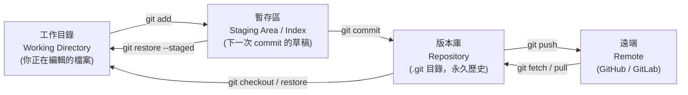

| 區域 | 說明 | 查看指令 |
|------|------|----------|
| Working Directory | 你在編輯器裡看到的檔案 | `git diff` |
| Staging Area (Index) | 已 `add`、準備進入下次 commit | `git diff --staged` |
| Repository (HEAD) | 已 commit 的歷史 | `git log` |

### 2.2 Git 的物件模型

Git 本質是一個**內容定址的檔案系統**，只有四種物件：

| 物件 | 內容 | 比喻 |
|------|------|------|
| **blob** | 檔案內容（不含檔名） | 檔案本體 |
| **tree** | 目錄結構：檔名 → blob/tree | 資料夾 |
| **commit** | 指向一個 tree + 父 commit + 作者 + 訊息 | 快照＋履歷 |
| **tag** | 指向一個 commit 的具名標記（annotated tag） | 書籤 |

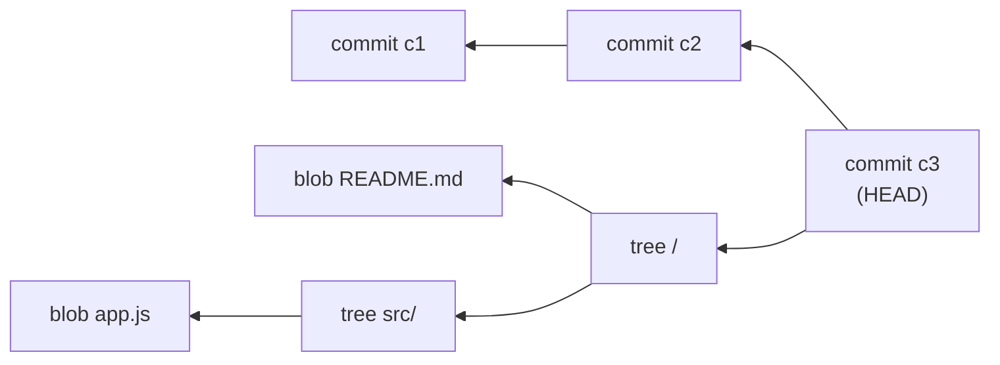

實際看看：

```bash
git log --format=%H -1                    # 取得 commit SHA
git cat-file -p HEAD                      # 看 commit 物件內容
git cat-file -p HEAD^{tree}               # 看 tree
git rev-parse HEAD                        # 解析任何 refs → SHA
```

> **重點觀念**：Git 儲存的是**完整快照**，不是差異（diff）。差異是顯示時才算出來的。

### 2.3 HEAD、分支、標籤

- **分支（branch）** = 一個「會移動的指標」，指向某個 commit（檔案就是 `.git/refs/heads/<name>`，內容只有 41 bytes 的 SHA）
- **HEAD** = 指向「你目前在哪個分支」的指標（`.git/HEAD`）
- **detached HEAD** = HEAD 直接指向某個 commit 而非分支，此時 commit 不屬於任何分支，容易遺失

```bash
cat .git/HEAD                 # ref: refs/heads/main
cat .git/refs/heads/main      # 3f2a1c...
git branch -v                 # 所有分支與最新 commit
```

因為分支只是指標，**開分支的成本趨近於零**——這正是 GitFlow 這類分支模型可行的基礎。

---

## 3. Git 基本操作

### 3.1 建立版本庫

```bash
# 從零開始
mkdir my-project && cd my-project
git init
git init -b main            # 直接指定初始分支名

# 從遠端複製
git clone git@github.com:user/repo.git
git clone git@github.com:user/repo.git my-dir     # 指定目錄名
git clone --depth 1 <url>                          # 淺複製，只抓最新一版（CI 常用）
git clone --branch develop <url>                   # 只 checkout 指定分支
```

### 3.2 日常循環：改 → add → commit

```bash
git status                  # 隨時確認狀態（最常用的指令）
git status -s               # 精簡格式

git add file.txt            # 加入單一檔案
git add src/                # 加入整個目錄
git add .                   # 加入當前目錄所有變更
git add -A                  # 加入所有變更（含刪除）
git add -p                  # ★ 互動式：逐段挑選要 stage 的內容

git commit -m "feat: 新增使用者登入 API"
git commit                  # 開編輯器寫多行訊息
git commit -am "訊息"        # 對「已追蹤」檔案 add + commit 一次完成
git commit --amend          # 修改最後一次 commit（訊息或內容）
git commit --amend --no-edit  # 補檔案進上一個 commit，訊息不變
```

> `git add -p` 是把「一次做了三件事」的髒工作目錄，拆成三個乾淨 commit 的關鍵工具。

### 3.3 查看歷史

```bash
git log
git log --oneline                          # 一行一個 commit
git log --oneline --graph --decorate --all # ★ 圖形化全貌（推薦設成別名 lg）
git log -5                                 # 最近 5 筆
git log --author="Rex"                     # 篩選作者
git log --since="2 weeks ago"              # 篩選時間
git log --grep="登入"                       # 搜尋 commit 訊息
git log -S "functionName"                  # ★ 找出「哪個 commit 動到這段程式碼」
git log -p file.txt                        # 某檔案的完整變更歷程
git log --stat                             # 顯示每個 commit 動了哪些檔案幾行
git log main..develop                      # develop 有、main 沒有的 commit
git log --follow file.txt                  # 跨越改名追蹤檔案

git show <sha>                             # 看單一 commit 詳情
git blame file.txt                         # 每一行是誰、何時改的
git reflog                                 # ★ 你所有 HEAD 移動紀錄（救命用）
```

### 3.4 比較差異

```bash
git diff                    # 工作目錄 vs 暫存區
git diff --staged           # 暫存區 vs HEAD（= 這次 commit 會提交什麼）
git diff HEAD               # 工作目錄 vs HEAD（所有未 commit 變更）
git diff main develop       # 兩分支差異
git diff main...develop     # 從共同祖先算起，develop 的變更
git diff --stat             # 只看統計
git diff <sha1> <sha2> -- file.txt   # 指定檔案在兩版本間的差異
```

### 3.5 刪除與移動

```bash
git rm file.txt             # 刪除檔案並 stage
git rm --cached file.txt    # 只移出版控，檔案保留在磁碟
git mv old.txt new.txt      # 等同 mv + git rm + git add
```

---

## 4. 分支與合併

### 4.1 分支操作

```bash
git branch                      # 列出本地分支
git branch -a                   # 含遠端分支
git branch -vv                  # 含追蹤關係與最新 commit

git branch feature/login        # 建立分支（不切換）
git switch feature/login        # 切換（Git 2.23+ 推薦）
git switch -c feature/login     # 建立並切換 ★
git checkout -b feature/login   # 舊寫法，等效

git switch -                    # 切回上一個分支
git switch -c hotfix main       # 從 main 建立分支

git branch -m old new           # 重新命名
git branch -d feature/login     # 刪除（未合併會擋下來）
git branch -D feature/login     # 強制刪除
git push origin --delete feature/login   # 刪除遠端分支
```

### 4.2 合併的三種形態

#### (a) Fast-forward（快轉）

目標分支沒有新 commit，指標直接前移，**不產生 merge commit**。

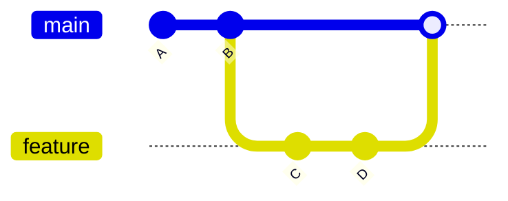

```bash
git switch main
git merge feature/login         # 可 ff 時自動 ff
```

#### (b) No-fast-forward（強制產生合併節點）★ GitFlow 採用

保留「這幾個 commit 屬於同一個 feature」的歷史結構。

```bash
git merge --no-ff feature/login -m "Merge feature/login into develop"
```

#### (c) Three-way merge（三方合併）

兩邊都有新 commit，Git 以共同祖先為基準自動合併，衝突時需人工介入。

```bash
git merge feature/login
```

| 方式 | 何時發生 | 歷史樣貌 | 建議 |
|------|----------|----------|------|
| fast-forward | 目標分支無新 commit | 線性 | 小修補可用 |
| `--no-ff` | 手動指定 | 有明確合併節點 | **GitFlow 標準做法** |
| three-way | 雙方都有新 commit | 分岔後匯流 | 自然發生 |

### 4.3 衝突處理 SOP

```bash
git merge feature/login
# CONFLICT (content): Merge conflict in src/app.js
# Automatic merge failed; fix conflicts and then commit the result.
```

衝突檔案長這樣：

```text
<<<<<<< HEAD
const port = 3000;          ← 目前分支（main）的版本
=======
const port = 8080;          ← 併入分支（feature/login）的版本
>>>>>>> feature/login
```

**處理步驟：**

```bash
git status                       # 1. 看哪些檔案衝突（Unmerged paths）
# 2. 編輯檔案，刪掉 <<<<<<< ======= >>>>>>> 標記，保留正確內容
git add src/app.js               # 3. 標記為已解決
git status                       # 4. 確認全部解決
git commit                       # 5. 完成合併（訊息已預填）

# 中途反悔：
git merge --abort                # 完全回到 merge 前的狀態
```

**實用工具：**

```bash
git mergetool                    # 開啟設定好的三方比對工具
git diff --name-only --diff-filter=U   # 只列出衝突中的檔案
git checkout --ours  file.txt    # 整檔採用「目前分支」版本
git checkout --theirs file.txt   # 整檔採用「併入分支」版本

# 顯示共同祖先版本，看得更清楚（強烈建議開啟）
git config --global merge.conflictstyle zdiff3
```

> **降低衝突的實務做法**：分支存活時間短（≤ 3 天）、頻繁從 develop 同步、避免多人同時改同一檔案、格式化規則統一（Prettier/gofmt）。

---

## 5. 遠端協作

### 5.1 遠端管理

```bash
git remote -v                                   # 查看遠端
git remote add origin git@github.com:u/r.git    # 新增
git remote set-url origin <new-url>             # 改網址
git remote rename origin upstream               # 改名
git remote remove origin                        # 移除
git remote show origin                          # 詳細資訊（含追蹤關係）
```

### 5.2 抓取與推送

```bash
git fetch origin                # ★ 只下載，不動你的工作目錄（安全）
git fetch --all --prune         # 抓全部並清掉遠端已刪的分支

git pull                        # = fetch + merge
git pull --rebase               # = fetch + rebase（歷史更乾淨）

git push origin main
git push -u origin feature/login  # 第一次推送並建立追蹤關係
git push                          # 之後直接這樣
git push --tags                   # 推送標籤
git push --force-with-lease       # ★ 安全版強推（別人有新 commit 時會擋下）
```

> ⚠️ **永遠不要對共用分支（main / develop）用 `git push --force`。**
> 需要強推時（例如 rebase 過自己的 feature 分支），一律用 `--force-with-lease`。

### 5.3 追蹤分支

```bash
git branch -u origin/develop           # 為當前分支設定上游
git branch -vv                         # 檢視追蹤關係與領先/落後數
git switch -c local-name origin/remote-name    # 從遠端分支建立本地分支
```

### 5.4 標籤與發布

```bash
git tag                                   # 列出
git tag -a v1.2.0 -m "Release 1.2.0"      # ★ annotated tag（正式發版用）
git tag v1.2.0-lightweight                # lightweight tag（僅指標）
git tag -a v1.1.0 <sha>                   # 為歷史 commit 補打標籤
git show v1.2.0                           # 檢視
git push origin v1.2.0                    # 推送單一標籤
git push origin --tags                    # 推送所有標籤
git tag -d v1.2.0                         # 刪本地
git push origin :refs/tags/v1.2.0         # 刪遠端
git describe --tags                       # 目前 commit 相對最近標籤的描述
```

---

## 6. 回溯與改寫歷史

### 6.1 撤銷變更對照表

| 情境 | 指令 |
|------|------|
| 丟棄工作目錄的修改 | `git restore file.txt` |
| 把檔案移出暫存區（保留修改） | `git restore --staged file.txt` |
| 修改最後一次 commit 訊息 | `git commit --amend` |
| 撤銷 commit，變更留在暫存區 | `git reset --soft HEAD~1` |
| 撤銷 commit，變更留在工作目錄 | `git reset HEAD~1`（預設 `--mixed`） |
| 撤銷 commit，**變更全部丟掉** | `git reset --hard HEAD~1` ⚠️ |
| 用一個新 commit 抵銷舊 commit | `git revert <sha>` ★ 共用分支唯一正解 |
| 回到某個歷史狀態（安全） | `git revert --no-commit <sha>..HEAD` |
| 救回誤刪的 commit | `git reflog` → `git reset --hard <sha>` |

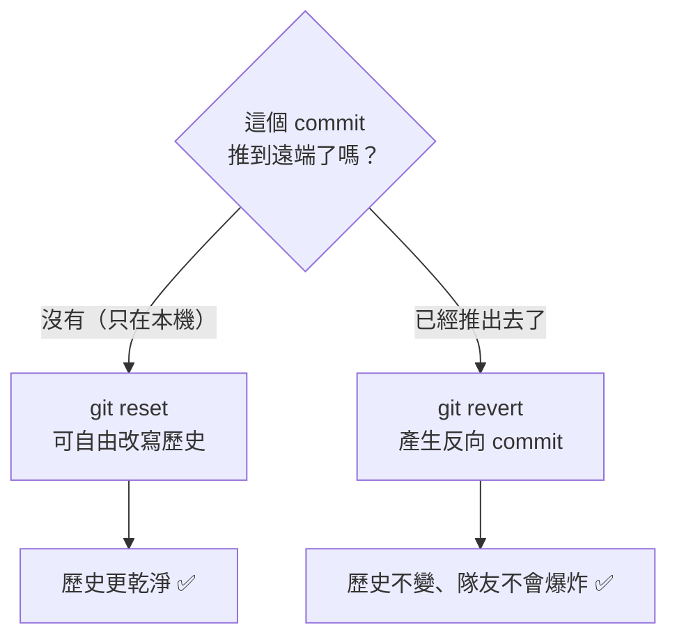

> **鐵律**：`reset` 用於**還沒 push** 的 commit；`revert` 用於**已經 push** 的 commit。

### 6.2 stash：暫存未完成的工作

```bash
git stash                        # 收起所有未 commit 的變更
git stash push -m "登入頁做到一半"  # 附說明
git stash -u                     # 含未追蹤檔案
git stash list                   # 列出所有 stash
git stash show -p stash@{0}      # 看內容
git stash pop                    # 取回最新一筆並從堆疊移除
git stash apply stash@{1}        # 取回指定筆但保留在堆疊
git stash drop stash@{0}         # 刪除
git stash clear                  # 全清 ⚠️
```

### 6.3 cherry-pick：挑選單一 commit

```bash
git cherry-pick <sha>            # 把某 commit 套用到當前分支
git cherry-pick <sha1> <sha2>    # 多個
git cherry-pick <sha1>..<sha2>   # 範圍（不含 sha1）
git cherry-pick -n <sha>         # 只套用不 commit
git cherry-pick --continue       # 解完衝突後繼續
git cherry-pick --abort          # 放棄
```

> 典型用途：hotfix 已修好在 `main`，要把同一修正帶進 `develop`（GitFlow 通常直接 merge，但單一 commit 情境用 cherry-pick 更精準）。

### 6.4 rebase：把分支基底搬家

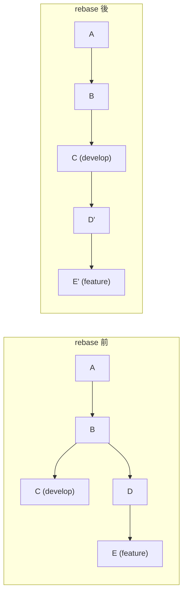

```bash
git switch feature/login
git rebase develop               # 把 feature 的 commit 重新接到 develop 之後

# 衝突時
git rebase --continue            # 解完衝突繼續
git rebase --skip                # 跳過這個 commit
git rebase --abort               # 放棄，回到 rebase 前

# 互動式 rebase：整理最近 3 個 commit
git rebase -i HEAD~3
```

互動式 rebase 可用動作：

```text
pick   3f2a1c  feat: 新增登入表單
squash 8b4d9e  fix: 修 typo          ← 併入上一個 commit
fixup  1c7e2a  fix: 再修 typo        ← 併入且丟棄訊息
reword 9a3f5b  feat: 加驗證          ← 只改訊息
edit   2d8c4f  refactor: 抽出函式    ← 停下來讓你修改
drop   5e1b7d  chore: 測試用 log     ← 刪掉這個 commit
# 上下調換行的順序 = 調換 commit 順序
```

> ⚠️ **rebase 黃金法則**：**絕不 rebase 已經推到共用分支的 commit。**
> rebase 會產生「新的 SHA」，別人基於舊 SHA 的工作全部對不上。
> 安全範圍：只有自己在用的 feature 分支。

### 6.5 reflog：後悔藥

```bash
git reflog
# 3f2a1c HEAD@{0}: reset: moving to HEAD~3
# 8b4d9e HEAD@{1}: commit: feat: 重要功能   ← 想救回這個
# ...

git reset --hard 8b4d9e          # 救回來
git branch recovered 8b4d9e      # 或開新分支保存
```

> reflog 預設保留 90 天，只存在於**本機**。就算 `reset --hard` 也幾乎救得回來。

### 6.6 其他救援工具

```bash
git bisect start                 # 二分搜尋找出引入 bug 的 commit
git bisect bad                   # 目前是壞的
git bisect good v1.0.0           # v1.0.0 是好的
# Git 自動 checkout 中間點 → 測試 → 回答 good/bad → 重複
git bisect reset                 # 結束

git fsck --lost-found            # 找孤兒物件
git clean -n                     # 預覽會刪掉哪些未追蹤檔案
git clean -fd                    # 實際刪除 ⚠️
```

---

## 7. GitFlow 模型

### 7.1 什麼是 GitFlow

由 Vincent Driessen 於 2010 年提出的分支模型，核心是用**固定角色的分支**把「開發中」與「已上線」徹底隔離，適合**有明確版本號、定期發版**的產品。

### 7.2 五種分支

| 分支 | 生命週期 | 從哪來 | 合併回哪 | 命名 | 用途 |
|------|----------|--------|----------|------|------|
| **main**（master） | 永久 | — | — | `main` | 只放**已上線**的版本，每個 commit 都有 tag |
| **develop** | 永久 | main | — | `develop` | 整合中的下一版，CI 的主戰場 |
| **feature** | 短期 | develop | develop | `feature/*` | 開發新功能 |
| **release** | 短期 | develop | main + develop | `release/*` | 發版前的凍結、測試、修 bug |
| **hotfix** | 短期 | **main** | main + develop | `hotfix/*` | 線上緊急修復 |

### 7.3 完整流程圖

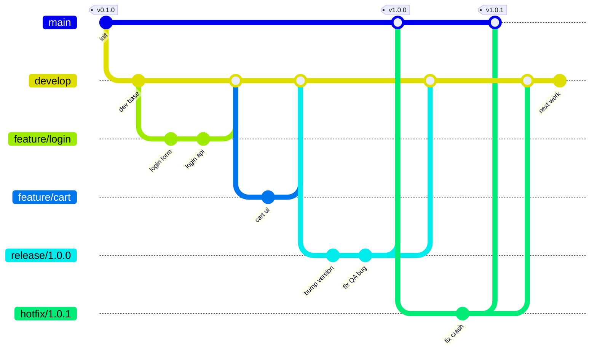

### 7.4 各分支的規則

#### `main`
- **禁止直接 commit**，只接受來自 `release/*` 與 `hotfix/*` 的合併
- 每次合併必須打 **annotated tag**（`v1.0.0`）
- 任何時刻 checkout 出來都應該是可上線的

#### `develop`
- 所有 feature 的匯流點
- **禁止直接 commit**（實務上透過 PR 合併）
- CI 必須全綠

#### `feature/*`
- 從 `develop` 開，合回 `develop`（用 `--no-ff`）
- **不可**直接合進 `main`
- 命名建議帶票號：`feature/PROJ-123-user-login`
- 存活時間建議 ≤ 3 天，過久必然衝突地獄

#### `release/*`
- 從 `develop` 開，同時合進 `main` 與 `develop`
- 開出來後 `develop` 就可以開始下一版的功能開發（**這是 GitFlow 最大的價值**）
- release 分支上**只允許 bug 修復、版本號、文件**，不接受新功能
- 命名：`release/1.2.0`

#### `hotfix/*`
- **從 `main` 開**（不是 develop！），合回 `main` 與 `develop`
- 若當下有 release 分支存在，應合進 `release/*` 而非 `develop`（否則會被 release 覆蓋掉）
- 命名：`hotfix/1.2.1`

### 7.5 環境對應

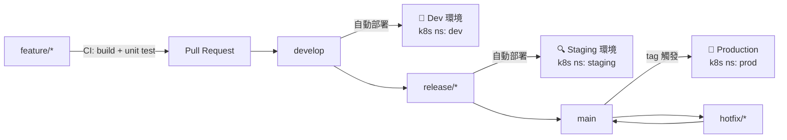

> 這張對應圖會在[附錄 A](docs/kubernetes.md#附錄-akind--kubernetes-部署) 用 Kind 實際跑一遍。

---

## 8. git-flow 指令與純 Git 對照

### 8.1 安裝 git-flow (AVH edition)

```bash
# macOS
brew install git-flow-avh

# Ubuntu / Debian
sudo apt install -y git-flow

# 手動安裝（通用）
curl -fsSL https://raw.githubusercontent.com/petervanderdoes/gitflow-avh/develop/contrib/gitflow-installer.sh | bash

git flow version
```

### 8.2 初始化

```bash
git flow init
# 互動式詢問各分支名稱，全部按 Enter 用預設即可
# Branch name for production releases: [main]
# Branch name for "next release" development: [develop]
# Feature branches? [feature/]
# Release branches? [release/]
# Hotfix branches?  [hotfix/]
# Version tag prefix? [] → 建議輸入 v

git flow init -d      # 全用預設，不問問題
```

### 8.3 完整指令對照表

| 操作 | git-flow 指令 | 等價的純 Git 指令 |
|------|---------------|-------------------|
| **初始化** | `git flow init -d` | `git switch -c develop main`<br/>`git push -u origin develop` |
| **開新功能** | `git flow feature start login` | `git switch develop && git pull`<br/>`git switch -c feature/login` |
| **推送功能分支** | `git flow feature publish login` | `git push -u origin feature/login` |
| **取得他人功能分支** | `git flow feature pull origin login` | `git switch -c feature/login origin/feature/login` |
| **完成功能** | `git flow feature finish login` | `git switch develop && git pull`<br/>`git merge --no-ff feature/login`<br/>`git branch -d feature/login`<br/>`git push origin develop` |
| **開始發版** | `git flow release start 1.2.0` | `git switch develop && git pull`<br/>`git switch -c release/1.2.0` |
| **發布 release 分支** | `git flow release publish 1.2.0` | `git push -u origin release/1.2.0` |
| **完成發版** | `git flow release finish 1.2.0` | `git switch main && git pull`<br/>`git merge --no-ff release/1.2.0`<br/>`git tag -a v1.2.0 -m "Release 1.2.0"`<br/>`git switch develop`<br/>`git merge --no-ff release/1.2.0`<br/>`git branch -d release/1.2.0`<br/>`git push origin main develop --tags` |
| **開始 hotfix** | `git flow hotfix start 1.2.1` | `git switch main && git pull`<br/>`git switch -c hotfix/1.2.1` |
| **完成 hotfix** | `git flow hotfix finish 1.2.1` | `git switch main`<br/>`git merge --no-ff hotfix/1.2.1`<br/>`git tag -a v1.2.1 -m "Hotfix 1.2.1"`<br/>`git switch develop`<br/>`git merge --no-ff hotfix/1.2.1`<br/>`git branch -d hotfix/1.2.1`<br/>`git push origin main develop --tags` |
| **列出進行中的功能** | `git flow feature list` | `git branch --list 'feature/*'` |

### 8.4 常用旗標

```bash
git flow feature finish -k login      # -k 保留分支不刪除
git flow feature finish -F login      # -F 先 fetch
git flow release finish -m "1.2.0" 1.2.0   # -m 指定 tag 訊息（避免開編輯器）
git flow release finish -p 1.2.0      # -p 完成後自動 push
git flow release finish -n 1.2.0      # -n 不打 tag
```

> **實務建議**：團隊若使用 GitHub/GitLab PR 流程，**不要用 `git flow feature finish`**（它會在本機直接合併，繞過 Code Review）。
> 正確做法是 `git flow feature publish` → 在平台開 PR → Review 通過後由平台合併。

---

## 9. GitFlow 完整實戰演練

以下腳本**可以整段複製到終端機執行**，會建立一個獨立的練習用 repo，完整跑過 feature → release → hotfix 的循環。

### 9.1 建立練習環境

```bash
cd /tmp && rm -rf gitflow-demo && mkdir gitflow-demo && cd gitflow-demo
git init -b main

cat > README.md <<'EOF'
# Demo App
一個用來練習 GitFlow 的示範專案。
EOF

cat > VERSION <<'EOF'
0.1.0
EOF

git add .
git commit -m "chore: 初始化專案"
git tag -a v0.1.0 -m "Initial release"

# 建立 develop 分支
git switch -c develop
git log --oneline --graph --decorate --all
```

### 9.2 Feature：開發登入功能

```bash
# ── 開新功能 ────────────────────────────────
git switch develop
git switch -c feature/user-login

mkdir -p src
cat > src/login.js <<'EOF'
export function login(username, password) {
  if (!username || !password) throw new Error('缺少帳號或密碼');
  return { token: 'fake-jwt-token', username };
}
EOF
git add src/login.js
git commit -m "feat(auth): 新增 login() 基本實作"

cat >> src/login.js <<'EOF'

export function logout() {
  return { ok: true };
}
EOF
git add src/login.js
git commit -m "feat(auth): 新增 logout()"

# ── 完成功能：合回 develop ───────────────────
git switch develop
git merge --no-ff feature/user-login -m "Merge branch 'feature/user-login' into develop"
git branch -d feature/user-login

git log --oneline --graph --decorate --all
```

### 9.3 Feature：平行開發購物車（模擬多人協作）

```bash
git switch develop
git switch -c feature/shopping-cart

cat > src/cart.js <<'EOF'
export function addToCart(items, item) {
  return [...items, item];
}
EOF
git add src/cart.js
git commit -m "feat(cart): 新增 addToCart()"

git switch develop
git merge --no-ff feature/shopping-cart -m "Merge branch 'feature/shopping-cart' into develop"
git branch -d feature/shopping-cart
```

### 9.4 Release：發布 1.0.0

```bash
# ── 從 develop 切出 release 分支 ─────────────
git switch develop
git switch -c release/1.0.0

# release 分支上只做：版本號、文件、bug 修復
echo "1.0.0" > VERSION
git add VERSION
git commit -m "chore(release): 版本號提升至 1.0.0"

# QA 測出小 bug，在 release 分支修
cat > src/login.js <<'EOF'
export function login(username, password) {
  if (!username || !password) throw new Error('缺少帳號或密碼');
  if (password.length < 8) throw new Error('密碼長度不足 8 碼');
  return { token: 'fake-jwt-token', username };
}

export function logout() {
  return { ok: true };
}
EOF
git add src/login.js
git commit -m "fix(auth): 補上密碼長度驗證"

# ★ 此時 develop 已可繼續開發下一版功能，互不影響

# ── 完成發版：合進 main 並打 tag ──────────────
git switch main
git merge --no-ff release/1.0.0 -m "Merge branch 'release/1.0.0'"
git tag -a v1.0.0 -m "Release 1.0.0"

# ── 同時把 release 上的修正帶回 develop ────────
git switch develop
git merge --no-ff release/1.0.0 -m "Merge branch 'release/1.0.0' into develop"

git branch -d release/1.0.0
git log --oneline --graph --decorate --all
```

### 9.5 Hotfix：線上緊急修復

```bash
# ★ 注意：hotfix 從 main 開，不是 develop
git switch main
git switch -c hotfix/1.0.1

cat > src/login.js <<'EOF'
export function login(username, password) {
  if (!username || !password) throw new Error('缺少帳號或密碼');
  if (typeof password !== 'string') throw new Error('密碼格式錯誤');
  if (password.length < 8) throw new Error('密碼長度不足 8 碼');
  return { token: 'fake-jwt-token', username };
}

export function logout() {
  return { ok: true };
}
EOF
echo "1.0.1" > VERSION
git add -A
git commit -m "fix(auth): 修復非字串密碼導致的 crash"

# ── 合回 main 並打 tag ───────────────────────
git switch main
git merge --no-ff hotfix/1.0.1 -m "Merge branch 'hotfix/1.0.1'"
git tag -a v1.0.1 -m "Hotfix 1.0.1"

# ── 一定要同步回 develop，否則下一版會退版 ─────
git switch develop
git merge --no-ff hotfix/1.0.1 -m "Merge branch 'hotfix/1.0.1' into develop"

git branch -d hotfix/1.0.1
```

### 9.6 檢視最終成果

```bash
git log --oneline --graph --decorate --all
git tag -l -n1
git branch -a
```

預期的歷史圖大致如下：

```text
*   Merge branch 'hotfix/1.0.1' into develop  (develop)
|\
| * fix(auth): 修復非字串密碼導致的 crash
|/
| *   Merge branch 'hotfix/1.0.1'  (main, tag: v1.0.1)
| |\
| |/
|/|
* |   Merge branch 'release/1.0.0' into develop
|\ \
| | *   Merge branch 'release/1.0.0'  (tag: v1.0.0)
| |/
| * fix(auth): 補上密碼長度驗證
| * chore(release): 版本號提升至 1.0.0
|/
*   Merge branch 'feature/shopping-cart' into develop
|\
| * feat(cart): 新增 addToCart()
|/
*   Merge branch 'feature/user-login' into develop
|\
| * feat(auth): 新增 logout()
| * feat(auth): 新增 login() 基本實作
|/
* chore: 初始化專案  (tag: v0.1.0)
```

### 9.7 用 git-flow CLI 跑同一套流程

```bash
cd /tmp && rm -rf gitflow-cli-demo && mkdir gitflow-cli-demo && cd gitflow-cli-demo
git init -b main
echo "# Demo" > README.md && git add . && git commit -m "chore: init"

git flow init -d                              # 初始化

git flow feature start user-login             # → feature/user-login
echo "login" > login.js && git add . && git commit -m "feat: login"
git flow feature finish user-login            # → 合回 develop 並刪分支

git flow release start 1.0.0                  # → release/1.0.0
echo "1.0.0" > VERSION && git add . && git commit -m "chore: bump 1.0.0"
git flow release finish -m "Release 1.0.0" 1.0.0   # → main + tag + develop

git flow hotfix start 1.0.1                   # → hotfix/1.0.1（從 main）
echo "fix" >> login.js && git add . && git commit -m "fix: crash"
git flow hotfix finish -m "Hotfix 1.0.1" 1.0.1     # → main + tag + develop

git log --oneline --graph --decorate --all
```

---

## 10. Commit 規範與版本號

### 10.1 Conventional Commits

```text
<type>(<scope>): <subject>
<空行>
<body>
<空行>
<footer>
```

| type | 用途 | 影響版本號 |
|------|------|-----------|
| `feat` | 新功能 | MINOR |
| `fix` | 修 bug | PATCH |
| `docs` | 只改文件 | — |
| `style` | 格式（不影響邏輯） | — |
| `refactor` | 重構（非新功能非修 bug） | — |
| `perf` | 效能改善 | PATCH |
| `test` | 測試 | — |
| `build` | 建置系統或相依 | — |
| `ci` | CI 設定 | — |
| `chore` | 雜項 | — |
| `revert` | 回退 | — |

**範例：**

```text
feat(auth): 支援 OAuth2 第三方登入

新增 Google 與 GitHub 兩家 provider 的登入流程，
token 統一由 AuthService 管理，有效期 2 小時。

Closes #123
BREAKING CHANGE: AuthService.login() 的簽章由 (user, pwd) 改為 (credentials)
```

> `BREAKING CHANGE:` 或 type 後加 `!`（如 `feat!:`）→ 提升 **MAJOR** 版本。

### 10.2 好的 commit 訊息守則

- 標題用**祈使句**、≤ 50 字元、結尾不加句號：✅ `fix: 修正登入逾時` ❌ `修正了登入逾時的問題。`
- 標題說明「做了什麼」，body 說明「**為什麼**」
- 一個 commit 只做一件事（用 `git add -p` 拆）
- 不要 `update`、`fix bug`、`wip`、`asdf` 這種訊息

### 10.3 語意化版本 SemVer

```text
v MAJOR . MINOR . PATCH
     │       │       └── 修 bug，向下相容
     │       └────────── 新功能，向下相容
     └────────────────── 破壞性變更，不相容
```

| 情境 | 從 | 到 |
|------|-----|-----|
| 修一個 crash | 1.4.2 | 1.4.**3** |
| 新增 API endpoint | 1.4.2 | 1.**5**.0 |
| 移除舊 API | 1.4.2 | **2**.0.0 |
| 發布前預覽 | — | 2.0.0-rc.1 |

### 10.4 用 commit-msg hook 強制規範

`.git/hooks/commit-msg`（記得 `chmod +x`）：

```bash
#!/usr/bin/env bash
PATTERN='^(feat|fix|docs|style|refactor|perf|test|build|ci|chore|revert)(\([a-z0-9/_-]+\))?!?: .{1,72}$'
FIRST_LINE=$(head -n1 "$1")

# 允許 merge / revert commit
if echo "$FIRST_LINE" | grep -qE '^(Merge|Revert) '; then exit 0; fi

if ! echo "$FIRST_LINE" | grep -qE "$PATTERN"; then
  echo "❌ Commit 訊息不符合 Conventional Commits 規範"
  echo "   格式：<type>(<scope>): <subject>"
  echo "   範例：feat(auth): 新增 OAuth2 登入"
  echo "   你的：$FIRST_LINE"
  exit 1
fi
```

> 團隊共用 hooks 請放 `.githooks/` 並執行 `git config core.hooksPath .githooks`，
> 或改用 [husky](https://typicode.github.io/husky/) / [pre-commit](https://pre-commit.com/)。

---

## 11. 團隊協作規範

### 11.1 Pull Request 流程

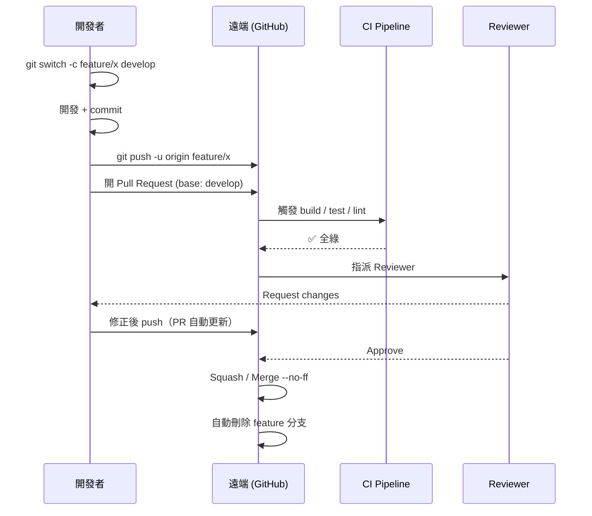

### 11.2 PR 檢查清單

```markdown
## 變更說明
<!-- 這個 PR 做了什麼？為什麼需要？ -->

## 關聯 Issue
Closes #

## 變更類型
- [ ] Bug fix（不破壞既有功能）
- [ ] New feature（不破壞既有功能）
- [ ] Breaking change
- [ ] 文件更新

## 檢查清單
- [ ] 自我 review 過程式碼
- [ ] 已加上必要的註解（複雜邏輯處）
- [ ] 已更新相關文件
- [ ] 沒有產生新的 warning
- [ ] 已加上對應的測試，且本機全數通過
- [ ] 相依的變更已先行合併
- [ ] 沒有把 secret / 憑證 commit 進去
```

### 11.3 分支保護規則（GitHub Settings → Branches）

對 `main` 與 `develop` 建議開啟：

- ✅ Require a pull request before merging（至少 1 位 approval）
- ✅ Require status checks to pass before merging（CI 綠燈才可合）
- ✅ Require branches to be up to date before merging
- ✅ Require conversation resolution before merging
- ✅ Do not allow bypassing the above settings
- ❌ Allow force pushes（**務必關閉**）
- ❌ Allow deletions（**務必關閉**）

### 11.4 CODEOWNERS

`.github/CODEOWNERS`：

```text
*                   @team-leads
/src/auth/          @security-team
/infra/             @devops-team
/k8s/               @devops-team
*.tf                @devops-team
```

### 11.5 Code Review 原則

**Reviewer：**
- 先看整體設計，再看細節
- 區分「必須改」與「建議」：用 `nit:` 前綴標示非阻擋性意見
- 對事不對人：「這個函式在 X 情況下會 panic」而非「你怎麼會這樣寫」
- 24 小時內回應，別讓 PR 卡著

**Author：**
- PR 控制在 400 行以內（超過就拆）
- 標題清楚、描述完整、附截圖或測試結果
- 每一則意見都要回覆（採納或說明為何不採納）

---

## 12. 分支策略比較

| | **GitFlow** | **GitHub Flow** | **GitLab Flow** | **Trunk-Based** |
|---|---|---|---|---|
| 長期分支 | main + develop | main | main + env 分支 | main |
| 短期分支 | feature/release/hotfix | feature | feature | 極短命 feature |
| 發版方式 | release 分支 + tag | 合併即部署 | 逐級推進環境 | 持續部署 + feature flag |
| 分支存活 | 數天～數週 | 數小時～數天 | 數小時～數天 | < 1 天 |
| 複雜度 | 高 | 低 | 中 | 低（但需強測試） |
| **適合** | 有版本號的產品、需維護多版本、有 QA 凍結期、桌面/嵌入式/企業軟體 | SaaS、持續部署、小團隊 | 需要明確環境階段的團隊 | 高頻部署、成熟 CI/CD、大型團隊 |
| **不適合** | 一天部署 10 次的 SaaS | 需要維護多個版本 | — | 測試覆蓋率低的團隊 |

### 何時**不該**用 GitFlow

- 你的產品是 SaaS，只有一個線上版本，且每天部署多次 → 用 GitHub Flow
- 團隊小於 5 人、沒有 QA 凍結期 → GitFlow 的儀式感會拖慢你
- feature 分支經常活超過一週 → 先解決「拆任務」的問題，換模型救不了

### 何時 GitFlow 很好用

- 需要同時維護 v1.x 與 v2.x
- 有明確的 QA / UAT 凍結期
- 發版需要走審批流程
- App Store / 韌體 / 客戶端安裝檔這類「發出去就收不回來」的產品

### 12.1 GitFlow 與 GitOps 的差別

這是最常被混淆的一組概念。原因是名字都有 Git、都跟分支有關、也都會出現在 CI/CD 的討論裡。

**但它們回答的根本不是同一個問題，因此不是二選一。**

| | **GitFlow** | **GitOps** |
|---|---|---|
| **它是什麼** | 分支策略（branching strategy） | 維運模型（operating model） |
| **回答的問題** | 「**原始碼**要怎麼分流、整合、發版？」 | 「**執行中的系統**該長什麼樣，由誰決定？」 |
| **管的東西** | 應用程式的原始碼 | 叢集的期望狀態（manifest / Helm values / Terraform） |
| **核心機制** | feature / release / hotfix 分支 + tag | 宣告式設定 + 持續調和（reconciliation） |
| **誰動到環境** | CI 拿著憑證**推**（push） | 叢集內的 Agent 自己**拉**（pull） |
| **「完成」的定義** | 合併進 main 並打 tag | 叢集實際狀態 == Git 中的期望狀態 |
| **回滾方式** | `git revert` 原始碼 → 重新發版 | `git revert` 設定檔 → Agent 自動收斂 |
| **典型工具** | git、git-flow、GitHub PR | Argo CD、Flux |
| **提出年份** | 2010 | 2017（Weaveworks） |

#### 一句話區分

> **GitFlow 管的是「程式碼怎麼變成一個版本」；GitOps 管的是「一個版本怎麼變成線上的狀態」。**

前者的終點（打出 `v1.2.0` 這個 tag），正好是後者的起點。

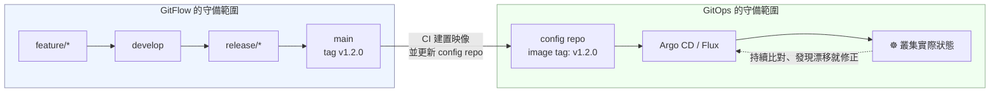

#### 兩者搭配時的實際樣貌

GitOps 通常會用到**兩個 repo**，這是與純 GitFlow 最大的體感差異：

| Repo | 內容 | 用什麼分支策略 |
|------|------|---------------|
| **app repo** | 應用程式原始碼 | **GitFlow**（feature / release / hotfix / tag） |
| **config repo** | K8s manifest、Helm values、環境差異 | 通常是 **Trunk-Based 或環境分支**，很少用完整 GitFlow |

為什麼 config repo 不用 GitFlow？因為它**沒有「版本」這個概念**——設定檔不需要 QA 凍結期，也不需要同時維護 v1.x 與 v2.x。它要的是「現在線上該是什麼樣」，越直接越好。

分支對應關係則可以無縫接軌（[附錄 D.3](docs/pipelines.md#d3-argo-cdgitops-版本) 有可執行的設定）：

| app repo 分支 | config repo 分支 / 目錄 | Argo CD Application | 同步策略 |
|---|---|---|---|
| `develop` | `envs/dev` | `demo-app-dev` | 全自動（`automated` + `selfHeal`） |
| `release/*` | `envs/staging` | `demo-app-staging` | 全自動 |
| `main` + tag | `envs/prod` | `demo-app-prod` | **手動 Sync**（人工閘門） |

#### 導入 GitOps 之後，GitFlow 要不要改？

不一定要，但有兩件事會被放大：

1. **hotfix 變快，所以更不能忘記合回 develop。** GitOps 讓「改設定 → 上線」縮短到幾十秒，
   於是「先救火、之後再補同步」的誘惑更大——而這正是[情境 10](docs/scenarios.md#情境-10release-進行中發生-hotfix) 那個回歸 bug 的溫床。
2. **release 分支的價值下降。** 若你已經有 staging 環境長期跑著、且能一鍵回滾，
   「凍結一個分支做 QA」的必要性就低了。這時候 GitHub Flow + GitOps 往往比 GitFlow + GitOps 更順。

反過來說，**如果你的產品有版本號、要維護多版本、發版需要審批，GitFlow 的價值不會因為導入 GitOps 而消失**——那些需求是 GitOps 完全沒有處理的。

#### 常見誤解

| 誤解 | 事實 |
|------|------|
| 「用了 GitOps 就不需要 GitFlow」 | 兩者管不同的東西。你仍然要決定 feature 怎麼合、版本怎麼發 |
| 「GitOps 就是把 YAML 放進 Git」 | 放進 Git 只是前提；核心是**持續調和**——有人手動改叢集，Agent 會自動改回來 |
| 「GitOps 是一種 CI/CD 工具」 | 它是 **CD** 的模型，CI（建置、測試）仍然由 GitHub Actions / GitLab CI 這類工具負責 |
| 「GitFlow 過時了，該換 GitOps」 | 這句話等於「腳踏車過時了，該換游泳」——不同維度的東西 |

---

## 13. Git 互動演練場

> 前面十二章是「讀」，這一章是「做」。
> `drills/practice.sh` 會幫你把情境佈置好（包含刻意製造的衝突與災難現場），
> **指令由你自己下**，再由它逐項驗收並給出診斷式回饋。

### 13.1 怎麼用

```bash
chmod +x drills/practice.sh

./drills/practice.sh list         # 列出 12 題
./drills/practice.sh start 5      # 佈置第 5 題並顯示任務
cd /tmp/gitflow-drills/d5         # ← 在這裡下你自己的 git 指令
./drills/practice.sh check 5      # 驗收（在哪個目錄執行都可以）
./drills/practice.sh hint 5       # 卡住時看提示（不含答案）
./drills/practice.sh solve 5      # 真的想不出來才看解答（會自動做完）
./drills/practice.sh reset 5      # 重來一次
./drills/practice.sh clean        # 全部清掉
```

> 練習全部在 `/tmp/gitflow-drills/` 的沙箱 repo 中進行，**不會動到你任何既有專案**。
> 只需要 `git`，不需要 Docker 或 Kubernetes。

### 13.2 12 題一覽

| # | 難度 | 練習 | 你會學到 |
|---|------|------|----------|
| 1 | ⭐ | 第一個 commit：add / commit / .gitignore | 追蹤與忽略的分界 |
| 2 | ⭐ | 三大區域：工作目錄 / 暫存區 / 版本庫 | `restore` 與 `restore --staged` 的天壤之別 |
| 3 | ⭐ | 分支：branch / switch，建立 GitFlow 骨架 | 分支只是指標，開分支近乎零成本 |
| 4 | ⭐⭐ | 合併：fast-forward vs `--no-ff` | 為什麼 GitFlow 堅持 `--no-ff` |
| 5 | ⭐⭐ | **★ 製造並解決合併衝突** | 解衝突五步驟、`zdiff3`、`--abort` |
| 6 | ⭐ | 標籤：annotated vs lightweight tag | 為何發版一定要 `-a` |
| 7 | ⭐⭐ | 撤銷三兄弟：restore / reset / revert | 「推出去了沒」決定用哪一個 |
| 8 | ⭐⭐ | stash：把做到一半的工作收起來 | `-u` 的陷阱、pop vs apply |
| 9 | ⭐⭐ | cherry-pick：只挑一個 commit | SHA 會變、何時該用它 |
| 10 | ⭐⭐⭐ | rebase：把分支換基底 | rebase 黃金法則、何時該改用 merge |
| 11 | ⭐⭐ | reflog：救回 `reset --hard` 掉的 commit | Git 幾乎刪不掉東西 |
| 12 | ⭐⭐⭐ | **★ 完整 GitFlow 小循環（總複習）** | feature → release → main + tag → develop |

### 13.3 實際長什麼樣

以最重要的**第 5 題（衝突處理）**為例：

```console
$ ./drills/practice.sh start 5

┌────────────────────────────────────────────────────────────┐
│ 練習 5  ⭐⭐  ★ 製造並解決合併衝突                            │
└────────────────────────────────────────────────────────────┘

📋 任務
  develop 與 feature/discount 改到了同一個檔案的相鄰行：
    · develop           freeShipping: 1000 → 500
    · feature/discount  discount: 0.1 → 0.2

  請在 develop 上執行 --no-ff 合併，解決衝突，
  最終 pricing.js 必須同時保留兩邊的修改：
    discount: 0.2  且  freeShipping: 500

💡 建議
  解衝突的順序永遠是這五步：
    1. git status                      看哪些檔案卡住（Unmerged paths）
    2. 編輯檔案                        刪掉 <<<<<<< ======= >>>>>>> 三種標記
    3. git add <file>                  標記為已解決
    4. git status                      確認沒有遺漏
    5. git commit                      完成合併（訊息已預填）

  做錯了不用怕：git merge --abort 隨時可以回到合併前，什麼都沒發生。

📂 練習目錄：/tmp/gitflow-drills/d5
   cd /tmp/gitflow-drills/d5
```

自己動手之後驗收：

```console
$ ./drills/practice.sh check 5

┌────────────────────────────────────────────────────────────┐
│ 驗收：練習 5  ★ 製造並解決合併衝突                           │
└────────────────────────────────────────────────────────────┘
  ✔ 沒有殘留的衝突標記
  ✔ 保留了 feature 的修改（discount: 0.2）
  ✔ 保留了 develop 的修改（freeShipping: 500）
  ✔ HEAD 是合併節點

🎓 學習重點
  衝突不是錯誤，是 Git 在說「這兩個改動我不敢替你決定」。
  它只比對文字，不理解語意 —— 所以解完一定要跑測試。

🎉 全部通過！
   下一題：./drills/practice.sh start 6
```

驗收訊息是**診斷式**的，做錯時會直接告訴你錯在哪個觀念：

```text
✘ HEAD 不是合併節點 —— 你可能做成了 fast-forward（少了 --no-ff）
✘ conf.txt 的修改被丟掉了 —— --staged 參數不能省
✘ wip.txt 不見了 —— stash 時少了 -u，未追蹤檔案沒被收進去
✘ 壞 commit 從歷史中消失了 —— 你用了 reset，但題目說它已經推出去了
✘ ★ release 沒有合回 develop —— 這是 GitFlow 最常見的錯誤（下一版會退版）
```

### 13.4 給初學者的學習路線

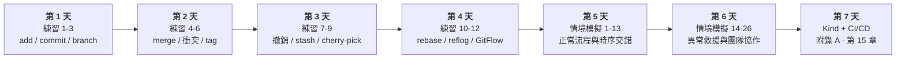

**六個建議**

1. **每個動作前後都 `git status`。** 新手九成的混亂，來自不知道自己現在在哪個狀態。
2. **把 `git log --oneline --graph --decorate --all` 設成別名。** 看得到圖，觀念才立得起來。
3. **刻意把事情搞砸，再救回來。** 練習 11 就是為此設計的 —— 知道救得回來，你才敢用 Git。
4. **先學會 `--abort`，再學那個指令本身。** `merge --abort`、`rebase --abort`、`cherry-pick --abort` 是你的安全網。
5. **commit 要小而頻繁。** Git 唯一救不回來的，是你從未 commit 過的東西。
6. **先分辨「推出去了沒」，再決定用 reset 還是 revert。** 這一題答錯，會害到整個團隊。

**新手最常見的五個誤解**

| 誤解 | 真相 |
|------|------|
| 「commit 就等於備份到雲端」 | commit 只寫在本機 `.git`，要 `push` 才會上遠端 |
| 「.gitignore 可以擋掉任何檔案」 | 對**已追蹤**的檔案無效，要先 `git rm --cached` |
| 「衝突代表我做錯了」 | 衝突是正常的協作結果，Git 只是不敢替你決定 |
| 「`reset --hard` 之後就沒救了」 | `git reflog` 幾乎都救得回來（預設保留 90 天） |
| 「rebase 比 merge 高級，應該都用 rebase」 | 共用分支上 rebase 會害慘同事，見練習 10 |

---

## 附錄 B：疑難排解 FAQ

### B.1 認證與連線

```bash
# Permission denied (publickey)
ssh -T git@github.com -v            # 查看握手細節
ssh-add -l                          # 確認金鑰已載入 agent
ssh-add ~/.ssh/id_ed25519

# 想從 HTTPS 換成 SSH
git remote set-url origin git@github.com:user/repo.git

# HTTPS 每次都要輸密碼（macOS）
git config --global credential.helper osxkeychain
```

### B.2 常見錯誤與解法

| 錯誤訊息 | 原因 | 解法 |
|---------|------|------|
| `Updates were rejected because the remote contains work...` | 遠端有你沒有的 commit | `git pull --rebase` 後再 push |
| `fatal: refusing to merge unrelated histories` | 兩個歷史無共同祖先 | `git pull --allow-unrelated-histories` |
| `error: Your local changes would be overwritten` | 有未 commit 的變更 | `git stash` → 操作 → `git stash pop` |
| `detached HEAD state` | checkout 到某個 commit | `git switch -c temp` 保存，或 `git switch main` |
| `branch is not fully merged` | 刪除未合併分支 | 確認後 `git branch -D` |
| `Cannot rebase: You have unstaged changes` | 工作目錄不乾淨 | `git stash` 或先 commit |
| `Auto-merging ... CONFLICT` | 合併衝突 | 見 [4.3 節](#43-衝突處理-sop) |

### B.3 我把東西搞砸了

```bash
# 1. 誤刪分支
git reflog                                   # 找到分支最後的 commit
git switch -c recovered-branch <sha>

# 2. 誤 reset --hard
git reflog                                   # 找 reset 前的 HEAD
git reset --hard HEAD@{1}

# 3. 誤 commit 到錯的分支
git reset --soft HEAD~1                      # 撤銷 commit，變更留著
git stash
git switch correct-branch
git stash pop
git commit -m "..."

# 4. 誤把大檔 / 機密 commit 了（尚未 push）
git reset --soft HEAD~1
git rm --cached secret.env
echo "secret.env" >> .gitignore
git commit -m "chore: 移除機密檔案"

# 5. 已 push 的機密（★ 先輪換金鑰，再清歷史）
pip install git-filter-repo
git filter-repo --path secret.env --invert-paths --force
git push origin --force --all
git push origin --force --tags
# 通知所有協作者重新 clone

# 6. 想放棄本地全部變更，完全同步遠端
git fetch origin
git reset --hard origin/main
git clean -fd
```

### B.4 GitFlow 特有問題

| 問題 | 解法 |
|------|------|
| hotfix 忘了合回 develop | `git switch develop && git merge --no-ff hotfix/x`；若分支已刪，用 `git merge --no-ff <tag>` 或 cherry-pick |
| release 期間有 hotfix 上線 | 把 hotfix **同時**合進 `main`、`release/*`；release 完成時自然帶進 develop |
| feature 分支落後 develop 太多 | `git switch feature/x && git rebase develop`（分支僅自己使用）或 `git merge develop`（多人共用） |
| 需要同時維護 v1.x 與 v2.x | 建立長期分支 `support/1.x`（`git flow support start 1.x v1.9.0`），hotfix 從該分支開 |
| `git flow feature finish` 繞過了 Code Review | 改用 `git flow feature publish` + 平台 PR 合併 |
| develop 上有不該進下一版的功能 | 用 feature flag 隱藏，或 `git revert` 後另開分支保存 |

---

## 附錄 C：指令速查表

### 設定

```bash
git config --global user.name "Name"
git config --global user.email "a@b.c"
git config --list --show-origin
```

### 基本

```bash
git init / git clone <url>
git status / git status -s
git add <file> / git add -A / git add -p
git commit -m "msg" / git commit --amend
git log --oneline --graph --decorate --all
git diff / git diff --staged
git show <sha> / git blame <file>
```

### 分支

```bash
git branch -a / git branch -vv
git switch <branch> / git switch -c <branch>
git merge --no-ff <branch>
git merge --abort
git branch -d <branch> / git branch -D <branch>
git rebase <base> / git rebase -i HEAD~N
```

### 遠端

```bash
git remote -v / git remote add origin <url>
git fetch --all --prune
git pull --rebase
git push -u origin <branch>
git push --force-with-lease
git push origin --delete <branch>
```

### 撤銷

```bash
git restore <file>                 # 丟棄工作目錄修改
git restore --staged <file>        # 取消 stage
git reset --soft HEAD~1            # 撤 commit，留暫存區
git reset --hard HEAD~1            # 撤 commit，全丟 ⚠️
git revert <sha>                   # 反向 commit（已 push 用這個）
git reflog                         # 後悔藥
git stash / git stash pop
git cherry-pick <sha>
```

### 標籤

```bash
git tag -a v1.0.0 -m "Release 1.0.0"
git push origin --tags
git tag -d v1.0.0
git push origin :refs/tags/v1.0.0
```

### GitFlow

```bash
git flow init -d
git flow feature start  <name>   /  publish <name>  /  finish <name>
git flow release start  <ver>    /  publish <ver>   /  finish -m "msg" <ver>
git flow hotfix  start  <ver>                       /  finish -m "msg" <ver>
git flow feature list
```

### Kind / Kubernetes

```bash
kind create cluster --config kind-cluster.yaml
kind load docker-image <image> --name <cluster>
kind get clusters / kind delete cluster --name <name>

kubectl get nodes,pods,svc -A
kubectl -n <ns> apply -f <file>
kubectl -n <ns> set image deployment/<d> <c>=<image>
kubectl -n <ns> rollout status deployment/<d>
kubectl -n <ns> rollout undo deployment/<d>
kubectl -n <ns> logs -f deployment/<d>
kubectl -n <ns> describe pod <pod>
kubectl -n <ns> port-forward svc/<svc> 8000:80
```

### 本專案的演練工具

```bash
./drills/practice.sh list          # 12 題互動演練（你動手）
./drills/practice.sh start <n>     # 佈題
./drills/practice.sh check <n>     # 驗收
./drills/practice.sh hint  <n>     # 提示
./drills/practice.sh solve <n>     # 解答

./scenarios/simulate.sh list       # 26 個情境（自動演示）
./scenarios/simulate.sh 10         # 跑單一情境
./scenarios/simulate.sh all        # 全部跑一遍

./scripts/deploy.sh <branch>       # 依分支部署到對應 namespace
./scripts/verify-docs.sh           # 文件與腳本一致性檢查（改完務必跑一次）
```

### 維護本手冊

手冊裡的題目與情境清單是手寫的，腳本才是真相來源。改動任一邊之後執行：

```bash
./scripts/verify-docs.sh
```

它會檢查演練題數與標題、情境編號、pipeline 檔案引用、所有 Markdown 連結與錨點、
程式碼圍籬平衡、Shell 語法與 YAML 可解析性，任何一項不一致就以非零離開碼結束。

---

## 延伸閱讀

- [Pro Git（繁體中文全書，免費）](https://git-scm.com/book/zh-tw/v2)
- [Vincent Driessen — A successful Git branching model（GitFlow 原文）](https://nvie.com/posts/a-successful-git-branching-model/)
- [gitflow-avh 官方文件](https://github.com/petervanderdoes/gitflow-avh/wiki)
- [Conventional Commits](https://www.conventionalcommits.org/zh-hant/)
- [Semantic Versioning](https://semver.org/lang/zh-TW/)
- [Kind 官方文件](https://kind.sigs.k8s.io/)
- [Learn Git Branching（互動式練習）](https://learngitbranching.js.org/?locale=zh_TW)
- [Oh Shit, Git!?!](https://ohshitgit.com/)
- [C4 Model 官方網站](https://c4model.com/)
- [Argo CD 官方文件](https://argo-cd.readthedocs.io/)
- [ingress-nginx for Kind](https://kind.sigs.k8s.io/docs/user/ingress/)

---

## 授權

本手冊以 [CC BY 4.0](https://creativecommons.org/licenses/by/4.0/deed.zh-hant) 釋出，歡迎自由使用與改作。
