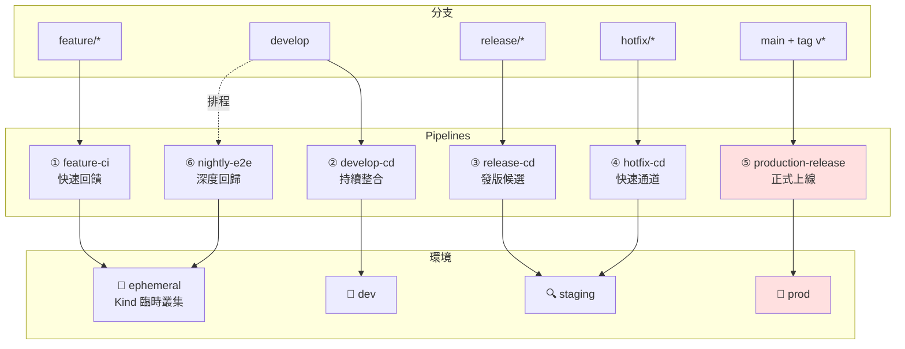
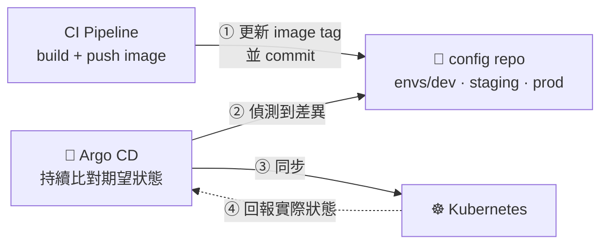

# 多 Pipeline 設計

> 本頁是《[Git 與 GitFlow 教學手冊](../README.md)》的第 15 章與附錄 D。

[← 回手冊首頁](../README.md) ｜ [上一章：GitFlow 情境模擬全集](scenarios.md) ｜ [下一章：Kind + Kubernetes 部署](kubernetes.md)

---

## 15. 多 Pipeline 設計

GitFlow 的每種分支有不同的**風險等級**與**目的**，因此不該共用同一條 pipeline。
本章把 CI/CD 拆成 **6 條獨立流水線**，各自有不同的觸發條件、檢查強度與審批要求。

> 檔案放在 [`ci-examples/github-actions/`](../ci-examples/github-actions/)，**目前為未啟用狀態**
> （不在 `.github/workflows/` 底下，GitHub 不會觸發）。啟用方式見[專案檔案結構](../README.md#專案檔案結構)的說明。

### 15.1 全景圖



### 15.2 Pipeline 矩陣

| # | Pipeline | 觸發 | 檢查項目 | 部署目標 | 時間預算 | 人工審批 |
|---|----------|------|----------|----------|----------|----------|
| ① | `feature-ci` | push `feature/**`、PR → develop | lint、unit test、build、secret 掃描 | Kind 臨時叢集（PR 專屬） | **< 5 min** | 否 |
| ② | `develop-cd` | push `develop` | ① + 整合測試 + 覆蓋率門檻 | `dev` namespace | < 15 min | 否 |
| ③ | `release-cd` | push `release/**` | ② + E2E + 效能 + 相依漏洞掃描 | `staging` namespace | < 30 min | 否（部署 staging） |
| ④ | `hotfix-cd` | push `hotfix/**` | 精簡：unit + 冒煙測試 | `staging`（快速通道） | **< 8 min** | 是（上 prod 前） |
| ⑤ | `production-release` | push tag `v*` | 映像簽章驗證、manifest diff | `prod` namespace | < 20 min | **是（2 人）** |
| ⑥ | `nightly-e2e` | 每日 02:00 排程 | 完整 GitFlow 回歸、多版本相容、負載測試 | Kind 臨時叢集 | < 90 min | 否 |

### 15.3 Pipeline ①：feature-ci（快速回饋）

`ci-examples/github-actions/01-feature-ci.yml`

```yaml
name: "① feature-ci"

on:
  push:
    branches: ['feature/**']
  pull_request:
    branches: [develop]

concurrency:                      # 同分支新 push 取消舊的跑，省 runner
  group: feature-ci-${{ github.ref }}
  cancel-in-progress: true

permissions:
  contents: read
  pull-requests: write

jobs:
  guard:
    name: 分支規範檢查
    runs-on: ubuntu-latest
    steps:
      - uses: actions/checkout@v4
        with: { fetch-depth: 0 }

      - name: 分支命名必須符合 GitFlow
        if: github.event_name == 'push'
        run: |
          B="${GITHUB_REF#refs/heads/}"
          [[ "$B" =~ ^feature/[a-z0-9._-]+$ ]] || {
            echo "::error::分支名 '$B' 不符 feature/<name> 規範"; exit 1; }

      - name: feature 的 PR 只能指向 develop
        if: github.event_name == 'pull_request'
        run: |
          [[ "${{ github.base_ref }}" == "develop" ]] || {
            echo "::error::feature 分支只能合併到 develop，不可直接進 main"; exit 1; }

      - name: Commit 訊息需符合 Conventional Commits
        if: github.event_name == 'pull_request'
        run: |
          PAT='^(feat|fix|docs|style|refactor|perf|test|build|ci|chore|revert)(\([a-z0-9/_-]+\))?!?: .{1,72}$'
          BAD=0
          while read -r line; do
            [[ "$line" =~ ^(Merge|Revert)\  ]] && continue
            echo "$line" | grep -qE "$PAT" || { echo "❌ $line"; BAD=1; }
          done < <(git log --format=%s origin/${{ github.base_ref }}..HEAD)
          exit $BAD

  quality:
    name: 靜態檢查與單元測試
    runs-on: ubuntu-latest
    needs: guard
    steps:
      - uses: actions/checkout@v4

      - name: Secret 掃描
        uses: gitleaks/gitleaks-action@v2
        env:
          GITHUB_TOKEN: ${{ secrets.GITHUB_TOKEN }}

      - name: Lint
        run: echo "npm run lint / golangci-lint run / ruff check ."

      - name: Unit test（含覆蓋率）
        run: echo "npm test -- --coverage"

      - name: 建置映像
        run: |
          docker build \
            --build-arg APP_VERSION="$(cat VERSION 2>/dev/null || echo 0.0.0-dev)" \
            --build-arg GIT_BRANCH="${GITHUB_REF_NAME}" \
            --build-arg GIT_SHA="${GITHUB_SHA::7}" \
            -t demo-app:${GITHUB_SHA::7} ./app

  preview:
    name: PR 預覽環境（Kind 臨時叢集）
    runs-on: ubuntu-latest
    needs: quality
    if: github.event_name == 'pull_request'
    steps:
      - uses: actions/checkout@v4

      - uses: helm/kind-action@v1
        with:
          cluster_name: pr-${{ github.event.number }}
          config: kind-cluster.yaml

      - name: 部署到臨時叢集並冒煙測試
        run: |
          NS="pr-${{ github.event.number }}"
          docker build -t demo-app:pr ./app
          kind load docker-image demo-app:pr --name "pr-${{ github.event.number }}"
          kubectl create namespace "$NS"
          kubectl -n "$NS" apply -f k8s/base/deployment.yaml
          kubectl -n "$NS" set image deployment/demo-app web=demo-app:pr
          kubectl -n "$NS" rollout status deployment/demo-app --timeout=180s
          kubectl -n "$NS" run smoke --image=curlimages/curl --rm -i --restart=Never -- \
            curl -sf "http://demo-app.${NS}.svc.cluster.local"

      - name: 在 PR 留言結果
        uses: actions/github-script@v7
        with:
          script: |
            github.rest.issues.createComment({
              issue_number: context.issue.number,
              owner: context.repo.owner,
              repo: context.repo.repo,
              body: '✅ 預覽環境部署成功（Kind ephemeral cluster）\n\n映像：`demo-app:pr`'
            })
```

> **Kind 叢集在 job 結束時隨 runner 一起消失**，這正是 PR 預覽環境最省成本的做法 —— 不需要維護一座常駐叢集。

---

### 15.4 Pipeline ②：develop-cd（持續整合 → dev 環境）

`ci-examples/github-actions/02-develop-cd.yml`

```yaml
name: "② develop-cd"

on:
  push:
    branches: [develop]

concurrency:
  group: develop-cd
  cancel-in-progress: false        # ★ 部署不可取消，排隊執行

permissions:
  contents: read
  packages: write

env:
  REGISTRY: ghcr.io
  IMAGE: ${{ github.repository }}/demo-app

jobs:
  build:
    runs-on: ubuntu-latest
    outputs:
      tag: ${{ steps.meta.outputs.tag }}
    steps:
      - uses: actions/checkout@v4

      - id: meta
        run: |
          VER="$(cat VERSION 2>/dev/null || echo 0.0.0)"
          echo "tag=${VER}-dev.${GITHUB_SHA::7}" >> $GITHUB_OUTPUT

      - uses: docker/login-action@v3
        with:
          registry: ${{ env.REGISTRY }}
          username: ${{ github.actor }}
          password: ${{ secrets.GITHUB_TOKEN }}

      - uses: docker/build-push-action@v6
        with:
          context: ./app
          push: true
          tags: ${{ env.REGISTRY }}/${{ env.IMAGE }}:${{ steps.meta.outputs.tag }}
          build-args: |
            APP_VERSION=${{ steps.meta.outputs.tag }}
            GIT_BRANCH=develop
            GIT_SHA=${{ github.sha }}

  test:
    runs-on: ubuntu-latest
    needs: build
    strategy:
      fail-fast: false
      matrix:
        suite: [unit, integration, contract]
    steps:
      - uses: actions/checkout@v4
      - name: 執行 ${{ matrix.suite }} 測試
        run: echo "npm run test:${{ matrix.suite }}"

      - name: 覆蓋率門檻（< 80% 就擋）
        if: matrix.suite == 'unit'
        run: echo "檢查 coverage >= 80%"

  deploy-dev:
    runs-on: ubuntu-latest
    needs: [build, test]
    environment:
      name: development
      url: https://dev.demo.example.com
    steps:
      - uses: actions/checkout@v4

      - name: 設定 kubeconfig
        run: |
          echo "${{ secrets.KUBECONFIG_DEV }}" | base64 -d > /tmp/kubeconfig
          echo "KUBECONFIG=/tmp/kubeconfig" >> $GITHUB_ENV

      - name: 部署到 dev namespace
        run: |
          kubectl -n dev apply -f k8s/base/
          kubectl -n dev set image deployment/demo-app \
            web=${{ env.REGISTRY }}/${{ env.IMAGE }}:${{ needs.build.outputs.tag }}
          kubectl -n dev annotate deployment/demo-app \
            kubernetes.io/change-cause="develop@${GITHUB_SHA::7}" --overwrite
          kubectl -n dev rollout status deployment/demo-app --timeout=180s

      - name: 部署失敗自動回滾
        if: failure()
        run: kubectl -n dev rollout undo deployment/demo-app
```

---

### 15.5 Pipeline ③：release-cd（發版候選 → staging）

`ci-examples/github-actions/03-release-cd.yml`

```yaml
name: "③ release-cd"

on:
  push:
    branches: ['release/**']

concurrency:
  group: release-cd-${{ github.ref }}
  cancel-in-progress: false

jobs:
  validate:
    name: 發版前置檢查
    runs-on: ubuntu-latest
    outputs:
      version: ${{ steps.v.outputs.version }}
    steps:
      - uses: actions/checkout@v4
        with: { fetch-depth: 0 }

      - id: v
        name: 分支名與 VERSION 檔必須一致
        run: |
          BR_VER="${GITHUB_REF#refs/heads/release/}"
          FILE_VER="$(cat VERSION)"
          [[ "$BR_VER" == "$FILE_VER" ]] || {
            echo "::error::分支 release/$BR_VER 與 VERSION 檔 ($FILE_VER) 不一致"; exit 1; }
          [[ "$BR_VER" =~ ^[0-9]+\.[0-9]+\.[0-9]+$ ]] || {
            echo "::error::版本號 '$BR_VER' 不符 SemVer"; exit 1; }
          echo "version=$BR_VER" >> $GITHUB_OUTPUT

      - name: tag 不可重複
        run: |
          git fetch --tags
          git rev-parse "v${{ steps.v.outputs.version }}" >/dev/null 2>&1 && {
            echo "::error::tag v${{ steps.v.outputs.version }} 已存在"; exit 1; } || true

      - name: release 分支不得含新功能 commit
        run: |
          NEW_FEATS=$(git log --format=%s origin/develop..HEAD | grep -c '^feat' || true)
          if [ "$NEW_FEATS" -gt 0 ]; then
            echo "::warning::release 分支上有 $NEW_FEATS 個 feat commit，請確認是否應退回 develop"
            git log --format='  %s' origin/develop..HEAD | grep '^  feat' || true
          fi

  security:
    runs-on: ubuntu-latest
    needs: validate
    steps:
      - uses: actions/checkout@v4
      - name: 相依套件漏洞掃描
        run: echo "npm audit --audit-level=high / trivy fs ."
      - name: 容器映像掃描
        run: |
          docker build -t demo-app:scan ./app
          echo "trivy image --severity HIGH,CRITICAL --exit-code 1 demo-app:scan"

  e2e:
    name: E2E（Kind 全流程）
    runs-on: ubuntu-latest
    needs: validate
    steps:
      - uses: actions/checkout@v4
      - uses: helm/kind-action@v1
        with: { cluster_name: rc, config: kind-cluster.yaml }
      - name: 部署完整堆疊並跑 E2E
        run: |
          docker build -t demo-app:rc ./app
          kind load docker-image demo-app:rc --name rc
          kubectl create namespace rc
          kubectl -n rc apply -f k8s/base/
          kubectl -n rc set image deployment/demo-app web=demo-app:rc
          kubectl -n rc rollout status deployment/demo-app --timeout=240s
          echo "npx playwright test --grep @e2e"

  perf:
    runs-on: ubuntu-latest
    needs: validate
    steps:
      - uses: actions/checkout@v4
      - name: 負載測試（p95 門檻）
        run: echo "k6 run --vus 50 --duration 3m tests/load.js"

  deploy-staging:
    runs-on: ubuntu-latest
    needs: [validate, security, e2e, perf]
    environment:
      name: staging
      url: https://stg.demo.example.com
    steps:
      - uses: actions/checkout@v4
      - name: 部署到 staging
        run: |
          echo "kubectl -n staging set image deployment/demo-app web=...:${{ needs.validate.outputs.version }}-rc.${GITHUB_SHA::7}"
          echo "kubectl -n staging rollout status deployment/demo-app"

  open-pr:
    name: 自動開立 release → main 的 PR
    runs-on: ubuntu-latest
    needs: deploy-staging
    permissions: { contents: read, pull-requests: write }
    steps:
      - uses: actions/checkout@v4
      - uses: actions/github-script@v7
        with:
          script: |
            const head = context.ref.replace('refs/heads/', '');
            const version = head.replace('release/', '');
            const { data: existing } = await github.rest.pulls.list({
              owner: context.repo.owner, repo: context.repo.repo,
              head: `${context.repo.owner}:${head}`, base: 'main', state: 'open',
            });
            if (existing.length) return;
            await github.rest.pulls.create({
              owner: context.repo.owner, repo: context.repo.repo,
              title: `Release ${version}`, head, base: 'main',
              body: [
                `## Release ${version}`, '',
                '- [ ] QA 於 staging 驗證通過',
                '- [ ] Release Notes 已撰寫',
                '- [ ] 資料庫 migration 已確認',
                '- [ ] 回滾方案已確認',
                '', '合併後請立即打上 `v' + version + '` tag 以觸發 production pipeline。',
              ].join('\n'),
            });
```

---

### 15.6 Pipeline ④：hotfix-cd（快速通道）

`ci-examples/github-actions/04-hotfix-cd.yml`

```yaml
name: "④ hotfix-cd"

on:
  push:
    branches: ['hotfix/**']

concurrency:
  group: hotfix-cd-${{ github.ref }}
  cancel-in-progress: true

jobs:
  fast-check:
    name: 精簡檢查（目標 < 8 分鐘）
    runs-on: ubuntu-latest
    timeout-minutes: 10
    outputs:
      version: ${{ steps.v.outputs.version }}
    steps:
      - uses: actions/checkout@v4
        with: { fetch-depth: 0 }

      - id: v
        run: echo "version=${GITHUB_REF#refs/heads/hotfix/}" >> $GITHUB_OUTPUT

      - name: ★ hotfix 必須以 main 為基底
        run: |
          git fetch origin main
          BASE=$(git merge-base origin/main HEAD)
          MAIN=$(git rev-parse origin/main)
          if [ "$BASE" != "$MAIN" ]; then
            echo "::error::hotfix 分支不是從最新的 main 開出來的"
            echo "請執行：git rebase --onto origin/main \$(git merge-base origin/main HEAD)"
            exit 1
          fi

      - name: hotfix 只能是 PATCH 版本號遞增
        run: |
          git fetch --tags
          LAST=$(git describe --tags --abbrev=0 origin/main)
          echo "上一版：$LAST → 本次：v${{ steps.v.outputs.version }}"
          echo "${{ steps.v.outputs.version }}" | grep -qE '^[0-9]+\.[0-9]+\.[1-9][0-9]*$' || {
            echo "::error::hotfix 版本號必須是 PATCH 遞增（x.y.Z）"; exit 1; }

      - name: hotfix 變更範圍檢查（過大就警告）
        run: |
          CHANGED=$(git diff --shortstat origin/main...HEAD)
          echo "變更：$CHANGED"
          LINES=$(git diff --numstat origin/main...HEAD | awk '{s+=$1+$2} END {print s+0}')
          [ "$LINES" -lt 300 ] || echo "::warning::hotfix 變更 $LINES 行，超出建議範圍（<300），請確認不是偽裝的 feature"

      - name: Unit test + 冒煙測試
        run: echo "npm run test:unit && npm run test:smoke"

  deploy-staging:
    runs-on: ubuntu-latest
    needs: fast-check
    environment: { name: staging }
    steps:
      - run: echo "kubectl -n staging set image deployment/demo-app web=...:hotfix-${GITHUB_SHA::7}"

  notify:
    runs-on: ubuntu-latest
    needs: deploy-staging
    steps:
      - name: 通知值班人員驗證
        run: |
          echo "🚨 Hotfix v${{ needs.fast-check.outputs.version }} 已部署到 staging"
          echo "驗證通過後，請合併 hotfix → main 並打 tag 以觸發 production pipeline"
          echo "★ 別忘了同時合併回 develop"

  remind-develop-sync:
    name: 提醒同步回 develop
    runs-on: ubuntu-latest
    needs: fast-check
    permissions: { contents: read, pull-requests: write }
    steps:
      - uses: actions/checkout@v4
        with: { fetch-depth: 0 }
      - uses: actions/github-script@v7
        with:
          script: |
            const head = context.ref.replace('refs/heads/', '');
            for (const base of ['main', 'develop']) {
              const { data: ex } = await github.rest.pulls.list({
                owner: context.repo.owner, repo: context.repo.repo,
                head: `${context.repo.owner}:${head}`, base, state: 'open' });
              if (ex.length) continue;
              await github.rest.pulls.create({
                owner: context.repo.owner, repo: context.repo.repo,
                title: `[Hotfix] ${head} → ${base}`, head, base,
                body: `Hotfix 必須同時合併回 \`main\` 與 \`develop\`，此 PR 為自動建立。`,
              }).catch(() => {});
            }
```

> **為何 hotfix 要獨立一條 pipeline？**
> 因為它的目標是**分鐘級**修復。跑完整 30 分鐘的 release pipeline，線上就多壞 30 分鐘。
> 代價是檢查較淺 — 所以用「必須從 main 開」「變更 < 300 行」「必須人工審批上 prod」來補回安全性。

---

### 15.7 Pipeline ⑤：production-release（正式上線）

`ci-examples/github-actions/05-production-release.yml`

```yaml
name: "⑤ production-release"

on:
  push:
    tags: ['v*.*.*']

concurrency:
  group: production-release
  cancel-in-progress: false

permissions:
  contents: write
  packages: write
  id-token: write            # 供 cosign keyless 簽章使用

jobs:
  verify:
    name: 上線前驗證
    runs-on: ubuntu-latest
    outputs:
      version: ${{ steps.v.outputs.version }}
    steps:
      - uses: actions/checkout@v4
        with: { fetch-depth: 0 }

      - id: v
        run: echo "version=${GITHUB_REF#refs/tags/v}" >> $GITHUB_OUTPUT

      - name: ★ tag 必須位於 main 分支上
        run: |
          git fetch origin main
          git merge-base --is-ancestor "$GITHUB_SHA" origin/main || {
            echo "::error::tag ${GITHUB_REF_NAME} 不在 main 分支上，拒絕上線"; exit 1; }

      - name: VERSION 檔需與 tag 一致
        run: |
          [[ "$(cat VERSION)" == "${{ steps.v.outputs.version }}" ]] || {
            echo "::error::VERSION 檔與 tag 不一致"; exit 1; }

      - name: 產生 Changelog
        run: |
          PREV=$(git describe --tags --abbrev=0 "${GITHUB_REF_NAME}^" 2>/dev/null || echo "")
          RANGE=${PREV:+$PREV..}${GITHUB_REF_NAME}
          {
            echo "## What's Changed"; echo
            echo "### ✨ Features";  git log --format='- %s (%h)' $RANGE | grep '^- feat' || echo "- 無"
            echo; echo "### 🐛 Fixes"; git log --format='- %s (%h)' $RANGE | grep '^- fix'  || echo "- 無"
            echo; echo "**Full Changelog**: ${PREV:-初版}...${GITHUB_REF_NAME}"
          } > CHANGELOG_RELEASE.md
          cat CHANGELOG_RELEASE.md

      - uses: actions/upload-artifact@v4
        with: { name: changelog, path: CHANGELOG_RELEASE.md }

  build-sign:
    runs-on: ubuntu-latest
    needs: verify
    steps:
      - uses: actions/checkout@v4
      - uses: docker/login-action@v3
        with:
          registry: ghcr.io
          username: ${{ github.actor }}
          password: ${{ secrets.GITHUB_TOKEN }}
      - uses: docker/build-push-action@v6
        id: push
        with:
          context: ./app
          push: true
          tags: |
            ghcr.io/${{ github.repository }}/demo-app:${{ needs.verify.outputs.version }}
            ghcr.io/${{ github.repository }}/demo-app:latest
          build-args: |
            APP_VERSION=${{ needs.verify.outputs.version }}
            GIT_BRANCH=main
            GIT_SHA=${{ github.sha }}
      - uses: sigstore/cosign-installer@v3
      - name: 簽署映像
        run: |
          cosign sign --yes \
            ghcr.io/${{ github.repository }}/demo-app@${{ steps.push.outputs.digest }}

  deploy-prod:
    name: 部署到 Production（需人工審批）
    runs-on: ubuntu-latest
    needs: [verify, build-sign]
    environment:
      name: production           # ★ 在 GitHub Settings 設定 required reviewers
      url: https://demo.example.com
    steps:
      - uses: actions/checkout@v4

      - name: 顯示 manifest 差異供審查
        run: echo "kubectl -n prod diff -f k8s/base/ || true"

      - name: 金絲雀部署（先 10% 流量）
        run: |
          echo "kubectl -n prod set image deployment/demo-app-canary web=...:${{ needs.verify.outputs.version }}"
          echo "kubectl -n prod rollout status deployment/demo-app-canary --timeout=300s"

      - name: 觀察錯誤率 5 分鐘
        run: echo "檢查 Prometheus：error_rate < 1% 且 p95 < 500ms"

      - name: 全量部署
        run: |
          echo "kubectl -n prod set image deployment/demo-app web=...:${{ needs.verify.outputs.version }}"
          echo "kubectl -n prod rollout status deployment/demo-app --timeout=600s"

      - name: 上線後冒煙測試
        run: echo "curl -sf https://demo.example.com/healthz"

      - name: ⛑ 失敗自動回滾
        if: failure()
        run: |
          echo "kubectl -n prod rollout undo deployment/demo-app"
          echo "kubectl -n prod rollout status deployment/demo-app"

  github-release:
    runs-on: ubuntu-latest
    needs: [verify, deploy-prod]
    steps:
      - uses: actions/download-artifact@v4
        with: { name: changelog }
      - uses: softprops/action-gh-release@v2
        with:
          body_path: CHANGELOG_RELEASE.md
          generate_release_notes: false

  sync-develop:
    name: 檢查 main 是否已同步回 develop
    runs-on: ubuntu-latest
    needs: deploy-prod
    steps:
      - uses: actions/checkout@v4
        with: { fetch-depth: 0 }
      - run: |
          git fetch origin main develop
          BEHIND=$(git rev-list --count origin/develop..origin/main)
          if [ "$BEHIND" -gt 0 ]; then
            echo "::warning::main 有 $BEHIND 個 commit 尚未合回 develop"
            git log --oneline origin/develop..origin/main
            echo "請執行：git switch develop && git merge --no-ff main && git push"
          else
            echo "✅ develop 已包含 main 的所有變更"
          fi
```

---

### 15.8 Pipeline ⑥：nightly-e2e（深度回歸）

`ci-examples/github-actions/06-nightly-e2e.yml`

```yaml
name: "⑥ nightly-e2e"

on:
  schedule:
    - cron: '0 18 * * *'        # UTC 18:00 = 台北 02:00
  workflow_dispatch:            # 允許手動觸發

jobs:
  gitflow-health:
    name: GitFlow 健康檢查
    runs-on: ubuntu-latest
    steps:
      - uses: actions/checkout@v4
        with: { fetch-depth: 0 }

      - name: main 與 develop 的分歧狀況
        run: |
          git fetch origin
          echo "### main → develop 未同步的 commit"
          git log --oneline origin/develop..origin/main || true
          echo "### develop 領先 main 的 commit 數"
          git rev-list --count origin/main..origin/develop

      - name: 找出長壽 feature 分支（> 7 天）
        run: |
          NOW=$(date +%s)
          git for-each-ref --format='%(refname:short) %(committerdate:unix)' refs/remotes/origin/feature | \
          while read -r br ts; do
            DAYS=$(( (NOW - ts) / 86400 ))
            [ "$DAYS" -gt 7 ] && echo "::warning::$br 已 $DAYS 天未更新，建議合併或關閉"
          done || true

      - name: 檢查是否有多個 release 分支並存
        run: |
          N=$(git branch -r --list 'origin/release/*' | wc -l)
          [ "$N" -le 1 ] || echo "::warning::目前有 $N 個 release 分支並存（GitFlow 反模式）"

      - name: 未合併的 hotfix 檢查
        run: |
          for h in $(git branch -r --list 'origin/hotfix/*'); do
            git merge-base --is-ancestor "$h" origin/develop || \
              echo "::warning::$h 尚未合併回 develop"
          done || true

  full-regression:
    name: 多版本 Kind 相容性回歸
    runs-on: ubuntu-latest
    strategy:
      fail-fast: false
      matrix:
        k8s: [v1.32.0, v1.33.0, v1.34.0]
    steps:
      - uses: actions/checkout@v4
      - uses: helm/kind-action@v1
        with:
          cluster_name: nightly-${{ strategy.job-index }}
          node_image: kindest/node:${{ matrix.k8s }}
          config: kind-cluster.yaml

      - name: 部署三個環境並驗證
        run: |
          docker build -t demo-app:nightly ./app
          kind load docker-image demo-app:nightly --name nightly-${{ strategy.job-index }}
          for NS in dev staging prod; do
            kubectl create namespace "$NS"
            kubectl -n "$NS" apply -f k8s/base/deployment.yaml
            kubectl -n "$NS" set image deployment/demo-app web=demo-app:nightly
            kubectl -n "$NS" rollout status deployment/demo-app --timeout=240s
            echo "✅ $NS on k8s ${{ matrix.k8s }}"
          done

      - name: 回滾演練
        run: |
          kubectl -n prod set image deployment/demo-app web=demo-app:nightly
          kubectl -n prod rollout status deployment/demo-app --timeout=120s
          kubectl -n prod rollout undo deployment/demo-app
          kubectl -n prod rollout status deployment/demo-app --timeout=120s
          echo "✅ 回滾機制正常"

  load-test:
    runs-on: ubuntu-latest
    needs: full-regression
    steps:
      - uses: actions/checkout@v4
      - run: echo "k6 run --vus 200 --duration 10m tests/load.js"
```

---

### 15.9 Pipeline 設計原則

| 原則 | 說明 |
|------|------|
| **分層檢查** | 越靠近 production，檢查越嚴；越靠近開發者，回饋越快 |
| **Fail fast** | 便宜的檢查（lint、分支命名）排最前面，貴的（E2E、負載）排後面 |
| **concurrency 控制** | feature：`cancel-in-progress: true`（省資源）；部署類：`false`（不可中斷） |
| **環境即審批** | 用 GitHub Environment 的 required reviewers 做人工閘門，而非在腳本裡寫 `if` |
| **回滾優先於修復** | 每條部署 pipeline 都要有 `if: failure()` 的自動回滾 |
| **Pipeline 也要版控** | workflow 檔案跟著 GitFlow 走，修改 pipeline 也要開 PR |
| **臨時叢集** | PR 預覽與 E2E 用 Kind 隨開隨關，不維護常駐測試環境 |
| **不可變映像** | 同一個 SHA 建出的映像，從 dev 一路用到 prod，不重新 build |

### 15.10 分支保護與 pipeline 的對應

| 分支 | 必過的 status checks | 審批人數 |
|------|---------------------|----------|
| `develop` | `① guard`、`① quality` | 1 |
| `release/**` | `② test`、`③ security`、`③ e2e` | 1 |
| `main` | `③ deploy-staging`、`④ fast-check`（hotfix 時） | **2** |
| tag `v*` | — （由 environment 的 required reviewers 把關） | **2** |

---

## 附錄 D：其他 CI 平台範本

[第 15 章](#15-多-pipeline-設計)以 GitHub Actions 示範，同一套「分支 → pipeline → 環境」的
設計原則在其他平台一樣適用。以下是等價實作。

### D.1 GitLab CI

`.gitlab-ci.yml` —— GitLab 用單一檔案 + `rules` 做分支分流：

```yaml
stages: [guard, test, build, deploy, release]

variables:
  IMAGE: $CI_REGISTRY_IMAGE/demo-app

# ── 可重用的規則片段 ─────────────────────────────
.on_feature: &on_feature
  rules:
    - if: '$CI_COMMIT_BRANCH =~ /^feature\//'
.on_develop: &on_develop
  rules:
    - if: '$CI_COMMIT_BRANCH == "develop"'
.on_release: &on_release
  rules:
    - if: '$CI_COMMIT_BRANCH =~ /^release\//'
.on_hotfix: &on_hotfix
  rules:
    - if: '$CI_COMMIT_BRANCH =~ /^hotfix\//'
.on_tag: &on_tag
  rules:
    - if: '$CI_COMMIT_TAG =~ /^v\d+\.\d+\.\d+$/'

# ── ① 分支規範（所有分支都跑）────────────────────
branch-guard:
  stage: guard
  script:
    - |
      case "$CI_COMMIT_BRANCH" in
        main|develop|feature/*|release/*|hotfix/*|support/*|"") ;;
        *) echo "分支 '$CI_COMMIT_BRANCH' 不符 GitFlow 規範"; exit 1 ;;
      esac

# ── ② feature：只驗證，不部署 ──────────────────
feature:test:
  <<: *on_feature
  stage: test
  script:
    - npm run lint && npm test

# ── ③ develop → dev ────────────────────────────
develop:deploy:
  <<: *on_develop
  stage: deploy
  environment:
    name: development
    url: https://dev.demo.example.com
  script:
    - docker build -t $IMAGE:$CI_COMMIT_SHORT_SHA ./app
    - docker push $IMAGE:$CI_COMMIT_SHORT_SHA
    - kubectl -n dev set image deployment/demo-app web=$IMAGE:$CI_COMMIT_SHORT_SHA
    - kubectl -n dev rollout status deployment/demo-app --timeout=180s

# ── ④ release → staging（含完整檢查）────────────
release:validate:
  <<: *on_release
  stage: guard
  script:
    - BR_VER="${CI_COMMIT_BRANCH#release/}"
    - '[ "$BR_VER" = "$(cat VERSION)" ] || { echo "分支名與 VERSION 不一致"; exit 1; }'
    - git fetch --tags
    - '! git rev-parse "v$BR_VER" >/dev/null 2>&1 || { echo "tag 已存在"; exit 1; }'

release:deploy:
  <<: *on_release
  stage: deploy
  needs: [release:validate]
  environment: { name: staging }
  script:
    - kubectl -n staging set image deployment/demo-app web=$IMAGE:$CI_COMMIT_SHORT_SHA
    - kubectl -n staging rollout status deployment/demo-app --timeout=300s

# ── ⑤ hotfix：快速通道 ─────────────────────────
hotfix:deploy:
  <<: *on_hotfix
  stage: deploy
  environment: { name: staging }
  script:
    - git fetch origin main
    - '[ "$(git merge-base origin/main HEAD)" = "$(git rev-parse origin/main)" ] || { echo "hotfix 必須從 main 開"; exit 1; }'
    - kubectl -n staging set image deployment/demo-app web=$IMAGE:$CI_COMMIT_SHORT_SHA

# ── ⑥ tag → production（需人工按鈕）─────────────
prod:deploy:
  <<: *on_tag
  stage: release
  when: manual                     # ★ GitLab 的人工閘門
  allow_failure: false
  environment:
    name: production
    url: https://demo.example.com
  script:
    - git merge-base --is-ancestor $CI_COMMIT_SHA origin/main || { echo "tag 不在 main 上"; exit 1; }
    - kubectl -n prod set image deployment/demo-app web=$IMAGE:${CI_COMMIT_TAG#v}
    - kubectl -n prod rollout status deployment/demo-app --timeout=600s
  after_script:
    - '[ "$CI_JOB_STATUS" = "failed" ] && kubectl -n prod rollout undo deployment/demo-app || true'
```

| GitHub Actions | GitLab CI |
|----------------|-----------|
| 多個 workflow 檔案 | 單一 `.gitlab-ci.yml` + `rules` |
| `environment` + required reviewers | `when: manual` + Protected environments |
| `concurrency` | `resource_group` |
| `needs:` | `needs:` / `stage` |
| `if: failure()` | `after_script` 檢查 `$CI_JOB_STATUS` |

### D.2 Jenkins（Multibranch Pipeline）

`Jenkinsfile` —— Jenkins 用單一檔案 + `when` 條件：

```groovy
pipeline {
  agent any

  environment {
    IMAGE   = "registry.example.com/demo-app"
    SHA     = "${env.GIT_COMMIT.take(7)}"
    VERSION = sh(script: 'cat VERSION 2>/dev/null || echo 0.0.0', returnStdout: true).trim()
  }

  stages {
    stage('分支規範檢查') {
      steps {
        script {
          if (!(env.BRANCH_NAME ==~ /^(main|develop|feature\/.+|release\/.+|hotfix\/.+|support\/.+)$/)) {
            error "分支 '${env.BRANCH_NAME}' 不符 GitFlow 規範"
          }
        }
      }
    }

    stage('Lint & Unit Test') {
      steps { sh 'npm run lint && npm test' }
    }

    stage('hotfix 前置條件') {
      when { branch pattern: 'hotfix/.*', comparator: 'REGEXP' }
      steps {
        sh '''
          git fetch origin main
          [ "$(git merge-base origin/main HEAD)" = "$(git rev-parse origin/main)" ] \
            || { echo "hotfix 必須從最新的 main 開出"; exit 1; }
        '''
      }
    }

    stage('release 版本號檢核') {
      when { branch pattern: 'release/.*', comparator: 'REGEXP' }
      steps {
        sh '''
          BR_VER="${BRANCH_NAME#release/}"
          [ "$BR_VER" = "$(cat VERSION)" ] || { echo "分支名與 VERSION 不一致"; exit 1; }
        '''
      }
    }

    stage('Build & Push') {
      steps {
        sh """
          docker build --build-arg APP_VERSION=${VERSION} \
                       --build-arg GIT_BRANCH=${BRANCH_NAME} \
                       --build-arg GIT_SHA=${SHA} \
                       -t ${IMAGE}:${SHA} ./app
          docker push ${IMAGE}:${SHA}
        """
      }
    }

    stage('Deploy') {
      steps {
        script {
          def target = [
            'develop': [ns: 'dev',     replicas: 1],
          ][env.BRANCH_NAME]
          if (env.BRANCH_NAME.startsWith('release/') ||
              env.BRANCH_NAME.startsWith('hotfix/'))  target = [ns: 'staging', replicas: 2]
          if (env.BRANCH_NAME == 'main')              target = [ns: 'prod',    replicas: 3]

          if (target == null) {
            echo "分支 ${env.BRANCH_NAME} 不部署（只跑 CI）"
            return
          }
          if (target.ns == 'prod') {
            timeout(time: 30, unit: 'MINUTES') {
              input message: "確認部署 ${VERSION} 到 Production？", submitter: 'release-managers'
            }
          }
          sh """
            kubectl -n ${target.ns} set image deployment/demo-app web=${IMAGE}:${SHA}
            kubectl -n ${target.ns} scale deployment/demo-app --replicas=${target.replicas}
            kubectl -n ${target.ns} rollout status deployment/demo-app --timeout=300s
          """
        }
      }
      post {
        failure {
          script {
            def ns = env.BRANCH_NAME == 'main' ? 'prod' :
                     env.BRANCH_NAME == 'develop' ? 'dev' : 'staging'
            sh "kubectl -n ${ns} rollout undo deployment/demo-app || true"
          }
        }
      }
    }
  }

  post {
    always { cleanWs() }
  }
}
```

> Jenkins 的 `input` step 就是人工審批閘門，`submitter` 可限定只有特定群組能按。

### D.3 Argo CD（GitOps 版本）

GitOps 把「部署什麼」也放進 Git，CI 只負責**更新 manifest 中的映像 tag**，
由 Argo CD 監看倉庫並同步到叢集。



`argocd/dev.yaml`：

```yaml
apiVersion: argoproj.io/v1alpha1
kind: Application
metadata:
  name: demo-app-dev
  namespace: argocd
spec:
  project: default
  source:
    repoURL: https://github.com/<org>/demo-app-config.git
    targetRevision: develop          # ★ 追蹤 develop 分支
    path: envs/dev
  destination:
    server: https://kubernetes.default.svc
    namespace: dev
  syncPolicy:
    automated: { prune: true, selfHeal: true }   # dev 全自動
---
apiVersion: argoproj.io/v1alpha1
kind: Application
metadata:
  name: demo-app-prod
  namespace: argocd
spec:
  source:
    repoURL: https://github.com/<org>/demo-app-config.git
    targetRevision: main             # ★ 追蹤 main 分支
    path: envs/prod
  destination:
    server: https://kubernetes.default.svc
    namespace: prod
  syncPolicy: {}                     # ★ prod 不自動同步，人工按 Sync
```

CI 端只需要一步：

```bash
# 在 config repo 上更新映像 tag 並 commit
yq -i ".image.tag = \"${VERSION}-${SHA}\"" envs/dev/values.yaml
git commit -am "chore(deploy): dev → ${VERSION}-${SHA}"
git push
# 剩下的交給 Argo CD
```

| | 傳統 Push 式 CD | GitOps (Argo CD) |
|---|---|---|
| 誰動叢集 | CI 拿著 kubeconfig 推 | 叢集內的 Argo CD 自己拉 |
| 憑證 | CI 需要叢集寫入權限 | CI 只需 config repo 的推送權 |
| 稽核 | 看 CI log | **看 Git 歷史**（每次部署都是一個 commit） |
| 回滾 | `kubectl rollout undo` | `git revert` config repo |
| 漂移偵測 | 無 | `selfHeal` 自動修正手動改動 |
| GitFlow 對應 | 分支觸發 pipeline | **分支對應 Application 的 targetRevision** |

> GitOps 與 GitFlow 搭配得很自然：`develop`/`release/*`/`main` 分別對應
> dev/staging/prod 三個 Argo CD Application 的 `targetRevision`，
> 分支模型直接變成部署模型。

---

[← 回手冊首頁](../README.md) ｜ [上一章：GitFlow 情境模擬全集](scenarios.md) ｜ [下一章：Kind + Kubernetes 部署](kubernetes.md)
