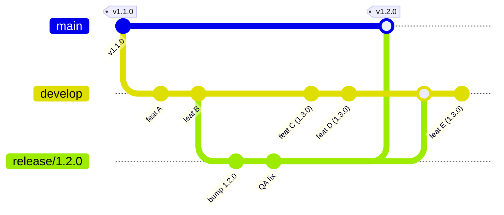
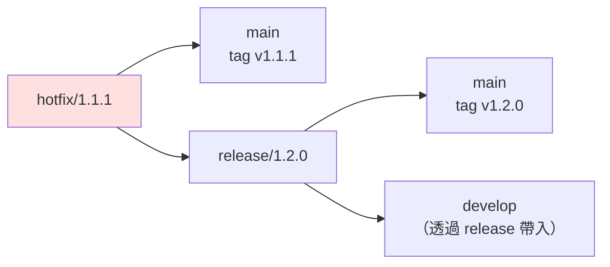
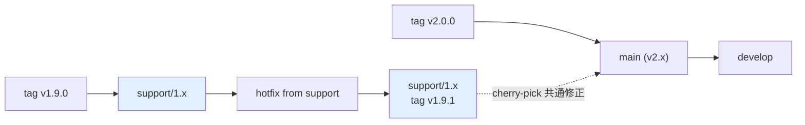

# GitFlow 情境模擬全集

> 本頁是《[Git 與 GitFlow 教學手冊](../README.md)》的第 14 章。

[← 回手冊首頁](../README.md) ｜ [上一章：Git 互動演練場](../README.md#13-git-互動演練場) ｜ [下一章：多 Pipeline 設計](pipelines.md)

---

## 14. GitFlow 情境模擬全集

> 這一章把 GitFlow 在真實專案裡會遇到的狀況分成 6 類、26 個情境，
> 每個情境都有**背景 → 操作 → 重點**，指令可直接複製執行。
> 全部情境都能用 `./scenarios/simulate.sh <編號>` 在沙箱 repo 中實際跑一遍（見 [14.7](#147-情境模擬器)）。
>
> 與[第 13 章](../README.md#13-git-互動演練場)的差別：
> **演練場是你動手**（練基本功）；**模擬器是自動演示**（看複雜時序怎麼走）。

| 類別 | 情境 | 難度 |
|------|------|------|
| [A. 正常流程](#a-正常流程) | 1–4 | ⭐ |
| [B. 衝突處理](#b-衝突處理) | 5–8 | ⭐⭐ |
| [C. 時序交錯](#c-時序交錯最刁鑽) | 9–13 | ⭐⭐⭐ |
| [D. 異常與救援](#d-異常與救援) | 14–20 | ⭐⭐⭐ |
| [E. 長期維護](#e-長期維護多版本並行) | 21–23 | ⭐⭐⭐ |
| [F. 團隊協作](#f-團隊協作) | 24–26 | ⭐⭐ |

---

### A. 正常流程

#### 情境 1：標準功能開發

**背景**：接到票號 PROJ-101，要新增使用者登入。

```bash
git switch develop && git pull origin develop
git switch -c feature/PROJ-101-user-login

# ... 開發 ...
git add -p && git commit -m "feat(auth): 新增登入表單"
git add -p && git commit -m "feat(auth): 串接登入 API"

git push -u origin feature/PROJ-101-user-login
# → 在 GitHub 開 PR (base: develop) → CI 綠燈 → Review 通過 → 平台合併
```

**重點**：
- 開分支前一定先 `pull`，否則基底是舊的
- 分支名帶票號，之後 `git log --grep=PROJ-101` 找得回來
- 用 PR 合併，不要本機 `git flow feature finish`（會繞過 Review）

---

#### 情境 2：多個 feature 平行開發（互不干擾）

**背景**：A 做登入、B 做購物車，改的是不同檔案。

```bash
# 開發者 A
git switch develop && git switch -c feature/login
echo "login" > src/login.js && git add . && git commit -m "feat: login"

# 開發者 B（同時間）
git switch develop && git switch -c feature/cart
echo "cart" > src/cart.js && git add . && git commit -m "feat: cart"

# A 先合併
git switch develop && git merge --no-ff feature/login -m "Merge feature/login"

# B 合併前先同步 develop，確認沒問題
git switch feature/cart
git merge develop            # 或 rebase develop（分支僅自己在用時）
git switch develop && git merge --no-ff feature/cart -m "Merge feature/cart"
```

**重點**：**後合併的人負責解衝突**。B 應在開 PR 前先把 develop 併進自己的分支，讓 PR 是乾淨的。

---

#### 情境 3：標準發版

**背景**：develop 上累積了 5 個 feature，要發 v1.2.0。

```bash
git switch develop && git pull
git switch -c release/1.2.0

echo "1.2.0" > VERSION
git commit -am "chore(release): bump to 1.2.0"
git push -u origin release/1.2.0          # → 自動部署到 staging，QA 開始測

# QA 回報小 bug，就地修（不回 develop 改）
git commit -am "fix(cart): 修正折扣計算誤差"
git push

# QA 通過 → 完成發版
git switch main && git pull
git merge --no-ff release/1.2.0 -m "Merge branch 'release/1.2.0'"
git tag -a v1.2.0 -m "Release 1.2.0"

git switch develop
git merge --no-ff release/1.2.0 -m "Merge branch 'release/1.2.0' into develop"

git push origin main develop --follow-tags
git branch -d release/1.2.0
git push origin --delete release/1.2.0
```

**重點**：
- release 分支開出去的那一刻，**develop 就解凍**，可以開始收下一版的 feature
- release 上只准 bug fix、版本號、文件；**任何新功能一律退回 develop**
- 一定要**兩邊都合**（main + develop），只合 main 會讓修正在下一版消失

---

#### 情境 4：線上緊急修復

**背景**：v1.2.0 上線後 30 分鐘，發現結帳頁面 crash。

```bash
git switch main && git pull
git switch -c hotfix/1.2.1                # ★ 從 main 開，不是 develop

git commit -am "fix(checkout): 修正 null 導致的 crash"
echo "1.2.1" > VERSION
git commit -am "chore(release): bump to 1.2.1"
git push -u origin hotfix/1.2.1           # → 走快速通道部署到 staging 驗證

# 驗證通過
git switch main
git merge --no-ff hotfix/1.2.1 -m "Merge branch 'hotfix/1.2.1'"
git tag -a v1.2.1 -m "Hotfix 1.2.1"

git switch develop
git merge --no-ff hotfix/1.2.1 -m "Merge branch 'hotfix/1.2.1' into develop"

git push origin main develop --follow-tags
git branch -d hotfix/1.2.1
```

**重點**：hotfix 的基底**必須是 main**。從 develop 開會把還沒發布的功能一起帶上線。

---

### B. 衝突處理

#### 情境 5：兩個 feature 改到同一個檔案

**背景**：A 和 B 都改了 `src/config.js` 的同一行。

```bash
git switch develop
git merge --no-ff feature/b
# CONFLICT (content): Merge conflict in src/config.js
```

```bash
git status                                    # 看 Unmerged paths
git diff --name-only --diff-filter=U          # 只列衝突檔

# 開啟衝突樣式，看得到共同祖先版本
git config --global merge.conflictstyle zdiff3
```

```text
<<<<<<< HEAD
export const TIMEOUT = 5000;      ← develop（含 A 的修改）
||||||| 共同祖先
export const TIMEOUT = 3000;      ← 兩人分家前的原始值
=======
export const TIMEOUT = 10000;     ← feature/b
>>>>>>> feature/b
```

```bash
# 人工判斷後改成正確內容，然後
git add src/config.js
git commit                                    # 訊息已預填
```

**重點**：`zdiff3` 顯示共同祖先，能看出「誰改了什麼」，是解衝突的關鍵資訊。

---

#### 情境 6：feature 分支落後 develop 太久

**背景**：feature 開了 3 週，develop 已前進 80 個 commit。

```bash
# 做法一：rebase（分支只有自己在用）→ 歷史線性乾淨
git switch feature/x
git fetch origin
git rebase origin/develop
# 每個 commit 逐一重放，衝突時：
#   解衝突 → git add <file> → git rebase --continue
#   放棄  → git rebase --abort
git push --force-with-lease                   # ★ 絕不用 --force

# 做法二：merge（分支有多人在用）→ 不改寫他人 SHA
git switch feature/x
git merge origin/develop
git push
```

| | rebase | merge |
|---|---|---|
| 歷史 | 線性 | 有合併節點 |
| SHA | **會改變** | 不變 |
| 適用 | 只有自己用的分支 | 多人共用的分支 |
| 衝突 | 可能要解多次（每個 commit） | 只解一次 |

**重點**：真正的解法是**別讓 feature 活超過 3 天**。拆小票、用 feature flag。

---

#### 情境 7：release 分支的修正回併 develop 時衝突

**背景**：release/1.2.0 上修了 bug，同時 develop 上有人重構了同一段程式。

```bash
git switch develop
git merge --no-ff release/1.2.0
# CONFLICT in src/cart.js
```

**處置**：
1. 這是**語意衝突**，不是文字衝突 — 要判斷「重構後的新結構下，這個 bug 修正該怎麼寫」
2. 找 release 的修正者 + 重構者一起看
3. 解完務必跑測試：`npm test` / `go test ./...`

```bash
git add src/cart.js
git commit
npm test                                      # ★ 一定要驗
```

**重點**：Git 只會告訴你「文字對不上」，**不會告訴你「邏輯錯了」**。release 回併 develop 之後的測試不能省。

---

#### 情境 8：rebase 過程中連續衝突，想放棄

```bash
git rebase develop
# 解到第 4 個 commit 已經崩潰

git rebase --abort            # 完全回到 rebase 前，什麼都沒發生

# 改用 merge 一次解決
git merge develop
```

**重點**：`--abort` 隨時可用，rebase 不是不歸路。若同一段衝突反覆出現，可開啟 rerere 讓 Git 記住你的解法：

```bash
git config --global rerere.enabled true       # reuse recorded resolution
```

---

### C. 時序交錯（最刁鑽）

#### 情境 9：release 凍結期間，develop 繼續開發下一版

**背景**：release/1.2.0 在 QA，同時要開始做 1.3.0 的功能。



```bash
# QA 團隊在 release/1.2.0
git switch release/1.2.0
git commit -am "fix: QA 回報的問題"

# 開發團隊同時在 develop 做 1.3.0
git switch develop
git switch -c feature/PROJ-201-new-dashboard
# ... 正常開發、正常合回 develop ...
```

**重點**：**這就是 GitFlow 存在的唯一理由**。若沒有 release 分支，QA 期間 develop 就必須凍結，全隊停工等 QA。

---

#### 情境 10：release 進行中發生 hotfix

**背景**：release/1.2.0 還在 staging 測，此時 v1.1.0（線上版）出了緊急 bug。

```bash
git switch main && git switch -c hotfix/1.1.1
git commit -am "fix: 線上緊急修復"

# ① 合進 main + tag（優先，先救火）
git switch main
git merge --no-ff hotfix/1.1.1 -m "Merge hotfix/1.1.1"
git tag -a v1.1.1 -m "Hotfix 1.1.1"

# ② ★ 合進 release/1.2.0（不是 develop！）
git switch release/1.2.0
git merge --no-ff hotfix/1.1.1 -m "Merge hotfix/1.1.1 into release/1.2.0"

# ③ develop 不用另外合 —— release 完成時會自然把它帶進去
#    但若 release 可能被廢棄，則 develop 也要合一份保險
```



**重點**：release 存在時，hotfix 要合進 **main + release**。
若只合 main + develop，release/1.2.0 上線時會**把這個修復覆蓋掉**（回歸 bug）。

---

#### 情境 11：hotfix 與 release 同時要上線

**背景**：hotfix/1.1.1 與 release/1.2.0 幾乎同時完成。

**正確順序：**

```bash
# ① hotfix 先合 main 並打 tag
git switch main
git merge --no-ff hotfix/1.1.1 && git tag -a v1.1.1 -m "Hotfix 1.1.1"

# ② hotfix 合進 release（讓 release 包含這個修復）
git switch release/1.2.0 && git merge --no-ff hotfix/1.1.1

# ③ release 重新跑完整 QA（因為內容變了！）

# ④ release 合 main 並打 tag
git switch main
git merge --no-ff release/1.2.0 && git tag -a v1.2.0 -m "Release 1.2.0"

# ⑤ release 合回 develop
git switch develop && git merge --no-ff release/1.2.0
```

**重點**：tag 的**時間順序**必須與版本號順序一致（v1.1.1 早於 v1.2.0）。
步驟 ③ 不能省 — release 內容被改動過，先前的 QA 結果已失效。

---

#### 情境 12：兩個 release 分支同時存在

**背景**：release/1.2.0 卡在客戶驗收，商業壓力下必須先切 release/1.3.0。

```bash
git switch develop
git switch -c release/1.3.0        # develop 已含 1.3.0 的功能
```

**風險與處置：**

| 風險 | 處置 |
|------|------|
| 1.2.0 的 QA 修正不會自動進 1.3.0 | 每次 1.2.0 有修正，**手動 cherry-pick 到 1.3.0** |
| 版本號與 tag 順序混亂 | 嚴格規定 1.2.0 必須先 tag 才能 tag 1.3.0 |
| 兩份 staging 環境 | 用 namespace 隔離：`staging-1-2-0`、`staging-1-3-0` |

```bash
# 1.2.0 有修正時
git switch release/1.2.0 && git commit -am "fix: QA issue"
git switch release/1.3.0 && git cherry-pick <sha>
```

**重點**：這是 GitFlow 的**反模式**。真的遇到，代表 release 週期太長，應該檢討發版節奏，而不是靠更多分支硬撐。

---

#### 情境 13：release 被判定不上線（廢棄）

**背景**：release/1.2.0 驗收未通過，功能整批延期。

```bash
# 方案 A：修好再上（首選）—— 留在 release 分支繼續修
git switch release/1.2.0
git commit -am "fix: 驗收問題"

# 方案 B：整批延期 —— 廢棄 release，功能留在 develop
git switch develop
git merge --no-ff release/1.2.0 -m "Merge release/1.2.0 into develop (廢棄，保留修正)"
git branch -D release/1.2.0
git push origin --delete release/1.2.0
# ★ main 完全不動，線上仍是 v1.1.x

# 方案 C：抽掉某個功能後再上
git switch release/1.2.0
git revert -m 1 <feature-X-的-merge-commit-sha>
git commit --amend -m "revert: 移除功能 X，延至 1.3.0"
```

**重點**：
- release 廢棄時**一定要先合回 develop**，否則 release 上的 QA 修正全部白做
- 方案 C 的 revert 之後，功能 X 要重新進版時會踩到[情境 17](#情境-17已合併的-feature-要抽掉) 的陷阱

---

### D. 異常與救援

#### 情境 14：feature 誤從 main 開出

**背景**：忘了先切 develop，直接從 main 開了 feature 分支，已經 commit 了 3 次。

```bash
git log --oneline --graph main develop feature/x     # 先確認基底

# ★ 把 feature/x 從 main 之後的 commit，接到 develop 上
git rebase --onto develop main feature/x

# 語法：git rebase --onto <新基底> <舊基底> <要搬的分支>
git log --oneline --graph --all                      # 確認結果
```

**重點**：`rebase --onto` 是「換基底」的精準工具。若已 push 過，之後要 `--force-with-lease`。

---

#### 情境 15：誤在 main 上直接 commit

```bash
git switch main
git log --oneline -3
# 8b4d9e (HEAD -> main) feat: 不該在這裡的功能   ← 誤 commit
# 3f2a1c (tag: v1.2.0) Merge branch 'release/1.2.0'

# ── 尚未 push ──────────────────────────────
git switch -c feature/rescue          # ① 先開分支保住這個 commit
git switch main
git reset --hard origin/main          # ② main 回到遠端狀態
# ③ 之後從 feature/rescue 走正常 PR 流程進 develop

# ── 已經 push（main 有保護時通常推不上去）────
git revert 8b4d9e                     # 用反向 commit 抵銷
git push origin main
git switch develop
git cherry-pick 8b4d9e                # 把功能帶到正確的分支
```

**重點**：開啟 main 的分支保護就不會發生這件事。預防勝於治療。

---

#### 情境 16：誤把 feature 直接合進 main

```bash
git log --oneline --graph main -5
# a1b2c3 (HEAD -> main) Merge branch 'feature/x'      ← 誤合的 merge commit

# ── 尚未 push ──
git reset --hard HEAD~1               # 直接回到合併前

# ── 已 push ──
git revert -m 1 a1b2c3                # -m 1 = 保留 main 這一邊（第一父）
git push origin main
# 然後走正常流程：feature/x → develop → release → main
```

**重點**：revert 一個 **merge commit** 必須用 `-m` 指定要保留哪一個父。
`-m 1` = 保留被合併進去的目標分支（通常是 main/develop）。

---

#### 情境 17：已合併的 feature 要抽掉

**背景**：feature/X 已經合進 develop，但客戶砍了這個需求。

```bash
git log --oneline --graph develop
# c4d5e6 Merge branch 'feature/X' into develop        ← 要抽掉的合併

git switch develop
git revert -m 1 c4d5e6 -m "revert: 移除功能 X（需求取消）"
git push origin develop
```

**⚠️ 最大陷阱**：日後功能 X 復活，**直接重新 merge 分支是無效的** —
Git 認為那些 commit 已經合併過，不會再帶進來，結果是「合了但程式碼沒回來」。

**正確做法（二選一）：**

```bash
# 做法一：revert 那個 revert（推薦）
git revert <revert-commit-的-sha>

# 做法二：重建分支
git switch -c feature/X-v2 <feature/X-最後一個-commit>
git rebase develop                     # 產生全新 SHA
# → 走正常 PR 流程
```

---

#### 情境 18：tag 打錯了

```bash
# 情況 A：tag 打在錯的 commit（尚未 push）
git tag -d v1.2.0
git tag -a v1.2.0 <正確的-sha> -m "Release 1.2.0"

# 情況 B：已 push（★ 高風險：別人可能已經抓走）
git tag -d v1.2.0
git push origin :refs/tags/v1.2.0            # 刪遠端 tag
git tag -a v1.2.0 <正確的-sha> -m "Release 1.2.0"
git push origin v1.2.0
# → 必須公告全隊：git fetch --tags --force

# 情況 C：版本號打錯（v1.2.0 應為 v1.3.0）
# 最安全：不刪舊 tag，直接補打正確的，並在 Release Notes 註明作廢
git tag -a v1.3.0 <same-sha> -m "Release 1.3.0 (v1.2.0 標記錯誤，已作廢)"
```

**重點**：tag 是**不可變的公開契約**。CI/CD、套件註冊表、客戶下載連結都可能綁著它。能不動就不動。

---

#### 情境 19：develop 被 force push 覆蓋

**背景**：同事誤 `git push --force`，develop 上少了 20 個 commit。

```bash
# ① 任何一位有舊版的人，本機都還留著紀錄
git reflog show origin/develop
# 或
git reflog                                    # 找 force push 前的 SHA

# ② 找到正確的 SHA 後救回來
git switch -c rescue-develop <好的-sha>
git log --oneline | head -25                  # 確認 20 個 commit 都在

# ③ 覆蓋回遠端（需臨時解除分支保護）
git push origin rescue-develop:develop --force-with-lease

# ④ 通知全隊
git fetch origin && git reset --hard origin/develop
```

**預防**：分支保護關閉 force push，這是**一次設定、永久受益**的事。

---

#### 情境 20：機密或大檔進了版控

```bash
# ── 尚未 push ──
git reset --soft HEAD~1
git rm --cached .env
echo ".env" >> .gitignore
git commit -m "chore: 移除誤入版控的 .env"

# ── 已 push（★ 順序很重要）──
# ① 立刻輪換那把金鑰／密碼 —— 它已經外洩了，清歷史救不回來
# ② 再清理歷史
pip install git-filter-repo
git filter-repo --path .env --invert-paths --force
git remote add origin <url>            # filter-repo 會移除 remote
git push origin --force --all
git push origin --force --tags
# ③ 通知所有人重新 clone（舊 clone 仍含機密）
```

**預防**：

```bash
# pre-commit hook 擋機密
brew install gitleaks
gitleaks protect --staged --redact
```

---

### E. 長期維護（多版本並行）

#### 情境 21：同時維護 v1.x 與 v2.x

**背景**：v2.0.0 已發布，但有大客戶仍在 v1.9，需要繼續收 bug 修復。

```bash
# 建立長期支援分支（從 v1.9.0 這個 tag）
git switch -c support/1.x v1.9.0
git push -u origin support/1.x

# git-flow 內建指令
git flow support start 1.x v1.9.0
```



```bash
# v1.x 的緊急修復
git switch support/1.x
git switch -c hotfix/1.9.1
git commit -am "fix: 修復 v1.x 的安全問題"
git switch support/1.x && git merge --no-ff hotfix/1.9.1
git tag -a v1.9.1 -m "Support release 1.9.1"

# 若這個 bug v2 也有 → cherry-pick 到 develop
git switch develop
git cherry-pick <fix-sha>              # 可能需手改（v2 程式結構已不同）
```

**重點**：`support/*` 分支**永不合回 main**。兩條線各自獨立演進，共通修正靠 cherry-pick 同步。

---

#### 情境 22：為舊版客戶做 hotfix

**背景**：線上是 v2.3.0，某客戶還停在 v2.1.0，需要一個只給他們的修補。

```bash
git switch -c hotfix/2.1.1 v2.1.0      # ★ 從舊 tag 開，不是從 main
git commit -am "fix: 修復 2.1.x 的問題"
git tag -a v2.1.1 -m "Hotfix 2.1.1 for legacy customers"
git push origin hotfix/2.1.1 v2.1.1

# ⚠️ 這個 hotfix 不合回 main（main 已是 2.3.x，更新）
# 但要確認同一個 bug 在 main/develop 上是否也存在
git log --oneline v2.1.0..main -- <相關檔案>
```

**重點**：檢查「新版是否也有這個 bug」，別讓修補只停在舊版分支。

---

#### 情境 23：一個修正要進多個版本

**背景**：安全漏洞，v1.9、v2.1、v2.3、develop 都要修。

```bash
# ① 在最舊的分支上修（最容易向前移植）
git switch support/1.x
git switch -c hotfix/1.9.2
git commit -am "fix(security): 修補 XSS 漏洞"
FIX=$(git rev-parse HEAD)

# ② 依序 cherry-pick 到每條線
for BR in support/2.1 support/2.3 main develop; do
  git switch "$BR"
  git cherry-pick "$FIX" || {
    echo "⚠️ $BR 需人工處理"; git cherry-pick --abort;
  }
done

# ③ 每條線各自打 tag、各自跑完整測試
```

**重點**：從**最舊**的分支往新的移植，成功率遠高於反過來（新程式碼常依賴舊版沒有的東西）。

---

### F. 團隊協作

#### 情境 24：多人共用同一個 feature 分支

```bash
# A 建立並發布
git switch -c feature/big-refactor develop
git push -u origin feature/big-refactor

# B 加入
git fetch origin
git switch -c feature/big-refactor origin/feature/big-refactor

# 日常同步（★ 共用分支上絕不 rebase）
git pull --no-rebase origin feature/big-refactor   # 用 merge 而非 rebase
git push origin feature/big-refactor
```

**重點**：共用分支**只 merge、不 rebase**。有人 rebase 過共用分支，其他人下次 pull 就會看到大量假衝突。

若團隊 `pull.rebase=true` 是全域設定，共用分支要明確指定 `--no-rebase`。

---

#### 情境 25：feature 依賴另一個未合併的 feature

**背景**：feature/api 還在 Review，feature/ui 需要用它的成果。

```bash
# 方案 A：疊在上面（stacked branches）
git switch -c feature/ui feature/api        # ★ 從 feature/api 開，不是 develop
# PR 的 base 也要設成 feature/api

# feature/api 合併進 develop 後，把 ui 換基底
git switch feature/ui
git rebase --onto develop feature/api feature/ui
git push --force-with-lease
# PR base 改回 develop

# 方案 B：先把 api 的介面部分獨立成小 PR 快速合併（推薦）
# 方案 C：ui 先用 mock/interface 開發，之後再串接
```

**重點**：stacked branches 一旦超過 2 層就難以維護。優先考慮方案 B — **把 PR 拆小、快速合併**。

---

#### 情境 26：PR 卡太久，develop 已經跑遠

```bash
git switch feature/x
git fetch origin

# 看落後多少
git rev-list --left-right --count origin/develop...feature/x
# 87   12      ← develop 領先 87，你領先 12

# 同步
git rebase origin/develop            # 或 git merge origin/develop
git push --force-with-lease
```

**根治做法：**

| 做法 | 說明 |
|------|------|
| PR ≤ 400 行 | 超過就拆成多個 PR |
| Feature flag | 未完成的功能先合進 develop，用開關隱藏 |
| Review SLA | 24 小時內必須有第一次回覆 |
| Draft PR | 早期就開，讓大家看得到進度 |

---

### 14.7 情境模擬器

本專案附帶 `scenarios/simulate.sh`，會在 `/tmp/gitflow-sandbox/` 建立乾淨的沙箱 repo，
把上述情境真的跑一次（含衝突、救援與驗證），**不會動到你任何既有的專案**。

```bash
chmod +x scenarios/simulate.sh

./scenarios/simulate.sh list        # 列出所有情境
./scenarios/simulate.sh 10          # 只跑情境 10（release 期間的 hotfix）
./scenarios/simulate.sh 1 3 4 9 10  # 跑指定幾個
./scenarios/simulate.sh all         # 全部跑一遍
./scenarios/simulate.sh clean       # 清掉沙箱
```

每個情境會**自我驗證**（全 26 個情境共 39 項斷言，實機執行全數通過）。
以最關鍵的情境 10 為例，實際輸出：

```console
$ ./scenarios/simulate.sh 10

════════════════════════════════════════════════════════════
 情境 10：release 進行中發生 hotfix（★ 最容易做錯）
════════════════════════════════════════════════════════════
▶ 切出 release/1.1.0，QA 進行中
▶ 此時線上 v1.0.0 出事 → 從 main 開 hotfix/1.0.1
▶ ① hotfix → main + tag（先救火）
▶ ② hotfix → release/1.1.0 （★ 關鍵：不是 develop！）
✔ 驗證：release/1.1.0 已包含 hotfix 修正
▶ ③ release 完成 → main + develop
✔ 驗證：v1.1.0 上線後仍保有 hotfix（沒有回歸）
✔ 驗證：develop 也透過 release 拿到修正

--- git log --oneline --graph --all ---
*   Merge branch 'release/1.1.0' into develop
|\
| *   Merge branch 'hotfix/1.0.1' into release/1.1.0
| |\
| | * fix: 線上緊急修復
...

⚠ 若步驟 ② 改成合進 develop 而非 release，v1.1.0 上線時會把 hotfix 覆蓋掉 → 回歸 bug
```

**推薦的閱讀／執行順序**

| 你的情況 | 建議跑哪幾個 |
|----------|-------------|
| 剛學會 GitFlow，想確認自己理解正確 | `1 2 3 4` |
| 準備第一次帶 release | `3 9 13` |
| 準備第一次處理線上事故 | `4 10 11` |
| 團隊常發生合併地獄 | `5 6 7 8 26` |
| 有人把 main 搞壞了 | `15 16 17 19` |
| 要開始維護多個版本 | `21 22 23` |
| **只挑一個看** | `10`（release 期間的 hotfix，最容易做錯） |

---

[← 回手冊首頁](../README.md) ｜ [上一章：Git 互動演練場](../README.md#13-git-互動演練場) ｜ [下一章：多 Pipeline 設計](pipelines.md)
